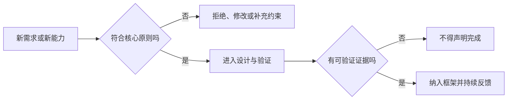
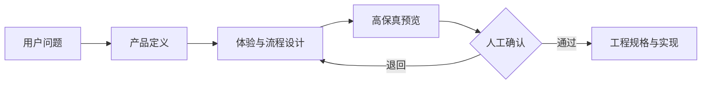
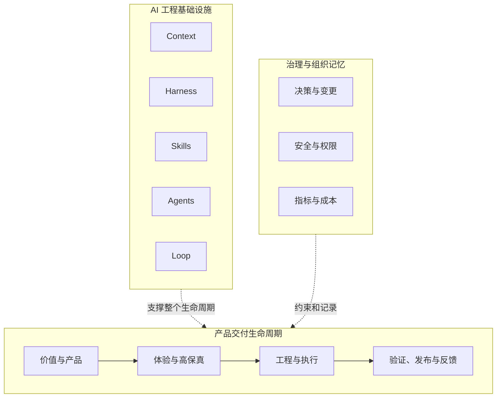
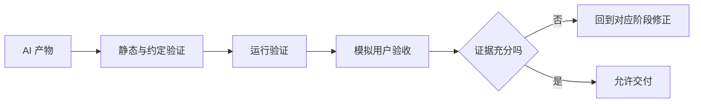

# AI 产品工程核心原则

> 本文定义 AI 产品工程框架不可被局部实现、具体工具或短期任务破坏的基本原则。后续的 Context、Harness、Skills、Agents、Loop、模板、检查关卡和参考工程都必须能够说明自己如何遵守这些原则。

中文术语遵循：[术语与易懂表达规范](术语与易懂表达规范.md)。

## 1. 原则的作用

核心原则不是口号，而是框架的判断标准。当出现新的流程、Skill、Agent、自动化方案或平台适配时，应先判断它是否符合本文件，而不是仅判断“能不能实现”。



## 2. 第一版核心原则

### 原则一：价值和目标先于任务

**宪法条款：** 所有任务都必须能够追溯到明确的用户问题、业务价值或工程目标。

- 不以“生成一个页面”“增加一个功能”“写一段代码”作为充分目标。
- 任务必须说明服务谁、解决什么问题、期望改变什么结果。
- 无法说明价值来源的工作，应先进入价值澄清，而不是直接执行。

**禁止：** 用交付数量、文档数量或代码数量代替产品价值。

### 原则二：产品与体验设计先于工程实现

**宪法条款：** 对用户可感知的产品能力，必须先完成产品定义、用户流程和高保真预览确认，再进入实现。



- 高保真预览是正式检查关卡，不是宣传插图。
- 必须覆盖正常、加载、空、错误、权限和关键边缘状态。
- 编码结果不得反向替代缺失的产品和体验决策。

### 原则三：上下文必须外置并可追溯

**宪法条款：** 仓库和受控知识资产是项目长期记忆的事实来源，模型会话不是。

- 愿景、业务规则、设计规格、架构、决策和验收标准必须文件化。
- 重要结论不能只保留在对话、提交信息或某个 Agent 的临时记忆中。
- 发生冲突时，必须指出冲突并按已批准设计决策处理。
- 过期 Context 必须标记、替代或归档，不得静默共存。

### 原则四：生命周期、AI 基础设施和治理必须分离

**宪法条款：** 不得把产品阶段、Agent 能力和治理机制混成一条扁平流水线。



- 生命周期回答“产品如何产生价值”。
- AI 工程基础设施回答“AI 如何可靠参与”。
- 治理回答“谁负责、如何审计、如何长期演进”。

### 原则五：约定和边界先于执行

**宪法条款：** AI 执行前必须明确输入、输出、依赖、允许修改范围、禁止事项和验收条件。

最小任务上下文应包含：

1. 任务目标与价值来源；
2. 事实和依赖文档；
3. 输入与预期输出；
4. 允许和禁止修改的范围；
5. 风险、权限与人工确认点；
6. 验证方法和完成证据。

**禁止：** 以“顺便优化”“整体重构”扩大未经授权的修改范围。

### 原则六：AI 受控执行，人类承担最终责任

**宪法条款：** AI 可以分析、生成、执行和验证，但价值取舍、高风险审批、高保真确认和最终发布责任必须由明确的人类角色承担。

- 自动化程度越高，权限、审计和停止条件越要明确。
- AI 的高置信度不构成人类批准。
- 人工介入点必须在流程中显式定义，不能临时依赖“有人会看”。

### 原则七：所有完成声明必须有证据

**宪法条款：** “生成完成”“代码已写”“测试应该通过”都不等于交付完成。

框架采用至少三层验证：

1. **静态与约定验证**：规范、边界、接口、数据和依赖一致性；
2. **运行验证**：构建、测试、接口、数据、性能和安全结果；
3. **模拟用户验收**：按真实角色、任务路径、异常状态和设备环境验证体验。



### 原则八：反馈必须进入 Loop，而不是停留在记录中

**宪法条款：** 执行失败、运行数据、用户反馈和人工修正必须能够改变下一轮产品决策、Context、Harness、Skill 或 Agent 协作方式。

- 反馈必须有来源、影响判断、责任人和处理结果。
- 不仅修复当前产物，还要判断是否需要修正规则和能力。
- 发布不是终点，真实使用才是产品验证的开始。

### 原则九：安全、隐私、合规和成本必须前置

**宪法条款：** 安全与成本不是发布前的补充检查，而是从 Context、权限、工具和任务设计开始的持续约束。

- 敏感数据不得因为“需要更多上下文”而无限提供给 AI。
- Agent 权限遵循最小权限原则。
- 高风险操作必须可审批、可停止、可审计和可回滚。
- 模型、Token、基础设施和人工复核成本必须能够被估算和观察。

### 原则十：平台无关标准优先，平台适配显式隔离

**宪法条款：** 框架不绑定 Claude Code、Codex、Kimi、GLM 或其他单一平台。

- 核心术语、生命周期、约定、验证和治理应保持平台无关。
- `AGENTS.md`、`CLAUDE.md`、Skills 目录、命令和工具调用等平台差异，应进入适配层。
- 不得把某个平台当前提供的能力误写成框架永久原则。

### 原则十一：复用必须建立在真实验证之上

**宪法条款：** 未经参考工程验证的方法，不得直接声明为通用最佳实践或稳定 Skill。

复用路径应为：

```text
具体问题 → 真实执行 → 结果验证 → 经验归纳 → 可复用资产 → 跨项目复验
```

- 先从真实场景形成候选方法。
- 再沉淀为模板、检查清单、检查关卡或 Skill。
- 最后通过不同类型参考工程验证适用边界。

### 原则十二：框架必须可裁剪，但不能失去闭环

**宪法条款：** 不同规模项目可以裁剪文档和角色数量，但不能删除价值判断、关键人工确认、执行边界、验证证据和反馈闭环。

个人项目可以由一个人承担多个角色，小任务可以合并文档，但以下能力不可被省略：

- 为什么做；
- 做到什么程度；
- AI 可以改什么；
- 如何证明正确；
- 谁承担最终责任；
- 结果如何进入下一轮改进。

## 3. 原则冲突时的处理顺序

当效率、自动化、体验、安全和成本发生冲突时，默认遵循：

1. 法律、合规、安全与不可逆风险；
2. 用户价值与真实体验；
3. 数据、约定与系统正确性；
4. 可维护性、可追溯性和可回滚性；
5. 交付速度与自动化程度；
6. 局部便利和短期产出数量。

如需偏离此顺序，必须形成设计决策，说明原因、影响、有效期和退出条件。

## 4. 新能力的宪法检查

任何新增模块、Skill、Agent 或平台适配，在合并前至少回答：

- 它服务哪个生命周期阶段和真实问题？
- 它依赖什么 Context，事实来源是什么？
- 它受到哪些 Harness 边界和检查关卡控制？
- 谁负责执行，谁负责批准？
- 输出如何验证，失败如何回流？
- 是否引入安全、隐私、权限或成本风险？
- 是否经过真实参考工程验证？
- 是否改变核心原则或框架边界，需要新增设计决策？

无法回答上述问题的能力，不应进入稳定框架。
