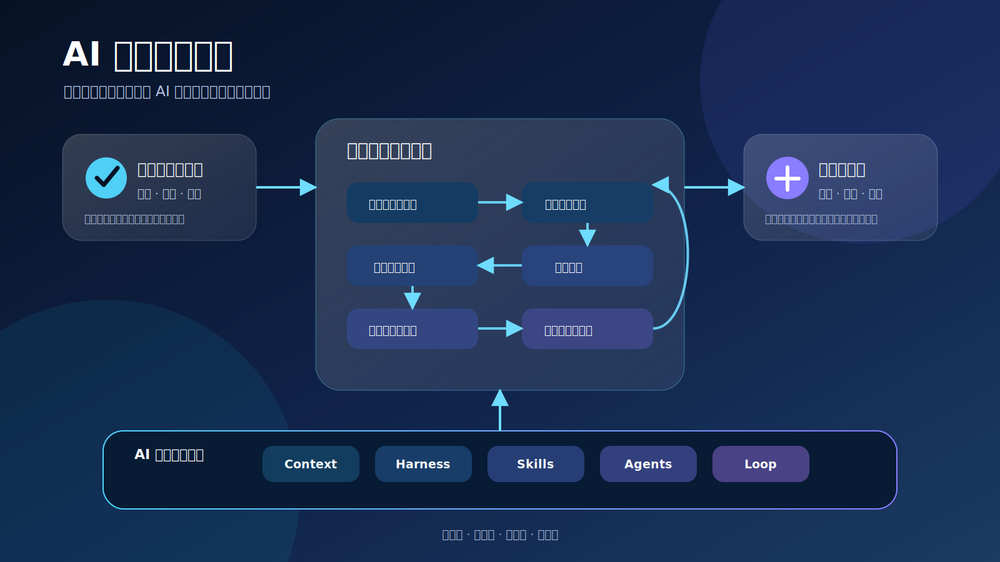

# AI 产品工程框架：愿景与定位

中文术语遵循：[术语与易懂表达规范](术语与易懂表达规范.md)。

## 1. 背景

AI Coding 产品已经能读取代码、修改文件、调用工具、运行测试并持续修正，但“能执行”不等于“能稳定交付产品”。

真实产品仍然需要解决：

- 需求是否真实、值得投入；
- 产品范围是否清晰；
- 用户体验是否在编码前得到确认；
- AI 是否理解项目事实和历史决策；
- 执行是否受到边界、约定和权限约束；
- 完成是否由测试、运行和用户验收共同证明；
- 上线后的数据和反馈是否进入下一轮改进。

如果缺少这些机制，AI 只会更快地产生更多不一致的代码、文档和局部方案。

## 2. 愿景

让个人、小团队和企业团队能够在明确的人类责任下，跨 Claude Code、Codex、Kimi、GLM 等执行平台，使用统一的产品工程标准管理 AI，持续交付可维护、可验证、可演进的软件产品。

## 3. 定位

本框架是：

- AI 时代的产品工程方法与资产体系；
- 人和多种 AI Agent 之间的协作约定；
- 把产品流程、Context、Harness、Skills、Agent 和 Loop 连接起来的总框架；
- 由 zhidao-studio 专有维护、可通过参考工程和检查关卡验证的跨平台标准。

本框架不是：

- 一个大模型；
- 一个 IDE 或聊天客户端；
- 单纯的 Prompt、Skill 或模板仓库；
- 默认追求无人参与的“全自动软件工厂”；
- 用 AI 绕过产品、设计、测试和治理流程的方法；
- 开源项目、公共标准或允许自由复制使用的知识库。

## 4. 专有权利定位

- 本框架及仓库内容为 zhidao-studio 专有资产；
- 本项目不是开源项目，不授予未经授权的使用权；
- 任何复制、实施、修改、分发、商业化、模型训练或衍生使用均须事先获得书面授权；
- 平台无关和跨平台仅描述技术适配能力，不表示开放许可；
- 正式权利边界以根目录 `LICENSE` 和 [DEC-009](../11_设计决策/DEC-009_采用专有闭源许可并限制未经授权使用.md) 为准。

## 5. 核心问题

框架必须持续回答五个问题：

1. **价值**：为什么值得做？
2. **体验**：用户最终如何感知和使用？
3. **实现**：系统如何在约定和边界内落地？
4. **证据**：如何证明产品正确、可用和安全？
5. **演进**：真实反馈如何改变下一轮决策、能力和规则？

## 6. 成功标准

框架的成功不是文档数量，而是能够通过经授权的真实参考工程证明：

- 非完整团队也能建立清晰的产品和工程上下文；
- 不同 AI 平台可以遵循相同的核心标准；
- 高保真确认能减少实现后的体验返工；
- 执行边界和约定检查关卡能降低意外修改；
- 三层验证能发现“代码正确但产品不可用”的问题；
- 失败经验能够沉淀为 Context、Skill、检查关卡或设计决策；
- 版本变化可追溯，关键结论不会随会话丢失。

## 7. 长期方向

长期形态可以包括标准、模板、Skills、检查关卡、平台适配、参考工程和可视化工作台，但任何自动化都必须建立在已验证的流程、责任边界、专有授权和受控环境之上。
