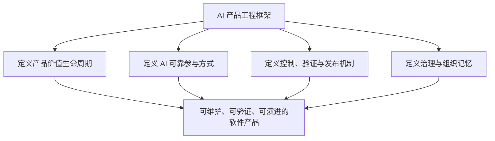
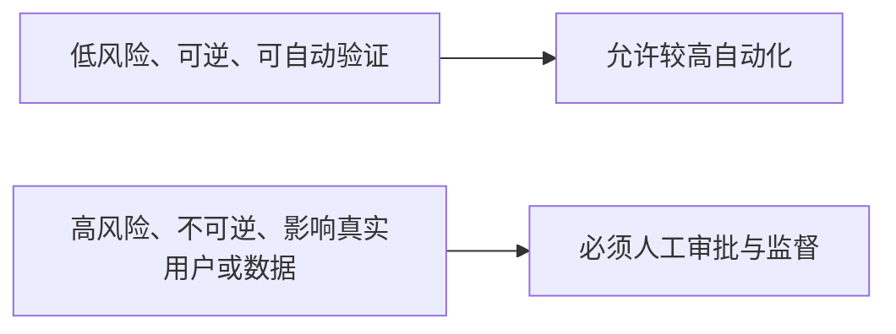

# AI 产品工程边界声明

> 本文明确 AI 产品工程框架负责什么、不负责什么，以及人在何处承担最终责任。边界的目的不是限制创新，而是防止框架退化为无限扩张的工具集合或“全自动软件工厂”口号。

中文术语遵循：[术语与易懂表达规范](术语与易懂表达规范.md)。

## 1. 框架的责任范围

本框架负责定义和提供：

- 从战略价值验证到运行反馈的十阶段产品价值生命周期；
- Context、Harness、Skills、Agents、Loop 五类 AI 工程基础设施；
- 人类角色与 AI Agent 的责任、输入输出约定和协作方式；
- 高保真预览、执行边界、质量检查关卡、模拟用户验收、发布交付和反馈闭环；
- 设计决策、版本变更、安全权限、指标成本和组织记忆机制；
- 标准、模板、检查关卡、Skills、平台适配和参考工程的建设准入规则。

## 2. 框架不负责的事项

### 2.1 不替代产品和商业决策

框架可以辅助分析市场、用户和方案，但不能替代责任人决定：

- 是否进入某个市场；
- 是否值得投入资源；
- 商业伦理和社会影响是否可接受；
- 产品范围、优先级和停止条件；
- 风险是否值得承担。

### 2.2 不保证 AI 输出绝对正确

任何模型和 Agent 都可能产生错误、幻觉、遗漏、过度修改或错误解释。框架的目标是提高可控性、可验证性和问题发现能力，而不是承诺零错误。

### 2.3 不等同于某个工具或平台

框架不等同于：

- Claude Code、Codex、Kimi、GLM 或其他 AI Coding 产品；
- IDE、命令行工具、Agent Runtime 或模型 API；
- MCP、插件、工作流平台或 CI/CD 产品；
- 某种编程语言、架构模式或云厂商方案。

这些产品可以作为执行平台或适配目标，但不能定义框架本身。

### 2.4 不默认追求无人值守自动化

自动化必须与任务风险、可逆性、权限范围和验证能力匹配。框架不以“完全无人参与”为成熟度标准。

### 2.5 不替代法律、行业与组织制度

涉及隐私、知识产权、金融、医疗、安全生产、劳动关系或其他受监管领域时，必须遵从适用法律、行业规范和组织制度。框架文档不能被当作法律意见或合规批准。

### 2.6 不授予外部使用权

本框架由 zhidao-studio 专有维护，不是开源项目，也不是允许自由使用的公共标准。

未经书面授权，任何个人或组织不得：

- 使用、实施或部署框架内容；
- 复制、下载、镜像、转载或摘录；
- 修改、翻译、改编或创建衍生作品；
- 分发、再许可、出售或用于商业交付；
- 纳入其他产品、服务、课程、咨询方案或内部工程体系；
- 用于模型训练、微调、评测或数据集建设。

正式权利边界以根目录 `LICENSE` 和 [DEC-009](../11_设计决策/DEC-009_采用专有闭源许可并限制未经授权使用.md) 为准。公开可见不等于授予使用许可；若要限制访问，仓库必须设为 Private。

## 3. 人与 AI 的责任边界

### 3.1 人类必须保留的责任

- 价值判断、目标和优先级；
- 产品范围和关键取舍；
- 高保真体验确认；
- 敏感数据、权限和高风险操作审批；
- 重大架构、依赖和治理变更批准；
- 验收豁免、发布决策、回滚决定和事故责任；
- 对用户、组织和社会影响的判断；
- 专有许可、商业授权、仓库可见性和知识产权决策。

### 3.2 AI 可以承担的工作

- 信息检索、归纳、分析和方案比较；
- 文档、原型、代码、配置、测试和报告生成；
- 在明确边界内调用工具和执行任务；
- 自动检查、测试、问题定位和候选修复；
- 运行数据、用户反馈、失败原因和成本分析；
- 将验证过的经验整理为候选 Context、模板、检查关卡或 Skill。

### 3.3 AI 不得自行扩张的权限

AI 不得因为任务需要而自行：

- 获取未授权数据、密钥或凭据；
- 扩大代码、基础设施或业务系统修改范围；
- 跳过人工确认、质量检查关卡、验收或发布审批；
- 将实验性能力标记为稳定标准；
- 隐藏失败、风险、冲突和不确定性；
- 代替责任人作出不可逆或高影响决策；
- 更换、放宽或移除专有许可；
- 将仓库内容发送到未授权模型、知识库、数据集或第三方系统。

## 4. 十阶段产品价值生命周期边界

根据 [DEC-005](../11_设计决策/DEC-005_拆分模拟用户验收与发布交付阶段.md)，生命周期统一如下：

| 阶段 | 框架关注 | 不越过的边界 |
|---|---|---|
| 1. 战略与价值验证 | 用户问题、价值、目标、成功指标 | 不代替责任人作商业决策 |
| 2. 产品定义 | 范围、规则、用户故事、验收断言 | 不直接跳到实现 |
| 3. 用户体验设计 | 流程、页面、状态和交互 | 不用代码结果代替体验设计 |
| 4. 高保真原型预览与确认 | 最终体验预览和人工确认 | 未确认不得进入正式实现 |
| 5. 工程规格设计 | 架构、API、数据、依赖和安全设计 | 不在执行中临时改写已批准约定 |
| 6. 受控任务执行 | 在任务 Context 和边界内生成产物 | 不扩大权限和修改范围 |
| 7. 质量与安全验证 | 静态、运行、安全和约定一致性验证 | 不以主观判断代替证据 |
| 8. 模拟用户验收 | 真实角色、任务路径、设备和异常状态 | AI 不得自我宣布验收通过 |
| 9. 发布交付 | 发布条件、迁移、监控、回滚和批准 | 验收通过不等于自动发布 |
| 10. 运行反馈与持续迭代 | 数据、反馈、问题和能力改进 | 不只记录反馈而不形成闭环 |

## 5. 五大 AI 工程基础设施的边界

### Context Engineering

负责向 AI 提供必要、准确、分层和可追溯的事实与规则；不负责无限堆积信息，也不允许用过期、冲突或无来源内容污染当前任务。

### Harness Engineering

负责阶段、权限、边界、约定、检查关卡和人工确认；不负责替代模型能力，也不应通过过度规则使任务无法执行。

### Skill Engineering

负责把真实验证过的方法封装成可复用能力；不负责收集未经验证的 Prompt，也不把任何说明文件都称为 Skill。

### Agent Engineering

负责角色职责、协作约定、任务编排和工具权限；不默认认为 Agent 数量越多越先进。

### Loop Engineering

负责观察、评估、修正、停止和经验沉淀；不允许无限重试，也不允许在目标、预算或风险边界之外自我扩张。

## 6. 自动化边界

| 等级 | 适用情况 | 人工要求 |
|---|---|---|
| 建议 | 需求不清、方向选择、高风险决策 | 人决定是否采用 |
| 辅助执行 | 有明确方案但仍需逐步确认 | 人确认关键阶段 |
| 受控自动执行 | 边界明确、可回滚、可自动验证 | 人查看证据并批准下一步 |
| 条件自治 | 低风险、成熟、可观察、可停止 | 人设定预算、权限、告警和接管条件 |

任何自动化都必须具备：

- 明确目标、成功指标和停止条件；
- 权限、时间、Token 和资源上限；
- 可观察日志、输入输出和验证结果；
- 失败、超时和异常分类；
- 人工接管、降级和回滚能力。

## 7. 裁剪边界

框架允许根据项目规模裁剪：

- 一个自然人可以同时承担多个责任角色；
- 小任务可以把多个文档合并；
- 已有成熟企业流程可以复用；
- 不同平台可以采用不同文件和工具实现。

但不得裁掉：

1. 价值和目标来源；
2. 关键产品与体验确认；
3. AI 执行范围和权限；
4. 可验证的完成证据；
5. 最终责任人；
6. 发布和回滚责任；
7. 反馈和变更的可追溯记录；
8. 专有许可、数据和知识产权边界。

## 8. 当前版本与建设边界

v0.1.4 稳定版本负责建立并治理：

- 愿景、定位、适用场景、核心原则、边界和术语规范；
- 三平面全局模型和十阶段生命周期；
- Context、Harness、Skills、Agents、Loop 的定义和关系；
- 人类与 AI 角色体系；
- 决策记录、版本治理、专有许可、模板入口、参考工程要求和 Roadmap；
- 面向中文读者的“约定”和“检查关卡”统一表达。

当前进入 v0.2.0 / A 的 Context 可执行化里程碑，但暂不实现：

- 通用 Agent Runtime 或可视化工作台；
- 完整跨平台 Skill 库；
- 企业级权限与审计平台；
- 无人值守生产发布系统；
- 尚未通过参考工程验证的自动化承诺。

## 9. 边界变更规则

以下变化必须形成新的设计决策，并同步更新本文件、`LICENSE`、`AGENTS.md`、README 和相关专题文档：

- 框架责任范围扩大或缩小；
- 生命周期阶段增加、删除、拆分或合并；
- 人类最终责任转移给 AI；
- 五大基础设施的定义和边界变化；
- 平台无关原则被改为绑定特定厂商；
- 自动化等级、权限、验收或发布责任发生重大变化；
- 专有许可、对外授权、仓库可见性或知识产权边界变化。

任何局部实现不得静默改变框架边界。
