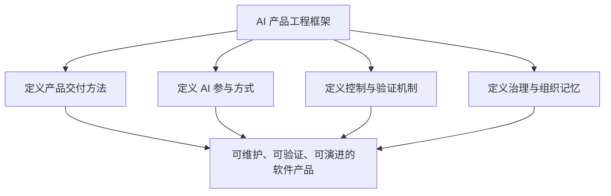
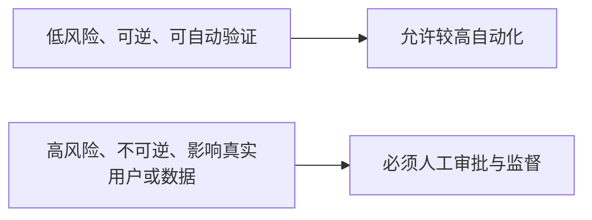

# AI 产品工程边界声明

> 本文明确 AI 产品工程框架负责什么、不负责什么，以及人在何处承担最终责任。边界的目的不是限制创新，而是防止框架退化为无限扩张的工具集合或“全自动软件工厂”口号。

## 1. 框架的责任范围

本框架负责定义和提供：

- 从战略价值验证到持续反馈的产品交付生命周期；
- Context、Harness、Skills、Agents、Loop 五类 AI 工程基础设施；
- 人类角色与 AI Agent 的责任、契约和协作方式；
- 高保真预览、执行边界、质量门禁、模拟用户验收和反馈闭环；
- 设计决策、版本变更、安全权限、指标成本和组织记忆机制；
- 可复用模板、检查清单、门禁、Skills、平台适配和参考工程的建设标准。

## 2. 框架不负责的事项

### 2.1 不替代产品和商业决策

框架可以辅助分析市场、用户和方案，但不能替代责任人决定：

- 是否进入某个市场；
- 是否值得投入资源；
- 商业伦理和社会影响是否可接受；
- 产品范围、优先级和停止条件；
- 风险是否值得承担。

### 2.2 不保证 AI 输出绝对正确

任何模型和 Agent 都可能产生错误、幻觉、遗漏、过度修改或错误解释。框架的目标是提高可控性和发现问题的能力，而不是承诺零错误。

### 2.3 不等同于某个工具或平台

框架不等同于：

- Claude Code、Codex、Kimi、GLM 或其他 AI Coding 产品；
- IDE、命令行工具、Agent Runtime 或模型 API；
- MCP、插件、工作流平台或 CI/CD 产品；
- 某种编程语言、架构模式或云厂商方案。

这些产品可以作为执行平台或适配目标，但不能定义框架本身。

### 2.4 不默认追求无人值守自动化

自动化必须与任务风险、可逆性、权限范围和验证能力匹配。框架不以“完全无人参与”为成熟度标准。

### 2.5 不替代法律、行业与组织制度

涉及隐私、知识产权、金融、医疗、安全生产、劳动关系或其他受监管领域时，必须遵从适用法律、行业规范和组织制度。框架文档不能被当作法律意见或合规批准。

## 3. 人与 AI 的责任边界

### 3.1 人类必须保留的责任

- 价值判断、目标和优先级；
- 产品范围和关键取舍；
- 高保真体验确认；
- 敏感数据、权限和高风险操作审批；
- 重大架构、依赖和治理变更批准；
- 发布决策、最终验收和事故责任；
- 对用户、组织和社会影响的判断。

### 3.2 AI 可以承担的责任

- 信息检索、归纳、分析和方案比较；
- 文档、原型、代码、配置、测试和报告生成；
- 在明确边界内调用工具和执行任务；
- 自动检查、测试、问题定位和候选修复；
- 运行数据、用户反馈和失败原因分析；
- 将验证过的经验整理为候选模板、门禁或 Skill。

### 3.3 AI 不得自行扩张的权限

AI 不得因为任务需要而自行：

- 获取未授权数据或凭据；
- 扩大代码、基础设施或业务系统修改范围；
- 跳过人工确认、质量门禁或审批；
- 将实验性能力标记为稳定标准；
- 隐藏失败、风险、冲突和不确定性；
- 代替责任人作出不可逆或高影响决策。

## 4. 产品生命周期边界

框架覆盖软件产品从价值验证到持续演进的完整闭环，但每个阶段必须有明确退出条件。

| 阶段 | 框架关注 | 不越过的边界 |
|---|---|---|
| 战略与价值验证 | 用户问题、价值、目标、成功指标 | 不代替责任人作商业决策 |
| 产品定义 | 范围、规则、用户故事、验收标准 | 不直接跳到实现 |
| 体验设计 | 流程、页面、状态和交互 | 不用代码结果代替设计 |
| 高保真预览 | 最终体验预览和人工确认 | 未确认不得进入正式实现 |
| 工程规格 | 架构、API、数据、依赖和安全设计 | 不在任务执行中临时改写契约 |
| 受控执行 | 在任务上下文和边界内生成产物 | 不扩大权限和修改范围 |
| 质量验证 | 静态、运行、安全和契约验证 | 不以主观判断代替证据 |
| 用户验收与发布 | 真实任务路径和发布决策 | AI 不承担最终批准责任 |
| 运行反馈与迭代 | 数据、反馈、问题和能力改进 | 不只记录反馈而不形成闭环 |

## 5. 五大 AI 工程基础设施的边界

### Context Engineering

负责向 AI 提供必要、准确、分层和可追溯的事实与规则；不负责无限堆积信息，也不允许用过期文档污染当前任务。

### Harness Engineering

负责阶段、权限、边界、契约、门禁和人工确认；不负责替代模型能力，也不应通过过度规则使任务无法执行。

### Skill Engineering

负责把验证过的方法封装成可复用能力；不负责收集未经验证的 Prompt 或把任何说明文件都称为 Skill。

### Agent Engineering

负责角色职责、协作契约、任务编排和工具使用；不默认认为 Agent 数量越多越先进。

### Loop Engineering

负责观察、评估、修正和经验沉淀；不允许无限重试，也不允许在目标、预算或风险边界之外自我扩张。

## 6. 自动化边界

自动化等级应依据风险进行选择：

| 等级 | 适用情况 | 人工要求 |
|---|---|---|
| 建议 | 需求不清、方向选择、高风险决策 | 人决定是否采用 |
| 辅助执行 | 有明确方案但仍需逐步确认 | 人确认关键阶段 |
| 受控自动执行 | 边界明确、可回滚、可自动验证 | 人查看验证证据 |
| 条件自治 | 低风险、成熟、可观察、可停止 | 人设定预算、权限和告警 |

任何自动化都必须具备：

- 明确目标和停止条件；
- 权限和资源上限；
- 可观察日志和结果；
- 失败、超时和异常处理；
- 人工接管与回滚能力。

## 7. 裁剪边界

框架允许根据项目规模裁剪：

- 一个自然人可以同时承担产品负责人、设计确认人和发布责任人；
- 小任务可以把多个文档合并；
- 已有成熟企业流程可以复用，不必重复建设同类门禁；
- 不同平台可以采用不同文件形式和工具实现。

但不得裁掉：

1. 价值和目标来源；
2. 关键产品与体验确认；
3. AI 执行范围和权限；
4. 可验证的完成证据；
5. 最终责任人；
6. 反馈和变更的可追溯记录。

## 8. v0.1 版本边界

v0.1 负责建立完整地图、统一语言和框架宪法，包含：

- 愿景、定位、适用场景、核心原则和边界；
- 三平面全局模型；
- 产品交付生命周期；
- Context、Harness、Skills、Agents、Loop 的定义和关系；
- 人类与 AI 角色体系；
- 决策记录、模板入口、参考工程要求和 Roadmap。

v0.1 暂不实现：

- 通用 Agent Runtime 或可视化工作台；
- 完整跨平台 Skill 库；
- 企业级权限与审计平台；
- 无人值守生产发布系统；
- 尚未通过参考工程验证的自动化承诺。

## 9. 边界变更规则

以下变化必须形成新的设计决策，并同步更新本文件、`AGENTS.md`、README 和相关专题文档：

- 框架责任范围扩大或缩小；
- 生命周期阶段增加、删除或重新定义；
- 人类最终责任转移给 AI；
- 五大基础设施的定义和边界变化；
- 平台无关原则被改为绑定特定厂商；
- 自动化等级、权限或发布责任发生重大变化。

任何局部实现不得静默改变框架边界。