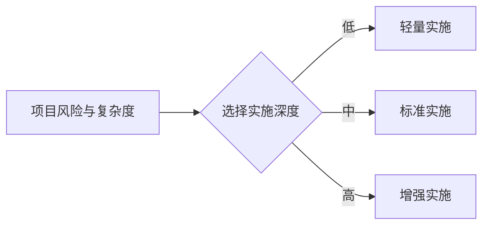
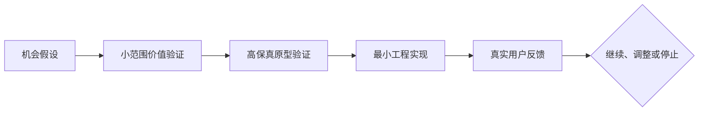

# AI 产品工程适用场景

> 本文用于说明哪些项目适合使用本框架、不同场景应采用多深的工程控制，以及哪些情况下不应机械套用完整流程。

## 1. 场景判断原则

AI 产品工程框架不是要求所有项目都使用相同重量的流程，而是要求关键问题都有明确归属：

- 为什么做；
- 为谁做；
- 做什么与不做什么；
- 用户如何使用；
- 如何预览并确认体验；
- 系统如何实现；
- AI 如何获得上下文并受控执行；
- 如何证明结果正确；
- 如何从反馈进入下一轮改进。

项目规模可以决定文档深度，但不能取消关键问题本身。

## 2. 场景一：个人开发者和独立产品

### 典型项目

- iOS、Android、H5 或小程序产品；
- 个人效率工具；
- 内容创作和运营工具；
- 垂直领域社区或服务产品；
- 小型 SaaS 或付费工具。

### 主要问题

个人通常同时承担产品、设计、开发、测试和运营职责，容易直接进入实现，导致范围失控、设计返工、技术债务和验证不足。

### 框架价值

- 用产品定义和不做清单控制范围；
- 用高保真预览降低体验返工；
- 用 Context Pack 让 AI 在多次任务中保持一致；
- 用任务边界和门禁减少无关修改；
- 用模拟用户验收弥补缺少专职测试人员；
- 用反馈 Loop 决定下一版，而不是不断堆功能。

### 推荐实施深度

采用标准生命周期，但文档可以短小。关键页面、核心流程、数据结构、接口契约和验收用例不可省略。

## 3. 场景二：创业团队和新产品验证

### 典型项目

- 0 到 1 的 MVP；
- 新业务试验；
- 市场机会快速验证；
- 小团队需要同时推进产品、设计和工程。

### 主要问题

团队往往把“更快开发”误认为“更快验证”，但真正风险通常来自价值假设错误、目标用户不清晰和范围过大。

### 框架价值

- 在编码前验证问题和价值假设；
- 明确 MVP、成功指标和终止条件；
- 通过高保真原型先验证体验；
- 让多个 Agent 按契约协作，而不是重复解释；
- 通过数据反馈决定继续、调整或停止。

## 4. 场景三：企业内部数字化和业务应用

### 典型项目

- 运营管理后台；
- 数据应用和指标平台；
- 审批、客服、销售、营销或服务工具；
- 旧系统改造和流程自动化；
- 面向员工、代理人、合作方的内部系统。

### 主要问题

企业项目不仅要求功能可用，还涉及业务口径、权限、数据质量、审计、安全、合规、系统集成和发布治理。

### 框架价值

- 把业务规则和数据口径外置为长期 Context；
- 对 API、数据库、权限和依赖建立契约门禁；
- 限制 Agent 可访问数据和可修改范围；
- 保留决策、执行和验收证据；
- 支持分阶段迁移、回滚和持续运营。

### 推荐实施深度

采用增强实施。必须包含责任人、风险分级、安全与合规检查、数据验证、变更管理、发布和回退方案。

## 5. 场景四：传统研发团队引入 AI Coding

### 典型项目

- 在现有前端、后端、移动端或数据工程中引入 Codex、Claude Code、Kimi、GLM 等；
- 多名开发人员同时使用不同 AI 工具；
- 希望把 AI 产出纳入正式 PR、测试和发布流程。

### 主要问题

如果只给开发者开放 AI 工具，而没有统一 Context、边界、任务格式和验证规则，团队会出现风格不一致、重复实现、架构漂移和不可追溯修改。

### 框架价值

- 用 AGENTS.md、规则和工程规范统一 AI 行为；
- 用任务上下文包统一需求传递；
- 用契约和依赖白名单控制架构变化；
- 用 CI 门禁和评审报告证明质量；
- 用经验沉淀不断改进团队 Skills。

## 6. 场景五：AI 原生产品和 Agent 产品

### 典型项目

- AI 助手；
- 多 Agent 工作流；
- 企业知识问答；
- 自动化运营、客服或研究系统；
- AI 视频、内容或设计生产系统。

### 主要问题

此类产品本身包含模型不确定性，需要同时验证产品体验、模型效果、工具调用、权限、成本和失败恢复。

### 框架价值

- 明确模型、Agent、工具和业务系统的职责；
- 建立提示、知识、工具和输出的版本化 Context；
- 定义人工介入点与失败降级；
- 监控任务成功率、人工修正率、延迟和成本；
- 把失败案例转化为评测集、规则或 Skill 改进。

## 7. 场景六：AI 工程平台和规范维护团队

### 典型项目

- 企业内部 AI 开发平台；
- 统一 Agent 规则、Skill、模板和门禁；
- 跨团队推广 AI 产品工程方法；
- 建设可复用的参考工程。

### 框架价值

- 提供统一的顶层分类，避免能力碎片化；
- 明确哪些属于核心框架、平台适配或业务特例；
- 为模板、Skill 和门禁提供准入标准；
- 用真实参考工程评估框架有效性；
- 通过决策日志管理长期演进。

## 8. 实施深度模型

| 实施模式 | 适用情况 | 最低要求 |
| --- | --- | --- |
| 轻量实施 | 一次性脚本、低风险内部工具、短期验证 | 目标、输入输出、边界、验证、结果记录 |
| 标准实施 | 个人产品、创业 MVP、中小型业务功能 | 产品定义、体验流程、高保真预览、工程规格、任务包、三层验收、反馈 |
| 增强实施 | 企业系统、高风险数据、核心业务、多人协作 | 标准实施全部内容，加安全合规、权限、审计、成本、变更、发布和回退治理 |

## 9. 不适合机械套用完整框架的情况

以下任务通常不需要完整产品生命周期，但仍应保留必要控制：

- 纯知识问答；
- 无持久影响的临时分析；
- 明确且低风险的单文件格式调整；
- 已有成熟规格下的机械性重复工作；
- 概念性头脑风暴。

这类任务可以裁剪流程，但只要 AI 会修改真实系统、处理敏感数据、产生对外内容或影响用户，就必须提高控制级别。

## 10. 适用场景的最终判断

当一个任务同时具备以下任一特征时，应使用本框架：

- 需要跨多个角色或阶段协作；
- 结果将长期维护；
- AI 会直接修改代码、数据、配置或生产资产；
- 错误会影响用户、资金、隐私、安全或合规；
- 需要跨会话、跨模型或跨人员保持项目连续性；
- 需要用真实反馈持续改进产品或 Agent 能力。
