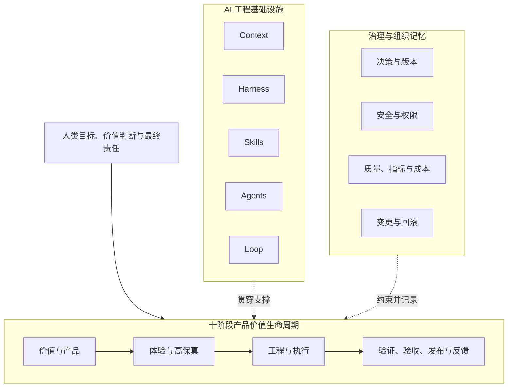

# README 结构规范

> 本文定义根目录 `README.md` 的信息架构、版本表达和维护边界。README 是人类快速理解项目的首页，不替代宪法、专题文档、正式契约和设计决策。

## 1. README 的职责

README 必须让新读者快速回答：

1. 这个项目是什么、不是什么；
2. 为什么需要它；
3. 产品价值生命周期如何运转；
4. Context、Harness、Skills、Agents、Loop 分别解决什么问题；
5. 人与 AI 的责任边界在哪里；
6. 当前稳定版本和开发目标分别是什么；
7. 哪些能力已稳定、哪些仍是候选或开发中；
8. 适合哪些场景；
9. 从哪里继续阅读、使用和贡献。

README 不负责保存全部细节。正式结论必须链接到权威文件。

## 2. 权威关系

```text
宪法、专题文档、正式契约与设计决策
                    ↓
              README 摘要与导航
```

README 不得：

- 独立创造新的生命周期或核心术语；
- 用简化描述覆盖更精确的专题结论；
- 将开发中或候选能力写成稳定能力；
- 只更新首页而不更新事实源；
- 使用与 CHANGELOG、Roadmap 不一致的版本状态。

## 3. 阅读目标

| 阅读时间 | 应获得的认知 |
|---|---|
| 10 秒 | 项目名称、一句话定位、真实概念图 |
| 1 分钟 | 三平面模型、十阶段生命周期、五大基础设施 |
| 5 分钟 | 宪法、责任边界、适用场景、稳定版本与开发状态 |
| 进一步阅读 | 进入 Context、Harness、Skills 与 Agent、Loop、模板、参考工程和决策 |

## 4. 推荐结构

```text
# AI 产品工程框架

一句话定位
真实概念图与权威说明

1. 这是什么
2. 三平面总架构
3. 框架宪法
4. 核心判断
5. 十阶段产品价值生命周期
6. 五大 AI 工程基础设施
7. 适用场景
8. 文档导航
9. 当前稳定版本与开发目标
10. 与实战仓库和执行平台的关系
11. 贡献与治理
12. 许可证状态
```

实际篇幅可以调整，但上述信息必须可定位。

## 5. 顶部区域

### 5.1 标题和定位

推荐：

```markdown
# AI 产品工程框架

> **AI Product Engineering Framework**：一套开放、跨平台、可验证的 AI 产品工程框架。
```

中文是主要表达语言，英文名称用于开源识别和跨语言传播。

### 5.2 真实图片

顶部展示 ChatGPT 生成的真实概念图或仓库内 SVG/PNG：

```markdown

```

图片下必须声明：

- 图片用于快速建立认知；
- 生成图片中的文字和关系可能存在误差；
- 正式定义以 Markdown、Mermaid、契约和设计决策为准。

### 5.3 版本状态

README 必须同时写清：

```text
当前稳定版本：v0.1.1
目标开发版本：v0.2.0
当前里程碑：A / Context 可执行化
```

`v0.2-A` 是里程碑，不是发布版本。详细规则链接到 `10_版本演进/版本管理规范.md`。

## 6. 总架构表达

README 使用精简 Mermaid，详细定义链接到 `02_全局模型/AI产品工程全局框架.md`。



不得将 Context、Harness、Skills、Agents、Loop 排成产品生命周期阶段。

## 7. 框架宪法导航

README 必须分别链接：

| 宪法文件 | 回答的问题 |
|---|---|
| 愿景与定位 | 为什么存在、是什么、不是什么 |
| 适用场景与期望 | 哪些项目适用、实施多深、版本期望是什么 |
| 核心原则 | 新能力进入框架必须满足什么 |
| 边界声明 | 框架负责什么、不负责什么，人和 AI 如何分工 |

不能只提供一个笼统的“框架定义”入口。

## 8. 生命周期表达

README 使用统一十阶段口径：

```text
战略与价值验证
→ 产品定义
→ 用户体验设计
→ 高保真原型预览与确认
→ 工程规格设计
→ 受控任务执行
→ 质量与安全验证
→ 模拟用户验收
→ 发布交付
→ 运行反馈与持续迭代
```

模拟用户验收与发布交付不得合并。

## 9. 五大基础设施表达

| 基础设施 | README 中的核心问题 |
|---|---|
| Context Engineering | AI 凭什么理解项目？ |
| Harness Engineering | 如何让 AI 在边界和门禁内执行？ |
| Skill Engineering | 如何把验证过的方法封装为能力？ |
| Agent Engineering | 谁承担任务，如何协作和升级？ |
| Loop Engineering | 如何观察、纠偏、停止并沉淀？ |

README 只给摘要，详细内容进入对应模块。

## 10. 当前权威目录

README 的仓库结构必须以实际目录为准：

```text
.
├── README.md
├── AGENTS.md
├── CHANGELOG.md
├── CONTRIBUTING.md
├── assets/
├── 01_框架定义/
├── 02_全局模型/
├── 03_角色体系/
├── 04_Context工程/
├── 05_Harness工程/
├── 06_Skills与Agent/
├── 07_Loop工程/
├── 08_模板资产/
├── 09_参考工程/
├── 10_版本演进/
├── 11_设计决策/
└── 12_框架项目Context/
```

禁止重新创建已删除的同义目录，例如：

- `02_核心模型`；
- `05_设计决策记录`；
- 与现有 Context、Harness 或版本目录含义相同的新目录。

未来新增一级目录必须说明现有目录为什么不能承载，并在必要时形成设计决策。

## 11. 当前完成度表达

README 必须区分：

### 稳定版本

说明已经正式复核和接受的内容。例如 v0.1.1 的宪法、三平面模型、十阶段生命周期、角色和基础设施定位。

### 开发中

说明目标发布版本和里程碑。例如 v0.2.0 / A：Context 可执行化。

### 候选资产

明确模板、门禁、Skills 或适配是否只经过自应用、单项目验证或跨项目验证。

不得使用“已完成”掩盖仍缺业务参考工程验证的能力。

## 12. 导航要求

README 至少链接：

- 四份宪法文档；
- 全局模型；
- 角色体系；
- Context、Harness、Skills 与 Agent、Loop；
- 模板和参考工程；
- Roadmap、版本规范和全量复核报告；
- 设计决策索引；
- Framework 自身项目 Context；
- `AGENTS.md` 和 `CONTRIBUTING.md`。

## 13. 与执行平台的关系

README 应明确：Claude Code、Codex、Kimi、GLM 等是执行平台或适配目标，不是框架本身。

核心标准保持平台无关；平台差异进入后续适配资产，并必须记录真实能力限制。

## 14. 贡献与许可证

README 应链接 `CONTRIBUTING.md`。

如果尚未选择许可证，应明确标记“许可证待维护者决定”，不能让公开可读状态被误解为已经授予明确开源许可。不得由 Agent 自行选择或更换许可证。

## 15. 维护规则

1. README 摘要必须来自权威事实源；
2. 核心模型、版本、边界和责任变化时必须同步；
3. 不堆放平台命令、模板全文和实现细节；
4. 图片、Mermaid 和文字必须表达一致；
5. 版本状态必须与 CHANGELOG、Roadmap 和项目 Context 一致；
6. 新链接提交前必须验证；
7. 已删除或替代文档不得继续作为导航入口；
8. 真实 Review 发现的问题应进入复核报告，不只改首页。

## 16. 验收清单

- [ ] 10 秒内能够理解项目定位；
- [ ] 真实图片正常显示并标明权威边界；
- [ ] Mermaid 可以在 GitHub 渲染；
- [ ] 三平面模型和十阶段口径正确；
- [ ] 生命周期与五大基础设施没有混用；
- [ ] 四份宪法文档分别可达；
- [ ] 稳定版本、目标版本和里程碑清楚；
- [ ] 候选能力没有被描述为稳定；
- [ ] 仓库结构与实际目录一致；
- [ ] Context 和设计决策入口有效；
- [ ] 贡献规范和许可证状态明确；
- [ ] 没有过期、重复或冲突定义；
- [ ] 所有内部链接有效。
