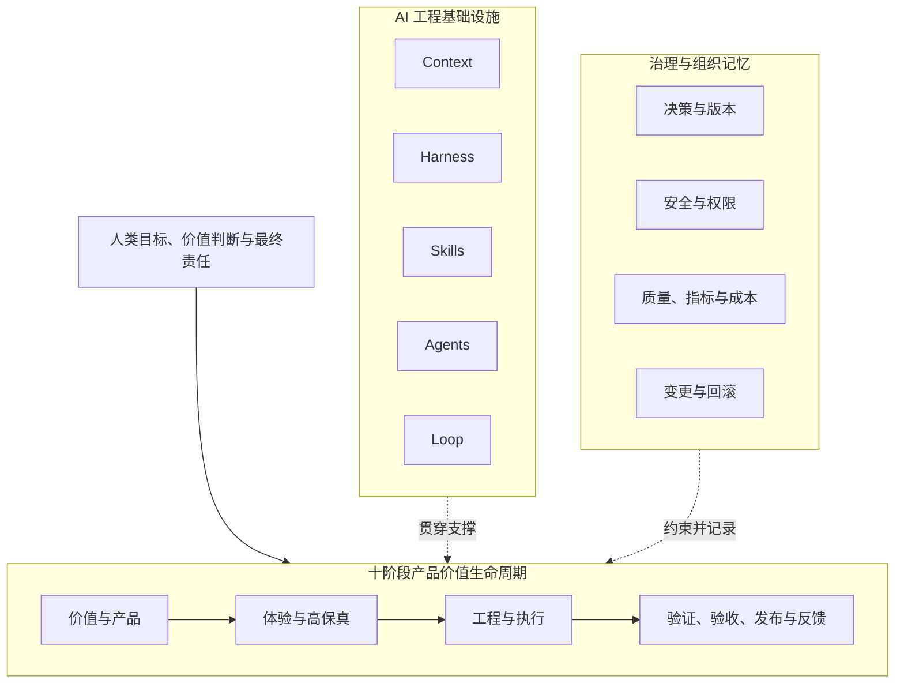

# README 结构规范

> 本文定义根目录 `README.md` 的信息架构、版本表达和维护边界。README 是人类快速理解项目的首页，不替代宪法、专题文档、正式约定、项目 Context 和设计决策。

中文术语遵循：[术语与易懂表达规范](术语与易懂表达规范.md)。

## 1. README 的职责

README 必须让新读者快速回答：

1. 这个项目是什么、不是什么；
2. 为什么需要它；
3. 产品价值生命周期如何运转；
4. Context、Harness、Skills、Agents、Loop 分别解决什么问题；
5. 人与 AI 的责任边界在哪里；
6. 当前稳定版本和开发目标分别是什么；
7. 当前里程碑、工作段、执行状态和阻塞是什么；
8. 哪些能力已稳定、哪些仍是候选或开发中；
9. 适合哪些场景；
10. 从哪里继续阅读和参与经授权协作。

README 不负责保存全部细节。正式结论必须链接到权威文件。

## 2. 权威关系

```text
宪法、专题文档、正式约定与设计决策
                    ↓
版本边界：VERSION / CHANGELOG
开发路线：Roadmap
当前运行状态：Framework 项目 Context
                    ↓
              README 摘要与导航
```

README 不得：

- 独立创造新的生命周期或核心术语；
- 用简化描述覆盖更精确的专题结论；
- 将开发中或候选能力写成稳定能力；
- 只更新首页而不更新事实源；
- 使用与 VERSION、CHANGELOG、Roadmap 或项目 Context 不一致的状态；
- 把历史任务或验证报告中的旧状态写成当前状态；
- 使用与 LICENSE 不一致的开放或授权表述。

## 3. 阅读目标

| 阅读时间 | 应获得的认知 |
|---|---|
| 10 秒 | 项目名称、一句话定位、专有权利提示和概念图 |
| 1 分钟 | 三平面模型、十阶段生命周期、五大基础设施 |
| 5 分钟 | 宪法、责任边界、稳定版本、开发目标、当前工作段和阻塞 |
| 进一步阅读 | 进入 Context、Harness、Skills 与 Agent、Loop、模板、参考工程和设计决策 |

## 4. 推荐结构

```text
# AI 产品工程框架

一句话定位与专有权利声明
真实概念图与权威说明

1. 当前版本与执行状态
2. 这是什么
3. 三平面总架构
4. 框架宪法
5. 核心判断
6. 十阶段产品价值生命周期
7. 五大 AI 工程基础设施
8. 适用场景
9. 文档导航
10. 与实战仓库和执行平台的关系
11. 当前进展摘要
12. 贡献与治理
13. 专有许可证
```

实际篇幅可以调整，但上述信息必须可定位。

## 5. 顶部区域

### 5.1 标题和定位

推荐：

```markdown
# AI 产品工程框架

> **AI Product Engineering Framework**：一套由 zhidao-studio 专有维护、跨平台、可验证的 AI 产品工程框架。

> **专有权利声明：** 本仓库不是开源项目，正式条款见 LICENSE。
```

中文是主要表达语言，英文名称用于稳定识别和跨语言说明，不表示开放许可。

### 5.2 真实图片

顶部展示 ChatGPT 生成的真实概念图或仓库内 SVG/PNG：

```markdown

```

图片下必须声明：

- 图片用于快速建立认知；
- 生成图片中的文字和关系可能存在误差；
- 正式定义以 Markdown、Mermaid、约定和设计决策为准。

### 5.3 版本与执行状态

README 必须同时写清：

```text
当前稳定版本：v0.1.6
目标开发版本：v0.2.0
当前开发里程碑：A / Context 可执行化
当前工作段：A2 / YouYu 业务功能准备
执行状态：active
业务准备：in_progress
正式业务实现：blocked
阻塞原因：历史敏感信息、共享会话与下游网络隔离、采集待审入库运行验证和 iOS 真机人工体验验收尚未关闭
许可证：Proprietary / All Rights Reserved
```

必须同时链接：

- `VERSION`：稳定版本；
- `CHANGELOG.md`：版本边界；
- `10_版本演进/Roadmap.md`：目标、里程碑和退出标准；
- `12_框架项目Context/README.md`：当前状态、阻塞和下一步。

`v0.2-A` 是建设里程碑，不是发布版本；`A1/A2` 是工作段说明，不是版本编号。

## 6. 总架构表达

README 使用精简 Mermaid，详细定义链接到 `02_全局模型/AI产品工程全局框架.md`。



不得将 Context、Harness、Skills、Agents、Loop 排成产品生命周期阶段。

## 7. 框架宪法导航

README 必须分别链接：

| 宪法文件 | 回答的问题 |
|---|---|
| 愿景与定位 | 为什么存在、是什么、不是什么 |
| 适用场景与期望 | 哪些项目适用、实施多深、版本期望是什么 |
| 核心原则 | 新能力进入框架必须满足什么 |
| 边界声明 | 框架负责什么、不负责什么，人和 AI 如何分工 |

术语规范应作为治理入口单独链接，但不替代四份宪法文档。

## 8. 生命周期表达

README 使用统一十阶段口径：

```text
战略与价值验证
→ 产品定义
→ 用户体验设计
→ 高保真原型预览与确认
→ 工程规格设计
→ 受控任务执行
→ 质量与安全验证
→ 模拟用户验收
→ 发布交付
→ 运行反馈与持续迭代
```

模拟用户验收与发布交付不得合并。

## 9. 五大基础设施表达

| 基础设施 | README 中的核心问题 |
|---|---|
| Context Engineering | AI 凭什么理解项目？ |
| Harness Engineering | 如何让 AI 在边界、约定和检查关卡内执行？ |
| Skill Engineering | 如何把验证过的方法封装为能力？ |
| Agent Engineering | 谁承担任务，如何协作和升级？ |
| Loop Engineering | 如何观察、纠偏、停止并沉淀？ |

README 只给摘要，详细内容进入对应模块。

## 10. 当前权威目录

README 的仓库结构必须以实际目录为准：

```text
.
├── README.md
├── AGENTS.md
├── CHANGELOG.md
├── CONTRIBUTING.md
├── LICENSE
├── VERSION
├── assets/
├── 01_框架定义/
├── 02_全局模型/
├── 03_角色体系/
├── 04_Context工程/
├── 05_Harness工程/
├── 06_Skills与Agent/
├── 07_Loop工程/
├── 08_模板资产/
├── 09_参考工程/
├── 10_版本演进/
├── 11_设计决策/
└── 12_框架项目Context/
```

禁止重新创建已删除的同义目录，例如：

- `02_核心模型`；
- `05_设计决策记录`；
- 与现有 Context、Harness 或版本目录含义相同的新目录。

未来新增一级目录必须说明现有目录为什么不能承载，并在必要时形成设计决策。

## 11. 当前完成度表达

README 必须区分：

### 稳定版本

说明已经正式复核和接受的内容，并以 `VERSION` 和 CHANGELOG 为准。

### 开发中

说明目标发布版本、当前里程碑和工作段，例如：

```text
v0.2.0 / A：Context 可执行化
A1：规范与自应用——已完成
A2：正式业务验证准备——blocked
```

### 候选资产

明确模板、检查关卡、Skills 或适配是否只经过自应用、单项目验证或跨项目验证。

不得使用“已完成”掩盖仍缺正式业务参考工程验证的能力。初步工程证据也不得描述为正式参考工程已通过。

### 历史快照

历史 TASK、验证和发布报告可以链接，但 README 不得直接采用其中的旧状态作为当前状态。历史文件与当前项目 Context 冲突时，必须使用当前项目 Context，并说明历史文件只反映当时判断。

## 12. 导航要求

README 至少链接：

- 四份宪法文档和术语规范；
- 全局模型；
- 角色体系；
- Context、Harness、Skills 与 Agent、Loop；
- 模板和参考工程；
- Roadmap、版本规范和当前发布报告；
- 设计决策索引；
- Framework 自身项目 Context；
- `AGENTS.md`、`CONTRIBUTING.md` 和 `LICENSE`。

## 13. 与执行平台的关系

README 应明确：Claude Code、Codex、Kimi、GLM 等是执行平台或适配目标，不是框架本身。

核心标准保持平台无关；平台差异进入后续适配资产，并必须记录真实能力限制。

## 14. 协作与许可证

- README 必须链接 `CONTRIBUTING.md`；
- 本项目采用专有闭源许可，README 必须链接根目录 `LICENSE`；
- Public 可见性不等于授权使用；
- 不得由 Agent 自行选择、更换、放宽或删除许可证；
- 仓库可见性、商业授权和外部使用权由项目维护者决定；
- 若已核验仓库可见性，应明确写出核验结果和仍需人工执行的动作。

## 15. 维护规则

1. README 摘要必须来自权威事实源；
2. 当前状态、阻塞和下一步只在项目 Context 详细维护；
3. 核心模型、版本、边界、术语和责任变化时必须同步；
4. 不堆放平台命令、模板全文和实现细节；
5. 图片、Mermaid 和文字必须表达一致；
6. 版本状态必须与 VERSION、CHANGELOG、Roadmap 和项目 Context 一致；
7. 新链接提交前必须验证；
8. 已删除或替代文档不得继续作为权威导航入口；
9. 真实 Review 发现的问题应进入复核报告，不只改首页；
10. 中文主要表述使用“约定”和“检查关卡”，必要技术名和机器标识按规范保留；
11. 历史快照不得覆盖当前状态。

## 16. 验收清单

- [ ] 10 秒内能够理解项目定位；
- [ ] 专有权利和许可证入口明确；
- [ ] 真实图片正常显示并标明权威边界；
- [ ] Mermaid 可以在 GitHub 渲染；
- [ ] 三平面模型和十阶段口径正确；
- [ ] 生命周期与五大基础设施没有混用；
- [ ] 四份宪法文档和术语规范分别可达；
- [ ] 稳定版本、目标版本、里程碑、工作段和执行状态清楚；
- [ ] 当前状态入口明确指向项目 Context；
- [ ] 候选能力没有被描述为稳定；
- [ ] 正式参考工程状态没有被初步证据夸大；
- [ ] 历史快照没有覆盖当前状态；
- [ ] 仓库结构与实际目录一致；
- [ ] Context 和设计决策入口有效；
- [ ] 协作规范和许可证状态明确；
- [ ] 中文术语符合当前规范；
- [ ] 没有过期、重复或冲突定义；
- [ ] 所有内部链接有效。
