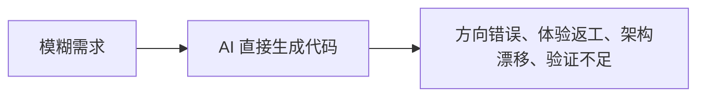
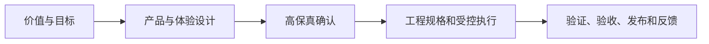
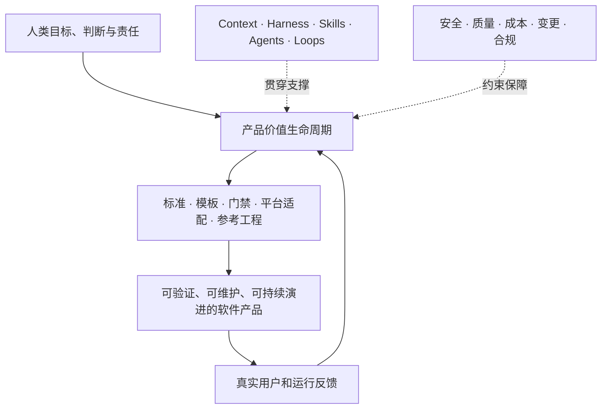
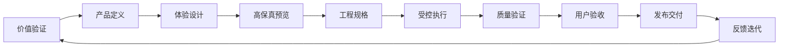

# README 结构规范

> 本文定义 AI Product Engineering Framework 根目录 `README.md` 的信息架构、阅读顺序和维护边界。README 是新读者进入项目的首页，不承担全部正式规范，但必须能够在较短时间内建立正确认知并导航到权威文档。

## 1. README 的职责

README 必须回答以下问题：

1. 这个项目是什么？
2. 为什么需要它？
3. 它解决哪些问题？
4. 整体架构是什么？
5. 产品生命周期和五类 AI 工程能力分别是什么？
6. 适合哪些人和项目？
7. 当前版本完成了什么、没有完成什么？
8. 从哪里开始阅读和使用？
9. 如何参与贡献？

README 不应成为全部规范的复制品。正式定义应链接到宪法层和核心模型文档。

## 2. 首页阅读目标

新读者应在以下时间内获得对应认知：

| 阅读时间 | 应获得的认知 |
| --- | --- |
| 10 秒 | 项目名称、一句话定位、总架构视觉图 |
| 1 分钟 | 为什么存在、双维度模型、适用对象 |
| 5 分钟 | 生命周期、五大工程基础设施、核心原则、v0.1 范围 |
| 进一步阅读 | 进入权威文档、角色体系、Context、Harness、Skills、Agents、Loops 和 Roadmap |

## 3. 推荐 README 结构

```text
# AI Product Engineering Framework

项目徽章与当前版本

一句话定位

真实总架构图

1. 为什么需要本框架
2. 框架是什么与不是什么
3. 总体架构
4. 产品价值生命周期
5. 五类 AI 工程基础设施
6. 核心原则
7. 适用场景
8. 当前版本与完成度
9. 仓库结构
10. 快速阅读路径
11. 与 Claude Code、Codex、Kimi、GLM 的关系
12. Roadmap
13. 贡献与治理
14. License
```

## 4. 顶部区域

### 4.1 标题

```markdown
# AI Product Engineering Framework

AI 产品工程框架
```

英文名称用于开源识别和跨语言传播，中文名称用于主要内容表达。

### 4.2 一句话定位

推荐使用：

> 一套开放、跨平台、可验证的软件产品生产框架，指导人类与 AI Agent 从产品机会、高保真原型、工程实现到发布反馈，持续交付真正可用的软件产品。

### 4.3 状态提示

README 必须明确当前版本仍处于什么阶段，例如：

```markdown
> 当前版本：v0.1（框架宪法与全局模型阶段）
>
> 当前重点是建立稳定的全局地图和判断标准，尚未提供完整自动化 Agent 平台。
```

避免让读者把早期框架误解为已经成熟的生产平台。

### 4.4 真实图片

顶部使用 ChatGPT 生成的真实总架构图片：

```markdown

```

图片用于快速认知，紧随其后的 Mermaid 图和权威文档用于正式定义。

## 5. 为什么需要本框架

用最少文字说明从“AI 生成代码”到“AI 参与产品工程”的差距。



与：



README 只呈现核心问题，详细论证链接到《AI 产品工程框架愿景与定位》。

## 6. 框架是什么与不是什么

README 应用短列表明确：

### 是什么

- AI Agent 时代的软件产品工程方法与执行框架；
- 跨平台的 Context、Harness、Skill、Agent 和 Loop 标准；
- 标准、模板、门禁和参考工程的集合；
- 人类判断与 AI 受控执行的协作体系。

### 不是什么

- Prompt 收藏库；
- 无序 Skills 集合；
- 只关注代码生成的教程；
- 某个厂商或模型的专用插件；
- 无需人类负责的全自动软件工厂。

## 7. 总体架构

README 采用一张精简 Mermaid 图，详细版本链接到《AI 产品工程总架构》。



## 8. 产品价值生命周期

README 用一行主流程展示十个阶段，并为每个阶段提供一句话说明，不在首页展开完整模板和产物列表。



## 9. 五类 AI 工程基础设施

建议用五列简表：

| 能力 | 核心问题 | 简要说明 |
| --- | --- | --- |
| Context Engineering | AI 知道什么？ | 项目记忆、阶段知识、任务上下文、决策经验 |
| Harness Engineering | AI 遵守什么？ | 阶段、边界、契约、权限、门禁、人工确认 |
| Skill Engineering | AI 会做什么？ | 可触发、可复用、可验证、可维护的标准能力 |
| Agent Engineering | 由谁执行？ | 角色、协作、任务分配、工具、状态和人工介入 |
| Loop Engineering | 如何改进？ | 目标、执行、观察、评估、纠偏和知识沉淀 |

## 10. 核心原则

README 只列出原则摘要，并链接到完整原则文件。建议首页展示：

1. 目标先于任务；
2. 价值验证先于规模投入；
3. 设计和高保真预览先于实现；
4. 上下文必须外置；
5. AI 必须受控执行；
6. 契约先于协作；
7. 所有输出必须可验证；
8. 人负责价值判断和最终责任；
9. 反馈必须形成 Loop；
10. 框架必须通过真实项目验证。

## 11. 适用场景

README 展示四类主要对象：

- 个人开发者；
- 创业和小团队；
- 企业内部数字化团队；
- 引入 AI Coding 的传统研发团队。

AI 原生产品、Agent 平台和工程治理团队可作为扩展场景链接到完整文档。

## 12. 当前版本与完成度

README 必须清晰区分“已建立”“正在建设”“未来规划”。

### v0.1 已建立

- 宪法层；
- 总架构和双维度模型；
- 生命周期和五类 AI 工程能力定位；
- 边界、适用场景和核心原则；
- 决策记忆机制。

### 正在建设

- Context 规范；
- Harness 规范；
- 角色和协作模型；
- 模板体系和门禁定义。

### 后续规划

- Skills 实现；
- 多平台适配；
- H5、iOS、后端、数据和 AI 原生参考工程；
- 自动化检查和执行流水线。

## 13. 仓库结构

README 只展示一级和关键二级目录，不应把所有文件完整复制到首页。

推荐结构：

```text
.
├── README.md
├── AGENTS.md
├── CHANGELOG.md
├── assets/
├── 01_框架定义/
├── 02_核心模型/
├── 03_Context工程/
├── 04_角色体系/
├── 05_设计决策记录/
├── 06_Harness规范/
├── 07_Skill体系/
├── 08_模板资产/
├── 09_门禁与验证/
├── 10_平台适配/
├── 11_参考工程/
└── 12_版本演进/
```

目录编号负责稳定阅读顺序。除必须兼容的根文件外，目录和文档使用中文命名。

## 14. 快速阅读路径

README 应提供不同读者路径：

### 第一次了解项目

1. 愿景与定位；
2. 总架构；
3. 核心原则；
4. 适用场景和边界。

### 准备在项目中使用

1. Context 工程；
2. Harness 规范；
3. 任务上下文模板；
4. 验收和门禁；
5. 对应平台适配。

### 准备贡献框架

1. AGENTS.md；
2. 核心原则；
3. 边界声明；
4. 设计决策规范；
5. CONTRIBUTING.md。

## 15. 与执行平台的关系

README 应明确：Claude Code、Codex、Kimi 和 GLM 是执行平台，不是框架本身。平台特定内容必须进入适配目录，核心文档保持跨平台。

## 16. Roadmap、贡献和许可证

README 底部应包含：

- 版本路线图链接；
- CHANGELOG 链接；
- 贡献规范链接；
- 设计决策入口；
- License。

## 17. README 维护规则

1. README 内容必须来自权威文档，不单独创造新的核心定义；
2. README 保持“可快速阅读”，详细内容通过链接下沉；
3. 总架构、核心阶段或边界变化时，README 必须同步更新；
4. 不在 README 堆放大量平台命令、模板正文和实现细节；
5. 图片、Mermaid 和文字必须表达一致；
6. README 中的当前版本和完成度必须真实，不夸大可用能力；
7. 所有新增链接在提交前必须验证有效。

## 18. README 验收清单

- [ ] 10 秒内能够理解项目定位；
- [ ] 真实总架构图可以正常显示；
- [ ] Mermaid 图能够在 GitHub 正常渲染；
- [ ] 明确区分生命周期和 AI 工程基础设施；
- [ ] 包含“是什么”和“不是什么”；
- [ ] 包含适用对象和当前版本边界；
- [ ] 链接到所有宪法层权威文档；
- [ ] 仓库结构与实际目录一致；
- [ ] 没有过期、重复或互相冲突的定义；
- [ ] 所有内部链接有效。
