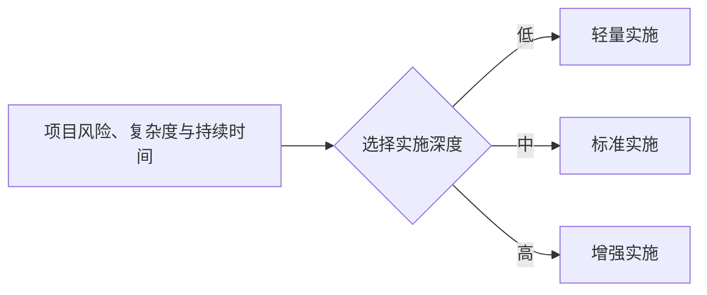
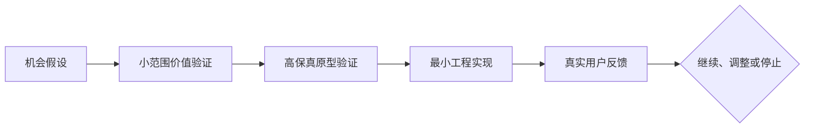

# 适用场景与期望

> 本文说明哪些项目适合使用本框架、不同场景应采用多深的工程控制，以及各版本希望达到什么可验证结果。

## 1. 场景判断原则

AI 产品工程框架不是要求所有项目使用相同重量的流程，而是要求关键问题都有明确归属：

- 为什么做、为谁做；
- 做什么与不做什么；
- 用户如何完成目标；
- 如何在编码前预览并确认体验；
- 系统如何实现；
- AI 如何获得正确 Context 并在边界内执行；
- 如何证明结果正确、可用和安全；
- 如何把真实反馈带入下一轮改进。

项目规模可以决定文档深度、角色数量和自动化程度，但不能取消关键问题本身。

## 2. 个人开发者和独立产品

### 典型项目

- iOS、Android、H5 或小程序产品；
- 个人效率工具、垂直服务、小型 SaaS；
- 内容创作、运营和自动化工具；
- 独立开发者长期维护的开源或商业产品。

### 主要问题

个人通常同时承担产品、设计、开发、测试和运营职责，容易直接进入实现，导致范围失控、设计返工、技术债务和验证不足。

### 框架价值

- 用产品定义和不做清单控制范围；
- 用高保真预览降低体验返工；
- 用项目 Context Pack 保持跨会话一致性；
- 用任务边界和门禁减少无关修改；
- 用模拟用户验收弥补缺少专职测试人员；
- 用反馈 Loop 决定下一版，而不是不断堆功能。

### 期望

一个人可以像管理小型软件团队一样管理多个 AI 角色，独立完成可维护 MVP，而不是只生成一次性样品。

## 3. 创业团队和新产品验证

### 典型项目

- 0 到 1 的 MVP；
- 新业务试验与市场机会验证；
- 2 至 10 人小团队同时推进产品、设计和工程。

### 主要问题

团队往往把“更快开发”误认为“更快验证”，但真正风险通常来自价值假设错误、目标用户不清晰和范围过大。

### 框架价值

- 在编码前验证用户问题和价值假设；
- 明确 MVP、成功指标和终止条件；
- 通过高保真原型先验证体验；
- 让多个 Agent 按契约协作，而不是反复解释；
- 通过数据反馈决定继续、调整或停止。

### 期望

更早发现方向错误，降低市场和工程试错成本，而不只是缩短编码时间。

## 4. 企业内部数字化和业务应用

### 典型项目

- 运营管理后台、数据应用和指标平台；
- 审批、客服、销售、营销或服务工具；
- 旧系统改造和流程自动化；
- 面向员工、代理人或合作方的内部系统。

### 主要问题

企业项目不仅要求功能可用，还涉及业务口径、权限、数据质量、审计、安全、合规、系统集成和发布治理。

### 框架价值

- 把业务规则和数据口径外置为长期 Context；
- 对 API、数据库、权限和依赖建立契约门禁；
- 限制 Agent 可访问数据和可修改范围；
- 保留决策、执行和验收证据；
- 支持分阶段迁移、发布、监控和回滚。

### 期望

在治理要求下提高交付速度，同时保持责任、口径和变更可追溯。

## 5. 传统研发团队引入 AI Coding

### 典型项目

- 在现有前端、后端、移动端或数据工程中引入 Codex、Claude Code、Kimi、GLM 等；
- 多名开发人员同时使用不同 AI 工具；
- 将 AI 产出纳入正式 PR、测试和发布流程。

### 主要问题

如果只开放 AI 工具，而没有统一 Context、边界、任务格式和验证规则，团队会出现风格不一致、重复实现、架构漂移和不可追溯修改。

### 框架价值

- 用 `AGENTS.md`、规则和工程规范统一 AI 行为；
- 用任务 Context Pack 统一需求传递；
- 用契约和依赖白名单控制架构变化；
- 用 CI 门禁和验证报告证明质量；
- 用经验沉淀不断改进团队 Skills。

### 期望

提高研发效率，但不绕过既有产品、设计、评审、测试和发布责任体系。

## 6. AI 原生产品、Agent 产品与内容工厂

### 典型项目

- AI 助手、多 Agent 工作流和企业知识问答；
- 自动化运营、客服、研究或数据处理系统；
- AI 视频、内容、设计和营销生产系统。

### 主要问题

此类产品本身包含模型不确定性，需要同时验证产品体验、模型效果、知识检索、工具调用、权限、成本和失败恢复。

### 框架价值

- 明确模型、Agent、工具和业务系统的职责；
- 建立提示、知识、工具和输出的版本化 Context；
- 定义人工介入点、失败降级和停止条件；
- 监控任务成功率、人工修正率、延迟和成本；
- 把失败案例转化为评测集、规则、门禁或 Skill 改进。

### 期望

把生成、人工质检、发布表现和下一轮优化连接成持续 Loop，而不是一次性生成流水线。

## 7. AI 工程平台和规范维护团队

### 典型项目

- 企业内部 AI 开发平台；
- 统一 Agent 规则、Skills、模板和门禁；
- 跨团队推广 AI 产品工程方法；
- 建设可复用参考工程。

### 框架价值

- 提供统一顶层分类，避免能力碎片化；
- 明确核心框架、平台适配和业务特例的边界；
- 为模板、Skill 和门禁提供准入标准；
- 用真实参考工程评估框架有效性；
- 通过设计决策管理长期演进。

## 8. 实施深度模型

| 实施模式 | 适用情况 | 最低要求 |
|---|---|---|
| 轻量实施 | 一次性脚本、低风险内部工具、短期验证 | 目标、输入输出、修改边界、验证方法、结果记录 |
| 标准实施 | 个人产品、创业 MVP、中小型业务功能 | 产品定义、体验流程、高保真预览、工程规格、任务包、三层验证、反馈 |
| 增强实施 | 企业系统、高风险数据、核心业务、多人协作 | 标准实施全部内容，加安全合规、权限、审计、成本、变更、发布和回滚治理 |

框架可以裁剪，但不能删除价值判断、关键人工确认、执行边界、验证证据和反馈闭环。

## 9. 不适合机械套用完整框架的情况

以下任务通常不需要完整产品生命周期，但仍应保留必要控制：

- 纯知识问答或概念性头脑风暴；
- 无持久影响的临时分析；
- 明确且低风险的单文件格式调整；
- 已有成熟规格下的机械性重复工作。

只要 AI 会修改真实系统、处理敏感数据、产生对外内容或影响用户，就必须提高控制级别。

## 10. 分版本期望

### v0.1：建立统一认知

任何参与者打开仓库，都能回答：框架是什么、为什么存在、十阶段生命周期是什么、五大基础设施是什么、谁负责什么、核心边界在哪里。

### v0.2：形成可执行 Context 与 Harness

能够使用项目 Context Pack、任务 Context Pack、阶段门禁、修改边界、契约检查和三层验证控制一次真实任务。

### v0.3：形成可复用 Skills

将已验证的产品、设计、架构、开发、验证和反馈方法封装为平台可适配的 Skills。

### v0.4：通过参考工程验证

至少使用两类真实工程，完整验证从产品定义、高保真预览到发布反馈的闭环。

### v0.5：形成 Agent 编排和多级 Loop

在保留关键人工决策的前提下，连接多个角色并具备失败分类、升级、停止和可视化验证报告。

### v1.0：形成跨平台可验证框架

明确哪些能力是平台无关标准、哪些需要 Claude Code、Codex、Kimi 或 GLM 适配，并提供可复用的真实验证结果。

## 11. 最终期望

框架不是让 AI 代替所有人，而是让一个人或团队可以像管理软件团队一样管理 AI：看得见目标、阶段、输入、输出、权限、风险、验证结果、成本和下一步决策。
