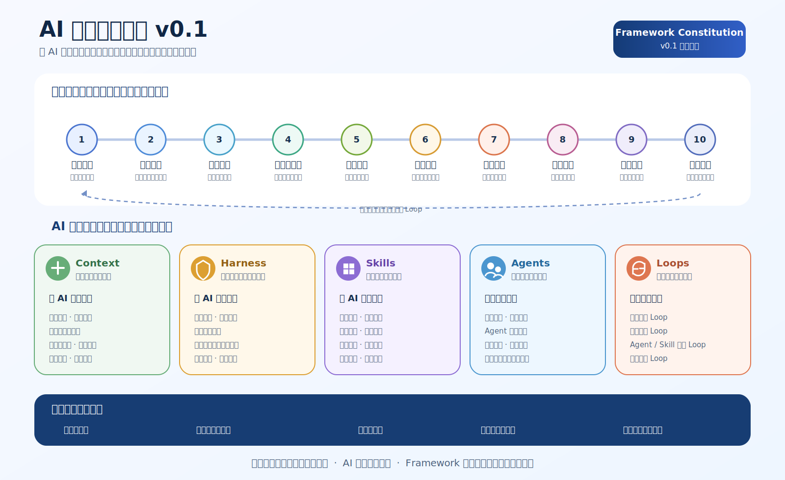
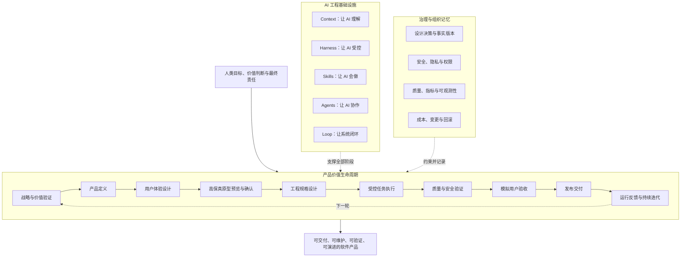

# AI 产品工程全局框架

> 本文是 v0.1 的权威总架构定义。它说明产品如何产生价值、AI 如何可靠参与，以及治理与组织记忆如何贯穿全过程。

## 1. 阅读说明与权威顺序

本框架使用三种图文表达：

1. **ChatGPT 生成的概念图片**：帮助快速建立整体认知；
2. **SVG 与 Mermaid 图**：表达可维护的结构、流程和关系；
3. **Markdown 正文**：定义正式术语、规则和边界。

如图片文字与正式定义存在差异，以 Markdown 正文、已批准设计决策和 Mermaid 模型为准。

## 2. 概念总览

> 该图片由 ChatGPT 生成，用于认知和传播，不作为细节文字的单一事实源。

## 3. 为什么采用三平面模型

产品生命周期、AI 工程能力和治理机制不是同一种事物：

- **产品价值生命周期**描述产品按什么顺序从机会走向持续价值；
- **AI 工程基础设施**描述每个阶段如何让 AI 理解、受控、具备能力、组织协作并形成闭环；
- **治理与组织记忆**描述谁负责、为什么这样决定、如何控制安全、成本、变更和长期风险。

将它们全部排成一条“十几层流水线”会产生错误含义，例如 Context 只在工程设计后出现、Loop 只在发布后出现。实际上 Context、Harness 和 Loop 必须贯穿全部生命周期。

## 4. 产品价值生命周期

根据 [DEC-005](../11_设计决策/DEC-005_拆分模拟用户验收与发布交付阶段.md)，生命周期统一为十个阶段：

| 阶段 | 核心问题 | 关键产物或证据 |
|---|---|---|
| 1. 战略与价值验证 | 为什么值得做？ | 用户问题、价值假设、成功指标、停止条件 |
| 2. 产品定义 | 做什么与不做什么？ | PRD、范围、不做清单、业务规则、验收断言 |
| 3. 用户体验设计 | 用户如何完成目标？ | 用户流程、信息架构、页面与状态设计 |
| 4. 高保真原型预览与确认 | 最终体验是否符合预期？ | 高保真页面、关键交互、状态覆盖、人工确认记录 |
| 5. 工程规格设计 | 系统如何实现？ | 架构、API、数据、依赖、安全和环境规格 |
| 6. 受控任务执行 | AI 可以在什么范围内完成什么任务？ | 任务上下文包、代码、配置、文档和变更说明 |
| 7. 质量与安全验证 | 系统是否正确、可靠和安全？ | 静态审查、契约检查、运行测试和安全结果 |
| 8. 模拟用户验收 | 真实用户路径是否可用？ | 用户脚本、设备与异常场景、验收报告 |
| 9. 发布交付 | 是否具备进入目标环境的条件？ | 发布清单、迁移、监控、回滚和批准记录 |
| 10. 运行反馈与持续迭代 | 真实使用如何改变下一轮？ | 指标、反馈、问题归因、优先级和改进决策 |

模拟用户验收和发布交付必须分开：前者证明产品可用，后者批准版本进入目标环境并承担生产变更责任。

## 5. 五大 AI 工程基础设施

| 基础设施 | 回答的问题 | 核心资产 |
|---|---|---|
| Context Engineering | AI 凭什么理解项目？ | 项目事实、规则、设计决策、项目 Context Pack、任务 Context Pack |
| Harness Engineering | 如何限制 AI 的执行并证明完成？ | 阶段门禁、修改边界、契约检查、权限、测试和人工确认 |
| Skill Engineering | 如何把成熟方法封装成可重复能力？ | `SKILL.md`、模板、脚本、参考资料、检查清单和验证记录 |
| Agent Engineering | 谁承担任务责任，如何协作？ | 角色职责、输入输出契约、工具权限、编排和升级路径 |
| Loop Engineering | 如何观察、评估、纠偏和沉淀？ | 重试、停止、反馈、失败归因、指标复盘和资产改进 |

五类基础设施不按顺序经过，而是按任务风险和阶段需要组合使用。

## 6. 治理与组织记忆

治理不是企业版本才需要。即使个人项目也需要最小治理：

- 谁做最终决定并承担责任；
- 哪些事实是当前有效版本；
- 为什么采用当前方案；
- 变更会影响哪些模块；
- 失败如何停止、升级和回滚；
- 数据、权限、模型调用和基础设施成本是否可接受；
- 哪些经验可以进入长期 Context、门禁或 Skill。

## 7. 框架落地资产

完整 Framework 最终形成六类资产：

1. **标准**：定义正确流程、职责和质量要求；
2. **模板**：降低标准执行成本；
3. **Skills**：把经过验证的方法变成可重复执行能力；
4. **门禁**：用自动或人工证据证明产物符合标准；
5. **平台适配**：将平台无关标准映射到 Claude Code、Codex、Kimi、GLM 等环境；
6. **参考工程**：用真实项目验证框架并反向产生改进。

## 8. 单一事实源规则

- 全局模型只在本文件定义；
- 愿景、场景、原则和边界分别由 `01_框架定义` 下四份宪法文档定义；
- 设计原因由 `11_设计决策` 保存；
- README 负责导航和快速理解，不复制全部正式定义；
- 禁止新增与本文件平行的“总架构”“核心模型”目录或文档，除非通过设计决策明确替代关系。
