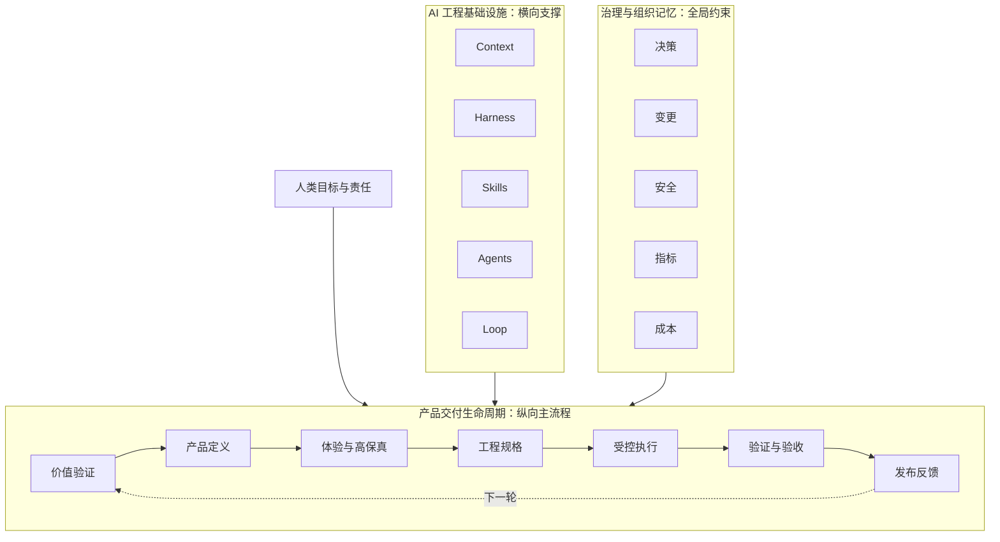

# AI 产品工程全局框架

## 1. 为什么采用三平面模型

产品生命周期、AI 工程能力和治理机制不是同一种东西。

- 生命周期描述**产品按什么顺序推进**；
- 基础设施描述**每个阶段如何让 AI 理解、受控、具备能力、协作和闭环**；
- 治理描述**谁负责、为什么这样决定、如何控制长期风险**。

将它们全部排成“十层”会产生错误含义，例如 Context 只在工程设计后出现、Loop 只在发布后出现。实际上 Context、Harness 和 Loop 应贯穿所有阶段。

## 2. 产品交付生命周期

生命周期负责将不确定的想法逐步转化为可验证产品。每个阶段都有明确输入、产物、门禁和责任人。

核心阶段：

1. 战略与价值验证；
2. 产品定义；
3. 用户体验设计；
4. 高保真预览与确认；
5. 工程规格设计；
6. 受控任务执行；
7. 质量与安全验证；
8. 模拟用户验收与发布；
9. 运行反馈与持续迭代。

## 3. 五大 AI 工程基础设施

- **Context** 保存事实、约束、历史和任务背景；
- **Harness** 控制阶段、范围、契约和质量门禁；
- **Skills** 将成熟方法封装成可重复执行能力；
- **Agents** 通过角色和输入输出契约协作；
- **Loop** 观察结果、评估差距、触发修正并沉淀经验。

## 4. 治理与组织记忆

治理不是企业版本才需要。即使个人项目也需要最小治理：

- 谁做最终决定；
- 哪些事实是当前有效版本；
- 为什么采用当前方案；
- 变更会影响哪些模块；
- 失败如何回滚；
- AI 使用和基础设施成本是否可接受。

## 5. 框架资产

完整框架最终形成五类资产：

1. **标准**：定义正确流程和质量要求；
2. **模板**：降低标准执行成本；
3. **Skills**：把标准变成可运行能力；
4. **门禁**：自动或人工证明产物符合标准；
5. **参考工程**：用真实项目验证框架并产生反馈。
