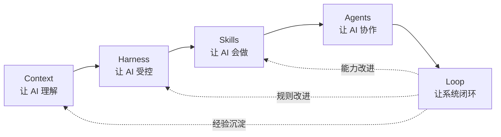

# 五大 AI 工程基础设施

## 1. 总览

这不是固定执行顺序，而是相互依赖关系。任何生命周期阶段都可能同时使用五类能力。

## 2. Context Engineering

管理 AI 需要知道的事实、规则、决策、依赖和当前任务背景。核心目标不是无限增加上下文，而是提供正确、相关、可追溯的上下文。

## 3. Harness Engineering

在模型外部建立控制结构，包括阶段门禁、修改范围、契约检查、依赖白名单、测试和人工确认。Harness 不提高模型智力，但提高结果稳定性。

## 4. Skill Engineering

将已经验证的方法与资产封装为可重复调用的能力。一个成熟 Skill 应包含触发条件、输入、执行步骤、输出、验证方式、参考资料和必要脚本。

## 5. Agent Engineering

定义谁负责什么、需要什么输入、产生什么输出、何时交给下一个角色、失败时如何处理，以及哪些节点必须由人确认。

## 6. Loop Engineering

将目标、执行、观察、评估和改进连接起来。Loop 既存在于一次代码修复，也存在于产品发布后的指标反馈，还存在于 Framework 自身的演进。

## 7. 共同约束

- Context 不得替代明确任务；
- Harness 不得变成无意义流程负担；
- Skill 必须经过真实场景验证；
- Agent 数量服从任务复杂度，不追求表面上的多 Agent；
- Loop 必须有停止条件、责任人和证据标准。
