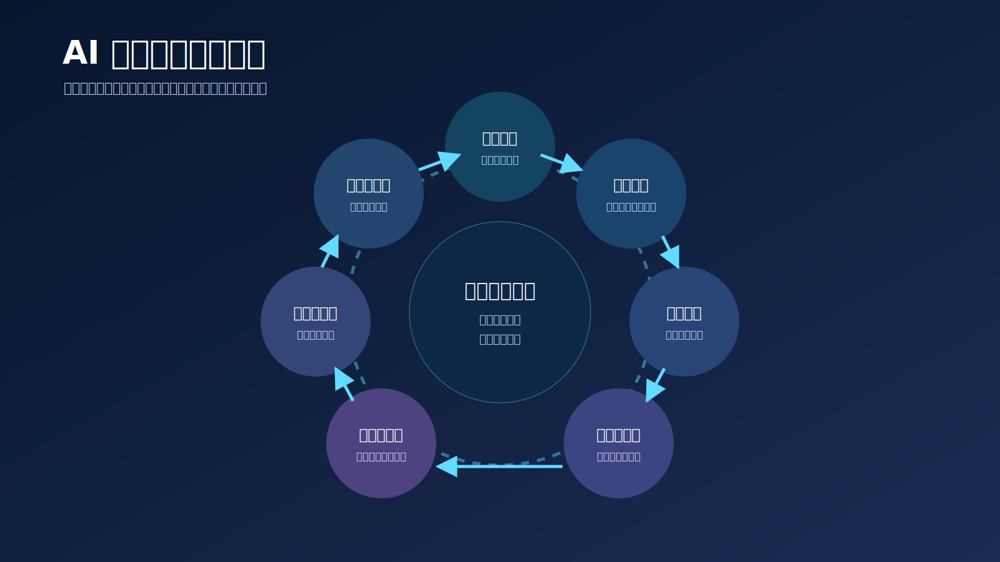
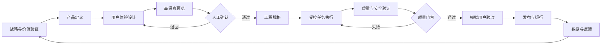

# 产品交付生命周期

## 阶段定义

| 阶段 | 核心问题 | 主要产物 | 退出门禁 |
|---|---|---|---|
| 战略与价值验证 | 为什么值得做？ | 用户问题、价值假设、成功指标、MVP 边界 | 有证据支持继续投入 |
| 产品定义 | 做什么与不做什么？ | PRD、业务规则、用户故事、验收断言 | 范围和关键规则已确认 |
| 用户体验设计 | 用户怎么完成目标？ | 用户流程、信息架构、页面与状态清单 | 主流程和异常流程完整 |
| 高保真预览 | 最终体验是否正确？ | 高保真图、可交互原型、视觉和内容规范 | 关键负责人明确确认 |
| 工程规格 | 系统如何实现？ | 架构、API、数据、前后端和基础设施规格 | 契约可执行、依赖明确 |
| 受控任务执行 | 如何在边界内交付？ | 任务包、代码、配置、同步文档 | 修改范围和任务自检通过 |
| 质量与安全验证 | 如何证明实现可靠？ | Review、自动测试、安全和契约报告 | 阻断问题全部关闭 |
| 模拟用户验收 | 产品是否真正可用？ | 用户脚本、边缘场景、视觉与体验报告 | 验收断言通过或有明确豁免 |
| 发布与运行 | 是否能安全交付？ | 发布清单、回滚方案、运行监控 | 发布责任人批准 |
| 数据与反馈 | 结果是否达到预期？ | 产品指标、用户反馈、问题分类、改进假设 | 形成下一轮明确决策 |

## 高保真预览的最低要求

至少覆盖：

- 主页面和关键跳转；
- 正常、加载、空、错误、权限和离线状态；
- 关键内容和真实长度示例；
- 主要交互反馈；
- 目标设备或响应式尺寸；
- 人工确认记录。

高保真预览不等同于最终代码截图。它的价值是让错误在实现前暴露。

## 三层验收

1. **代码与文档审查**：规范、边界、契约、风险；
2. **运行验证**：构建、测试、接口、数据和部署；
3. **模拟用户验收**：按真实任务、真实设备和边缘场景使用产品。

三层不能互相替代。自动测试通过并不代表用户能够顺利完成任务。
