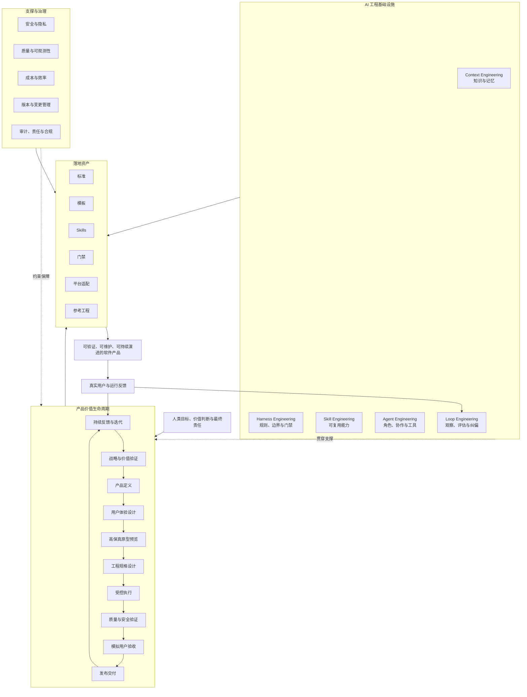
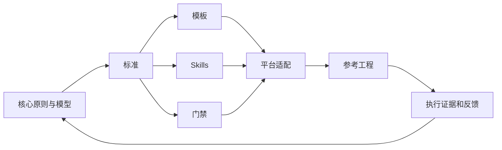
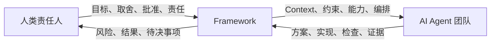

# AI 产品工程总架构

> 本文是 v0.1 的总架构定义。它把产品价值生命周期与 AI 工程基础设施组合成一个二维框架，并说明标准、模板、Skills、门禁和参考工程如何挂载。

## 1. 总架构结论

AI Product Engineering Framework 由两个主维度和一组支撑治理能力构成：

1. **产品价值生命周期**：描述一个产品如何从机会走向持续价值；
2. **AI 工程基础设施**：描述 AI 如何获得知识、受到约束、具备能力、组织协作并形成反馈；
3. **支撑治理能力**：安全、隐私、合规、质量、可观测性、成本、变更和版本管理。

框架最终通过标准、模板、Skills、门禁和参考工程落地。

## 2. 真实概念总览图

> 说明：该图片由 ChatGPT 生成，用于快速建立视觉认知。图片中的细节文字可能存在生成误差，正式定义以本文正文和 Mermaid 图为准。

## 3. 权威总架构图

## 4. 产品价值生命周期

### 4.1 战略与价值验证

回答：为什么值得做？

主要产物：目标用户、问题证据、价值假设、成功指标、MVP 边界、终止条件。

### 4.2 产品定义

回答：做什么和不做什么？

主要产物：PRD、用户故事、业务规则、范围清单、不做清单、验收断言。

### 4.3 用户体验设计

回答：用户如何完成目标？

主要产物：用户旅程、信息架构、页面清单、交互流程、状态和异常设计。

### 4.4 高保真原型预览

回答：在实现前，最终体验是否可以被理解和确认？

主要产物：高保真页面、可交互原型、关键状态预览、原型确认记录、设计修改清单。

### 4.5 工程规格设计

回答：系统如何实现并保持可维护？

主要产物：技术架构、前后端规格、数据模型、API 契约、数据库规范、非功能要求、安全和部署方案。

### 4.6 受控执行

回答：AI 和人如何在明确任务、依赖和边界内完成实现？

主要产物：任务上下文包、任务拆解、允许与禁止范围、实现结果、修改文件清单、执行报告。

### 4.7 质量与安全验证

回答：如何证明代码、系统、数据和安全满足标准？

主要产物：静态检查、编译和测试结果、契约检查、数据校验、安全扫描、性能和可观测性报告。

### 4.8 模拟用户验收

回答：真实角色能否在真实场景中完成目标？

主要产物：用户验收脚本、关键路径执行证据、边缘场景结果、体验问题、验收报告。

### 4.9 发布交付

回答：系统是否具备安全上线、运营和回退条件？

主要产物：发布清单、版本说明、迁移和回退方案、运行手册、责任人和风险接受记录。

### 4.10 持续反馈与迭代

回答：上线后的证据如何驱动下一轮产品和工程决策？

主要产物：用户反馈、行为数据、运行指标、问题分类、优先级、迭代假设和版本计划。

## 5. 五类 AI 工程基础设施

### 5.1 Context Engineering

作用：让 AI 知道完成当前工作所必需的稳定事实、阶段知识、任务上下文和历史经验。

核心组成：

- 项目愿景、原则和边界；
- 产品、设计和工程规格；
- AGENTS.md、规则和平台指令；
- 决策日志；
- 任务 Context Pack；
- 执行经验与问题案例；
- 分层加载和过期治理。

### 5.2 Harness Engineering

作用：把目标、边界、契约、门禁、权限和人工确认点放在模型之外，使 AI 执行受控。

核心组成：

- 阶段门禁；
- 允许和禁止修改范围；
- 输入输出契约；
- 依赖白名单；
- 权限和工具控制；
- 自动检查；
- 人工批准和失败停止规则。

### 5.3 Skill Engineering

作用：将高频、稳定、可验证的方法转化为可复用能力。

每个 Skill 至少需要：

- 触发条件；
- 适用和不适用场景；
- 必要输入；
- 执行步骤；
- 标准输出；
- 验证规则；
- 失败处理；
- 示例和反例；
- 版本与维护责任。

### 5.4 Agent Engineering

作用：定义由谁承担任务、如何协作、如何调用工具以及何时交还人类判断。

核心组成：

- 角色和责任；
- Agent 间协议；
- 任务分配和状态；
- 工具集成；
- 人工介入点；
- 冲突处理；
- 多 Agent 编排；
- 执行证据和通信记录。

### 5.5 Loop Engineering

作用：将目标、行动、观察、评估和调整形成闭环，避免一次性生成。

核心 Loop：

- 开发修复 Loop；
- 设计预览与反馈 Loop；
- 质量验证 Loop；
- 产品反馈 Loop；
- Agent/Skill 改进 Loop；
- 框架演进 Loop。

## 6. 二维关系矩阵

| 生命周期阶段 | Context | Harness | Skills | Agents | Loops |
| --- | --- | --- | --- | --- | --- |
| 战略与价值验证 | 市场、用户、历史假设 | 证据和决策门槛 | 调研、价值分析 | 产品/研究 Agent | 假设验证 Loop |
| 产品定义 | PRD、业务规则 | 范围、验收门禁 | PRD、需求分析 | 产品 Agent | 需求澄清 Loop |
| 体验设计 | 用户旅程、设计规范 | 页面和状态完整性 | UX/UI 设计 | 设计 Agent | 原型反馈 Loop |
| 高保真预览 | 原型、组件和视觉规则 | 人工确认点 | 原型生成与审查 | 设计/评审 Agent | 预览修正 Loop |
| 工程规格 | 架构、API、DB、数据规则 | 契约和依赖门禁 | 架构/API/DB 设计 | 架构 Agent | 方案评审 Loop |
| 受控执行 | 任务包、代码和项目规则 | 文件边界、权限、命令 | 前后端、移动端、数据开发 | 开发 Agent | 编译修复 Loop |
| 质量安全验证 | 标准、测试集、风险库 | CI、扫描和阻断规则 | 测试、Review、安全审计 | QA/安全 Agent | 缺陷修复 Loop |
| 模拟用户验收 | 用户角色、场景和验收脚本 | 通过/失败标准 | 用户验收 | 验收 Agent + 人 | 体验纠偏 Loop |
| 发布交付 | 环境、运行和版本知识 | 发布、迁移、回退门禁 | 发布检查 | 发布 Agent + 人 | 发布恢复 Loop |
| 持续反馈迭代 | 数据、反馈、历史版本 | 指标和变更规则 | 分析、诊断、规划 | 产品/数据 Agent | 产品演进 Loop |

## 7. 落地资产关系

### 标准

规定阶段、角色、输入、输出、边界和验收。

### 模板

把标准变成项目可以直接填写和维护的文档或配置。

### Skills

把标准流程变成 Agent 可以执行的能力。

### 门禁

检查项目是否满足阶段、契约、边界和质量要求。

### 平台适配

把同一套框架映射到 Claude Code、Codex、Kimi、GLM 等平台。

### 参考工程

通过 H5、iOS、后端、数据应用和 AI 原生产品等真实项目验证框架。

## 8. 人机责任关系

人类保留目标、价值、高风险取舍、发布和最终责任；AI Agent 承担分析、生成、实现、检查和建议；Framework 负责让两者之间的协作可管理、可验证和可追溯。

## 9. v0.1 完成标准

当新参与者阅读 v0.1 后，应能够准确回答：

1. 本框架为什么存在？
2. 它与普通 AI Coding、Skills 仓库和具体 Agent 平台有什么区别？
3. 一个产品如何从价值验证走向持续反馈？
4. Context、Harness、Skill、Agent、Loop 分别解决什么问题？
5. 人类和 AI 各自承担什么责任？
6. 后续标准、模板、门禁和参考工程应挂在哪里？
7. 哪些内容符合框架，哪些超出边界？

如果以上问题仍然依赖聊天记录才能回答，则 v0.1 尚未完成。
