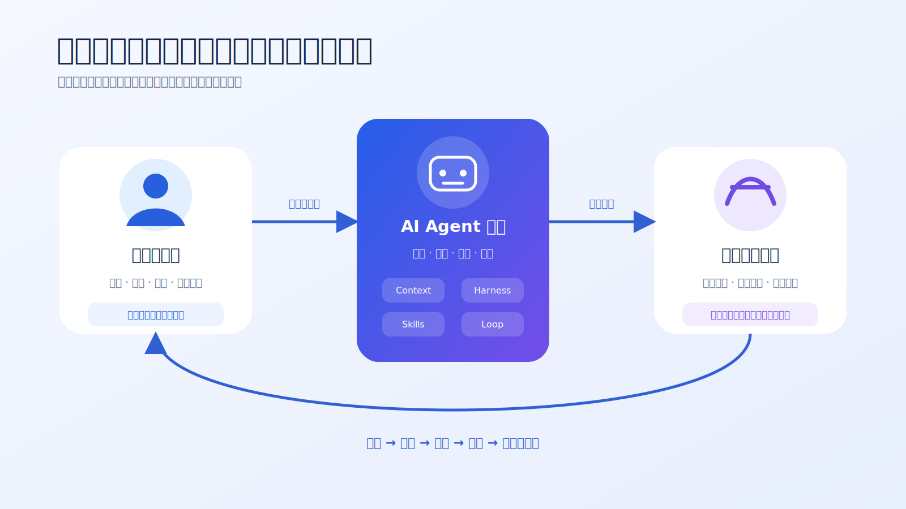
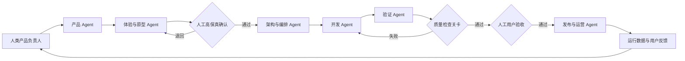

# 人类与 AI 角色体系

## 1. 角色设计原则

角色用于明确责任和输入输出，不用于模拟传统组织的头衔数量。一个人可以承担多个人类角色，一个 Agent 也可以在不同任务中承担多个角色，但同一任务的责任边界必须清晰。

中文术语遵循：[术语与易懂表达规范](../01_框架定义/术语与易懂表达规范.md)。

## 2. 人类角色

| 角色 | 核心责任 | 不可委托的决定 |
|---|---|---|
| 产品发起人 | 提出目标、资源约束和业务期望 | 是否值得继续投入 |
| 产品负责人 | 管理范围、优先级、业务规则和验收 | 做什么、不做什么、何时接受 |
| 体验确认人 | 审查流程、高保真图、内容和关键状态 | 最终用户体验是否可接受 |
| 工程责任人 | 批准架构、高风险变更、发布和回滚 | 技术风险是否可接受 |
| 框架维护者 | 维护标准、模板、检查关卡、Skills 和决策 | 是否改变框架核心模型 |

在个人项目中，这些角色可以由同一个人承担，但确认动作仍需显式记录。

## 3. AI Agent 角色

| AI 角色 | 主要工作 | 关键输出 |
|---|---|---|
| 产品 Agent | 需求澄清、价值假设、PRD、验收断言 | 产品定义包 |
| 用户研究与体验 Agent | 用户流程、信息架构、状态和可用性分析 | 体验规格 |
| 视觉与原型 Agent | 高保真页面、组件、内容和交互预览 | 原型与视觉规范 |
| 架构 Agent | 架构、模块边界、API、数据和基础设施方案 | 工程规格 |
| 任务编排 Agent | 依赖拆解、任务包、角色分配和人工节点 | 执行计划 |
| 开发 Agent | 在允许范围内实现、修复和同步文档 | 代码与变更说明 |
| 验证 Agent | Review、测试、约定一致性、安全、视觉和用户脚本验证 | 验证报告 |
| 发布 Agent | 发布前检查、迁移、监控和回滚准备 | 发布包 |
| 运营与数据 Agent | 指标、用户反馈、问题归类和改进假设 | 反馈报告 |

## 4. 协作流程

## 5. 必须人工介入的节点

- 是否进入产品开发；
- 产品范围和关键业务规则确认；
- 高保真主流程确认；
- 高风险架构、数据或权限变更；
- 验收豁免；
- 正式发布和回滚决定；
- 产品方向或框架核心模型变化。

## 6. 角色反模式

- 一个“超级 Agent”同时定义目标、实现并宣布验收通过；
- 多个 Agent 没有输入输出约定，互相产生冲突文档；
- 人只在最后看结果，前面没有任何确认点；
- 为展示复杂度而人为增加 Agent 数量；
- AI 角色的输出没有明确事实来源和验证方式。
