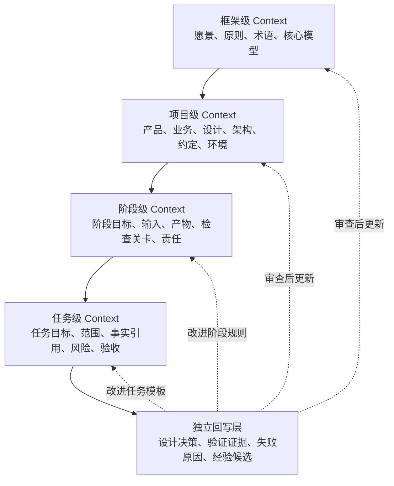
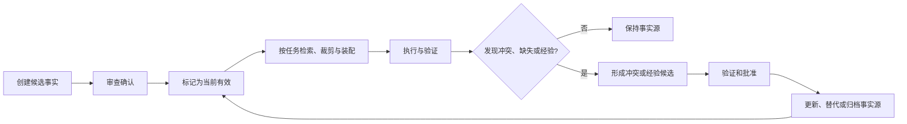

# Context 与记忆管理

> 不要让模型负责长期记忆，让工程系统负责事实、版本、装配、冲突和回写。

中文术语遵循：[术语与易懂表达规范](../01_框架定义/术语与易懂表达规范.md)。

## 1. 核心判断

Claude Code 的项目指令、Codex 的 `AGENTS.md`、规则文件和自动记忆机制都说明：可靠 Agent 会把关键上下文外部化，并在需要时重新加载。

本框架把这个原则扩展到完整产品生命周期：AI 不仅需要理解代码，还需要理解产品价值、用户体验、高保真确认、业务规则、架构约定、任务边界、验证证据和历史决策。

Context 工程的目标不是让模型“看到更多”，而是让模型在正确时间看到**正确、必要、最新、可追溯且安全**的信息。

## 2. 四级作用域与独立回写层

根据 [DEC-006](../11_设计决策/DEC-006_Context采用四级作用域与独立回写层.md)：

### 2.1 框架级 Context

回答：整个 Framework 遵循什么方向、原则、术语和核心模型？

典型载体：

- 框架宪法；
- 全局模型；
- 通用角色和工程规范；
- 已批准的框架设计决策。

### 2.2 项目级 Context

回答：这个具体产品长期是什么、为谁服务、如何设计和实现？

典型载体：

- 项目目标与边界；
- PRD、业务规则和不做清单；
- 用户流程、高保真原型和设计规格；
- 架构、API、Schema、依赖和环境；
- 项目决策、风险、验证和发布记录。

### 2.3 阶段级 Context

回答：当前生命周期阶段要完成什么、依赖什么、如何退出？

典型内容：

- 阶段目标和责任人；
- 必要输入和已批准状态；
- 标准产物；
- 阶段检查关卡；
- 下一阶段依赖。

### 2.4 任务级 Context

回答：当前这一次任务允许 AI 做什么、不能做什么、如何证明完成？

典型内容：

- 任务目标和价值来源；
- 权威事实引用；
- 允许与禁止修改范围；
- 需要保持的约定；
- 风险、权限和人工节点；
- 验收断言、验证命令和输出格式。

### 2.5 独立回写层

设计决策、验证证据和经验不是新的作用域，而是跨层记忆资产：

- **决策**解释为什么形成当前规则；
- **证据**证明当前事实或结果是否成立；
- **失败原因**指出 Context、Harness、Skill、工具或产品假设的问题；
- **经验候选**在验证和批准后回写对应作用域。

## 3. Context 不是 Context Pack

二者必须区分：

| 概念 | 定义 | 是否权威事实源 |
|---|---|---|
| Context 事实源 | 产品、设计、工程、决策、约定等长期资产 | 是，按状态和优先级确定 |
| Context Pack | 针对一个项目、阶段或任务装配的引用与摘要快照 | 否，除非经过批准回写 |
| 模型会话 | 临时推理和交互环境 | 否 |
| 自动记忆 | 工具自动记录的候选经验 | 否，需审查 |

Context Pack 应尽量引用权威文件，而不是复制大量内容后形成新的分叉版本。

## 4. Context 类型

| 类型 | 内容 | 示例载体 |
|---|---|---|
| 战略与产品 | 愿景、用户、价值、范围、业务规则 | 愿景、PRD、不做清单、决策记录 |
| 设计 | 用户流程、页面、状态、原型、视觉和内容 | 设计规格、高保真图、状态矩阵 |
| 工程 | 架构、API、数据、依赖、环境、安全 | 架构文档、OpenAPI、Schema、环境规范 |
| 执行 | 当前任务、允许修改、禁止修改、依赖和验收 | 任务 Context Pack |
| 验证 | 静态、运行、用户验收和发布证据 | 验证报告、测试结果、发布记录 |
| 经验 | 失败原因、人工修正、规则改进和平台限制 | 经验候选、Decision Log、评测集 |

## 5. Context 质量维度

每份 Context 或 Context Pack 至少从七个维度判断：

1. **正确性**：内容是否真实、经过确认；
2. **完整性**：当前任务必要信息是否齐全；
3. **相关性**：是否与当前阶段和任务直接相关；
4. **新鲜度**：版本、有效期和替代关系是否清楚；
5. **可追溯性**：能否定位到来源、责任人和决策；
6. **最小化**：是否避免无关信息和上下文噪声；
7. **安全性**：是否遵守敏感级别、最小权限和数据边界。

“信息越多越好”不是 Context 成熟度。

## 6. 信息优先级

发生冲突时，默认优先级如下：

1. 当前有效且已批准的设计决策；
2. 当前版本正式约定、Schema、高保真确认和专题文档；
3. 仓库级 Agent 指令；
4. 已批准的项目、阶段或任务 Context Pack；
5. 验证记录和运行证据；
6. 临时对话、自动记忆和模型推断。

优先级不是静默覆盖机制。发现冲突必须记录双方来源、影响和处理责任人。

## 7. Context 生命周期

Context 资产至少具有以下状态：

- `草稿`：尚未成为执行依据；
- `当前有效`：可以作为权威来源；
- `已替代`：保留历史，但不得用于新任务；
- `已归档`：仅用于审计和历史理解。

经验可以额外具有：`候选`、`已验证`、`已采纳`、`已拒绝`。

## 8. 最小项目记忆包

一个采用本框架的项目至少应具备：

- `README.md`：人类快速理解；
- `AGENTS.md` 或平台适配规则：AI 行为和事实入口；
- 项目目标、产品定义和不做清单；
- 用户流程、高保真原型和关键状态入口；
- 工程架构、API、数据和依赖约定；
- 当前阶段状态和检查关卡；
- 当前任务 Context Pack；
- 验收标准与验证记录；
- 设计决策目录；
- 版本、发布和反馈记录。

## 9. 反模式

- 把聊天记录当作长期事实来源；
- `AGENTS.md` 无限膨胀并复制所有细节；
- Context Pack 复制全文后成为第二套事实；
- 把整个仓库无差别输入模型；
- 旧决策不标状态，新旧规则同时有效；
- 只记录“决定了什么”，不记录原因和影响；
- 自动记忆未经审查直接成为强制规则；
- 敏感数据因为“模型需要上下文”而被过度提供；
- 任务完成后不回写文档、证据和经验。

## 10. 下一步

本模块接下来由以下规范实现：

- [Context 事实源与状态规范](Context事实源与状态规范.md)；
- [项目 Context Pack 规范](项目Context-Pack规范.md)；
- [任务 Context Pack 规范](任务Context-Pack规范.md)；
- [Context 装配与冲突处理](Context装配与冲突处理.md)；
- [决策与经验回写规范](决策与经验回写规范.md)；
- [Context 完整性检查清单](Context完整性检查清单.md)。
