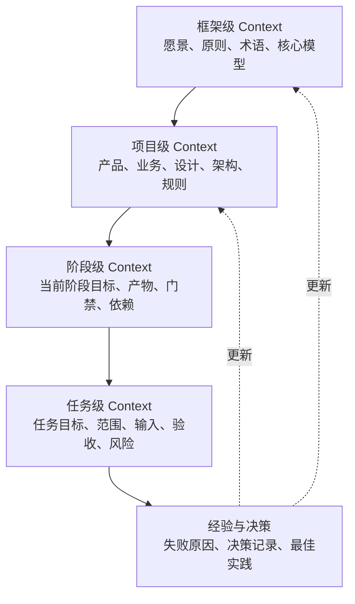
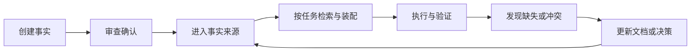

# Context 与记忆管理

## 1. 核心判断

不要让模型负责长期记忆，让工程系统负责长期记忆。

Claude Code 的项目指令、Codex 的 `AGENTS.md`、规则文件和自动记忆机制都说明：可靠 Agent 会把关键上下文外部化，并在需要时重新加载。本框架在此基础上扩展到完整产品生命周期。

## 2. 四级 Context 模型

## 3. Context 类型

| 类型 | 内容 | 示例载体 |
|---|---|---|
| 战略与产品 | 愿景、用户、价值、范围、业务规则 | PRD、愿景文档、决策记录 |
| 设计 | 用户流程、页面、状态、原型和视觉规范 | 设计规格、高保真图 |
| 工程 | 架构、API、数据、依赖、环境和技术规范 | 架构文档、OpenAPI、Schema |
| 执行 | 当前任务、允许修改、禁止修改、依赖和验收 | 任务上下文包 |
| 经验 | 失败原因、调试结论、规则改进和平台限制 | 经验记录、Decision Log |

## 4. 信息优先级

发生冲突时，优先级如下：

1. 当前有效且已批准的设计决策；
2. 当前版本专题文档和契约；
3. 仓库级 Agent 指令；
4. 任务上下文包；
5. 临时对话和模型推断。

模型不得在冲突信息中静默选择。

## 5. Context 生命周期

Context 管理的目标不是把整个仓库塞给模型，而是：

- 保证关键事实存在；
- 保证事实有版本和责任来源；
- 根据任务装配最相关内容；
- 对冲突、过期和缺失可见；
- 将执行经验更新回长期资产。

## 6. 最小项目记忆包

一个采用本框架的项目至少应具备：

- `README.md`：人类快速理解；
- `AGENTS.md`：AI 行为规则和事实入口；
- 产品定义与不做清单；
- 高保真图或原型入口；
- 工程架构、API 和数据契约；
- 当前任务上下文包；
- 验收标准与验证记录；
- 设计决策目录；
- 版本变更记录。

## 7. 反模式

- 把聊天记录当事实来源；
- `AGENTS.md` 无限膨胀，包含所有细节；
- 旧决策不标状态，新旧规则同时有效；
- 只记录“决定了什么”，不记录背景和影响；
- 每次任务都重新描述项目，不维护稳定入口；
- 自动记忆未经审查直接成为强制规则。
