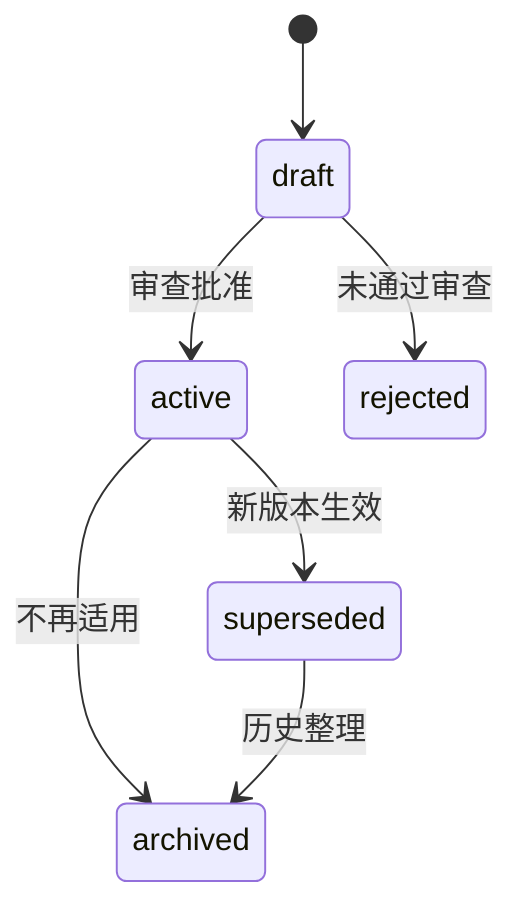

# Context 事实源与状态规范

> 本规范定义什么可以成为项目事实、如何标识当前有效版本，以及 AI 在读取时如何判断权威性、新鲜度和敏感级别。

中文术语遵循：[术语与易懂表达规范](../01_框架定义/术语与易懂表达规范.md)。

## 1. 基本原则

1. 一个事实在同一适用范围内只能有一个当前权威来源；
2. 摘要、导航和 Context Pack 应引用权威来源，不复制形成平行版本；
3. 每个事实源必须有责任人、状态、版本或提交依据；
4. 被替代内容保留历史，但不能继续参与新任务装配；
5. 对话、自动记忆和模型推断只能作为候选信息，不能直接成为强制规则；
6. 敏感信息遵循最小必要原则，不因“上下文需要”扩大暴露范围；
7. 机器字段使用统一英文枚举，文档正文可以使用对应中文名称；
8. 历史任务、验证和发布报告保留当时事实，但不得覆盖当前项目 Context；
9. 当前运行状态必须有唯一入口，不能由多个摘要文件并列维护。

## 2. 事实源分类

| 分类 | 典型内容 | 推荐载体 |
|---|---|---|
| 框架事实 | 愿景、原则、术语、全局模型 | 宪法文档、设计决策 |
| 产品事实 | 用户、价值、范围、业务规则、验收断言 | PRD、不做清单、规则文档 |
| 设计事实 | 用户流程、页面、状态、内容、视觉 | 设计规格、高保真原型、状态矩阵 |
| 工程事实 | 架构、API、Schema、依赖、环境、安全 | 架构文档、OpenAPI、DDL、配置规范 |
| 执行事实 | 当前任务、范围、依赖、验证和风险 | 任务 Context Pack |
| 当前状态事实 | 当前工作段、执行状态、阻塞、风险和下一步 | 项目 Context Pack、当前阶段 Context |
| 验证事实 | 测试、用户验收、发布和运行证据 | 验证报告、日志、发布记录 |
| 历史事实 | 为什么这样决定、过去发生了什么 | 设计决策、CHANGELOG、历史 TASK、事故复盘 |

## 3. 最小元数据

正式 Context 资产至少包含以下元数据；可放在文档头部、索引或机器可读清单中：

```yaml
context_id: CTX-项目-产品范围
name: 产品范围与不做清单
type: product
scope: project
owner: 产品负责人
status: active
source_version: v1.2
effective_from: 2026-07-12
last_verified_at: 2026-07-12
source: 01_产品定义/产品范围与不做清单.md
source_commit: abc1234
sensitivity: internal
review_trigger:
  - 产品方向变化
  - 新增一级功能
replaces: CTX-项目-产品范围-v1.1
```

### 必填字段

- `context_id`：稳定标识；
- `name`：人类可理解名称；
- `type`：产品、设计、工程、执行、当前状态、验证、历史等；
- `scope`：framework、project、stage、task；
- `owner`：负责确认和维护的人；
- `status`：统一机器状态；
- `source`：事实文件或约定路径；
- `sensitivity`：敏感级别；
- `last_verified_at`：最近确认日期或版本。

项目与阶段 Context 还应包含：

- `source_commit` 或 `baseline_commit`；
- `current_milestone`；
- `current_work_segment`；
- `execution_status`；
- 阻塞原因和解除条件。

## 4. 版本字段命名

禁止在 Context Pack 中使用含义不清的通用 `version` 字段。

| 字段 | 含义 | 示例 |
|---|---|---|
| `context_pack_version` | 当前 Pack 自身版本 | `0.2-A.8` |
| `project_context_pack_version` | 任务或阶段引用的项目 Pack 版本 | `0.2-A.8` |
| `stage_context_pack_version` | 任务引用的阶段 Pack 版本 | `1.7` |
| `task_context_pack_version` | 当前任务 Pack 自身版本 | `1.0` |
| `source_version` | 某个产品、设计或约定事实的版本 | `OpenAPI v2` |
| `stable_release` | 已确认稳定的框架或产品发布 | `v0.1.5` |
| `target_release` | 当前工作计划进入的发布 | `v0.2.0` |
| `source_commit` | Context 最近复核时对应的 Git 基线 | `abc1234` |
| `baseline_commit` | 阶段或任务开始时固定的 Git 基线 | `def5678` |

发布版本规则详见 `10_版本演进/版本管理规范.md`。

## 5. 统一状态枚举

### 5.1 事实源状态

| 机器值 | 中文显示 | 是否可用于新任务 | 说明 |
|---|---|---|---|
| `draft` | 草稿 | 否 | 可以讨论，不能作为正式执行依据 |
| `active` | 当前有效 | 是 | 当前权威版本 |
| `superseded` | 已替代 | 否 | 已有新版本，仅用于历史追溯 |
| `archived` | 已归档 | 否 | 不再适用，仅保留审计和历史 |
| `rejected` | 已拒绝 | 否 | 候选内容未被采纳 |



### 5.2 阶段状态

| 机器值 | 中文显示 |
|---|---|
| `not_started` | 未开始 |
| `preparing` | 准备中 |
| `active` | 进行中 |
| `in_review` | 待评审 |
| `approved` | 已通过 |
| `blocked` | 已阻塞 |
| `stopped` | 已停止 |

### 5.3 任务状态

| 机器值 | 中文显示 |
|---|---|
| `draft` | 草稿 |
| `pending_confirmation` | 待确认 |
| `ready` | 就绪 |
| `in_progress` | 执行中 |
| `verifying` | 验证中 |
| `pending_human_approval` | 待人工确认 |
| `completed` | 已完成 |
| `blocked` | 已阻塞 |
| `cancelled` | 已取消 |

### 5.4 资产成熟度

| 机器值 | 中文显示 | 是否可作为稳定框架资产 |
|---|---|---|
| `candidate` | 候选 | 否 |
| `single_project_validated` | 单项目已验证 | 否，限项目参考 |
| `cross_project_validated` | 跨项目已验证 | 可申请进入稳定资产 |
| `stable` | 稳定 | 是 |
| `deprecated` | 已废弃 | 否 |

### 5.5 项目长期状态与当前执行状态

项目 Context 可以同时存在：

```yaml
status: active
execution_status: blocked
```

含义是：项目或里程碑仍然有效，但当前工作因明确依赖无法继续。

禁止用一个 `status` 字段同时表达“项目仍在推进”和“当前执行被阻塞”。

文档表格可以显示中文，但 YAML、脚本和自动检查关卡必须使用机器值。不得在同一字段中混用 `active`、`当前有效`、`进行中` 等不同语义。

## 6. 权威优先级

### 6.1 长期事实优先级

1. 当前有效且未被替代的设计决策；
2. 当前有效约定、Schema、高保真确认和专题文档；
3. 仓库级 Agent 指令；
4. 已批准的项目、阶段或任务 Context Pack；
5. 验证和运行证据；
6. 临时对话、Issue、自动记忆和模型推断。

设计决策通常解释“为什么”，专题文档和约定描述“当前是什么”。如决策与当前事实描述不一致，不得只按序号机械覆盖，应检查决策状态、替代关系和适用范围。

### 6.2 当前运行状态优先级

1. 当前项目 Context Pack；
2. 当前阶段 Context；
3. 当前任务 Context Pack；
4. Roadmap、README 和 AGENTS 摘要；
5. 历史 TASK、验证和发布报告。

历史文件中的 `partial_pass`、`completed`、版本号或“下一步”只表示当时判断。若后续项目 Context 已修正状态，必须使用当前项目 Context。

## 7. 版本与引用规则

任务执行时，关键事实引用至少固定一种依据：

- Git 提交 SHA；
- 发布版本或标签；
- 约定版本号；
- 文件路径和最近确认日期；
- 原型版本和确认记录；
- 数据 Schema 或迁移版本。

推荐格式：

```text
来源：02_工程规格/openapi.yaml
来源版本：v1.4
Git：abc1234
状态：active / 当前有效
责任人：后端责任人
```

禁止只写“参考最新文档”“按之前讨论”“沿用现状”等不可追溯表达。

`source_commit` 可以指向 Pack 最近完成复核时已经存在的提交。更新 Pack 自身产生的新提交不要求 Pack 自我引用，但下一次实质性复核必须刷新基线。

## 8. 新鲜度与复核触发

Context 不一定按固定日期过期，但必须定义复核触发条件：

- 产品范围、目标用户或业务规则变化；
- 高保真主流程重新确认；
- API、Schema、依赖或架构变化；
- 环境、权限和发布策略变化；
- 任务执行发现事实冲突；
- 验证失败表明现有规则不完整；
- 当前工作段、阻塞或解除条件变化；
- 稳定版本、目标版本或里程碑变化；
- 超过组织规定的复核周期。

超过复核周期不代表自动失效，但装配时必须标记风险并要求确认。

## 9. 敏感级别

| 机器值 | 中文显示 | 示例 | AI 使用要求 |
|---|---|---|---|
| `public` | 公开 | 开源文档、公开规范 | 可按任务使用 |
| `internal` | 内部 | 内部架构、非敏感业务规则 | 仅授权环境和成员使用 |
| `confidential` | 机密 | 客户数据、未发布产品 | 默认不进入模型，需脱敏和审批 |
| `restricted` | 严格受限 | 凭据、密钥、生产个人信息 | 不直接提供，使用受控工具或人工处理 |
| `proprietary` | 专有资产 | 专有框架、内部标准和模板 | 仅授权仓库、人员、模型和工具使用 |

Context Pack 必须说明敏感信息是否被排除、脱敏或通过工具间接访问。

## 10. 单一事实源索引

项目建议维护事实源索引：

| Context ID | 名称 | 类型 | 作用域 | 当前来源 | 状态 | 责任人 | 最近确认 |
|---|---|---|---|---|---|---|---|
| CTX-PROD-001 | 产品范围 | 产品 | 项目 | 产品范围与不做清单.md | active | 产品负责人 | 2026-07-12 |
| CTX-API-001 | 主接口约定 | 工程 | 项目 | openapi.yaml | active | 后端责任人 | 2026-07-12 |
| CTX-STATUS-001 | 当前运行状态 | 当前状态 | 项目 | 项目Context/README.md | active | 项目负责人 | 2026-07-12 |

索引用于发现重复、失效和无人维护的事实，不应复制事实正文。

## 11. 历史快照规则

历史 TASK、验证和发布报告：

- 保留当时版本、术语、状态和证据；
- 文件顶部标明“历史快照”；
- 链接当前项目 Context 或后续修正任务；
- 不作为当前运行状态的优先来源；
- 不因当前状态变化而篡改原始正文；
- 历史文件中的下一步不自动延续到当前计划。

## 12. 事实源准入检查

一项内容成为 `active` 前，至少确认：

- 是否有明确适用范围；
- 是否有责任人；
- 是否与现有事实重复或冲突；
- 是否经过必要的人类批准；
- 是否可被版本化和追溯；
- 是否定义复核或失效触发；
- 是否标明敏感级别；
- 是否说明替代了什么；
- 是否需要同步 README、AGENTS、项目 Context、约定、版本记录或设计决策；
- 是否会错误覆盖历史快照或当前状态入口。
