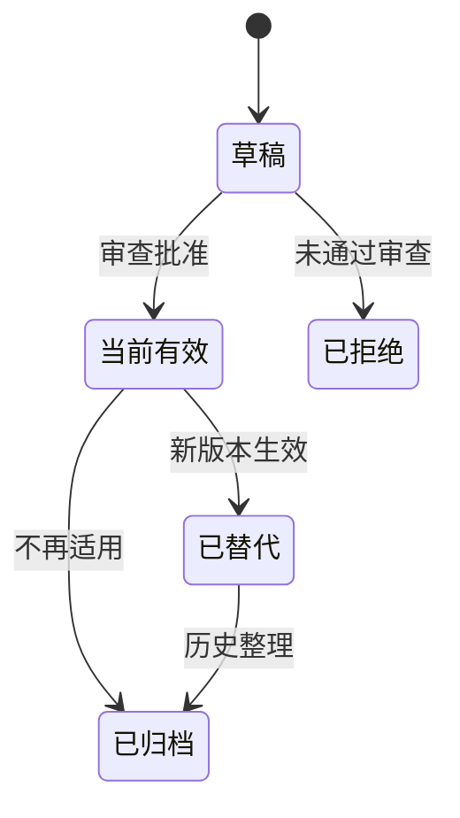

# Context 事实源与状态规范

> 本规范定义什么可以成为项目事实、如何标识当前有效版本，以及 AI 在读取时如何判断权威性、新鲜度和敏感级别。

## 1. 基本原则

1. 一个事实在同一适用范围内只能有一个当前权威来源；
2. 摘要、导航和 Context Pack 应引用权威来源，不复制形成平行版本；
3. 每个事实源必须有责任人、状态、版本或提交依据；
4. 被替代内容保留历史，但不能继续参与新任务装配；
5. 对话、自动记忆和模型推断只能作为候选信息，不能直接成为强制规则；
6. 敏感信息遵循最小必要原则，不因“上下文需要”而扩大暴露范围。

## 2. 事实源分类

| 分类 | 典型内容 | 推荐载体 |
|---|---|---|
| 框架事实 | 愿景、原则、术语、全局模型 | 宪法文档、设计决策 |
| 产品事实 | 用户、价值、范围、业务规则、验收断言 | PRD、不做清单、规则文档 |
| 设计事实 | 用户流程、页面、状态、内容、视觉 | 设计规格、高保真原型、状态矩阵 |
| 工程事实 | 架构、API、Schema、依赖、环境、安全 | 架构文档、OpenAPI、DDL、配置规范 |
| 执行事实 | 当前任务、范围、依赖、验证和风险 | 任务 Context Pack |
| 验证事实 | 测试结果、用户验收、发布和运行证据 | 验证报告、日志、发布记录 |
| 历史事实 | 为什么这样决定、过去发生了什么 | 设计决策、CHANGELOG、事故复盘 |

## 3. 最小元数据

正式 Context 资产至少包含以下元数据；可放在文档头部、索引或机器可读清单中：

```yaml
context_id: CTX-项目-产品范围
name: 产品范围与不做清单
type: product
scope: project
owner: 产品负责人
status: active
version: v1.2
effective_from: 2026-07-12
last_verified_at: 2026-07-12
source: 01_产品定义/产品范围与不做清单.md
sensitivity: internal
review_trigger:
  - 产品方向变化
  - 新增一级功能
replaces: CTX-项目-产品范围-v1.1
```

### 必填字段

- `context_id`：稳定标识；
- `name`：人类可理解名称；
- `type`：产品、设计、工程、执行、验证、历史等；
- `scope`：framework、project、stage、task；
- `owner`：负责确认和维护的人；
- `status`：当前状态；
- `source`：事实文件或契约路径；
- `sensitivity`：敏感级别；
- `last_verified_at`：最近确认日期或版本。

## 4. 状态模型



| 状态 | 是否可用于新任务 | 说明 |
|---|---|---|
| 草稿 | 否 | 可以讨论，但不能作为执行依据 |
| 当前有效 | 是 | 当前权威版本 |
| 已替代 | 否 | 由新版本替代，仅用于历史追溯 |
| 已归档 | 否 | 不再适用，仅保留审计和历史 |
| 已拒绝 | 否 | 候选内容未被采纳 |

经验资产还可以使用：候选、已验证、已采纳、已拒绝。

## 5. 权威优先级

默认优先级：

1. 已批准设计决策；
2. 当前有效契约、Schema、高保真确认和专题文档；
3. 仓库级 Agent 指令；
4. 已批准的项目、阶段或任务 Context Pack；
5. 验证和运行证据；
6. 临时对话、Issue、自动记忆和模型推断。

注意：设计决策通常解释“为什么”，专题文档和契约描述“当前是什么”。如历史决策已经被后续决策替代，应以最新有效决策为准。

## 6. 版本与引用规则

任务执行时，关键事实引用至少固定以下一种依据：

- Git 提交 SHA；
- 发布版本或标签；
- 契约版本号；
- 文件路径 + 最近确认日期；
- 原型版本和确认记录；
- 数据 Schema 或迁移版本。

推荐引用格式：

```text
来源：02_工程规格/openapi.yaml
版本：v1.4
Git：abc1234
状态：当前有效
责任人：后端责任人
```

禁止只写“参考最新文档”“按之前讨论”“沿用现状”等不可追溯表达。

## 7. 新鲜度与复核触发

Context 不一定按固定日期过期，但必须定义复核触发条件。

典型触发：

- 产品范围、目标用户或业务规则变化；
- 高保真主流程重新确认；
- API、Schema、依赖或架构变化；
- 环境、权限和发布策略变化；
- 任务执行发现事实冲突；
- 验证失败表明现有规则不完整；
- 超过组织规定的复核周期。

超过复核周期不代表自动失效，但装配时必须标记风险并要求确认。

## 8. 敏感级别

| 级别 | 示例 | AI 使用要求 |
|---|---|---|
| 公开 | 开源文档、公开规范 | 可按任务使用 |
| 内部 | 内部架构、非敏感业务规则 | 仅授权环境和成员使用 |
| 机密 | 客户数据、未发布产品、内部密钥信息 | 默认不进入模型，需脱敏和审批 |
| 严格受限 | 凭据、密钥、金融医疗敏感数据、生产个人信息 | 不直接提供；使用受控工具、代理查询或人工处理 |

Context Pack 必须标明敏感信息是否被排除、脱敏或通过工具间接访问。

## 9. 单一事实源索引

项目建议维护一个事实源索引：

| Context ID | 名称 | 类型 | 作用域 | 当前来源 | 状态 | 责任人 | 最近确认 |
|---|---|---|---|---|---|---|---|
| CTX-PROD-001 | 产品范围 | 产品 | 项目 | 产品范围与不做清单.md | 当前有效 | 产品负责人 | 2026-07-12 |
| CTX-API-001 | 主接口契约 | 工程 | 项目 | openapi.yaml | 当前有效 | 后端责任人 | 2026-07-12 |

索引用于发现重复、失效和无人维护的事实，不应复制事实正文。

## 10. 事实源准入检查

一项内容成为当前有效 Context 前，至少确认：

- 是否有明确适用范围；
- 是否有责任人；
- 是否与现有事实重复或冲突；
- 是否经过必要的人类批准；
- 是否可被版本化和追溯；
- 是否定义复核或失效触发；
- 是否标明敏感级别；
- 是否说明替代了什么；
- 是否需要同步 README、AGENTS、契约或设计决策。
