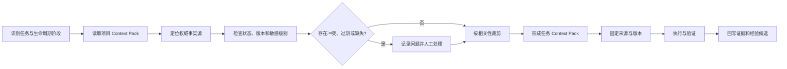
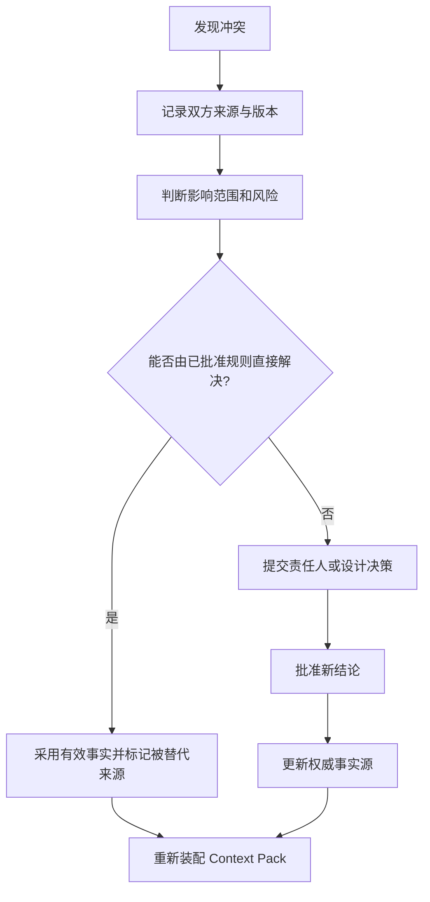

# Context 装配与冲突处理

> Context 装配负责从长期事实源中选择当前任务真正需要的信息；冲突处理负责在事实不一致、过期、缺失或权限不足时阻止 AI 静默猜测。

中文术语遵循：[术语与易懂表达规范](../01_框架定义/术语与易懂表达规范.md)。

## 1. 装配目标

一个合格的 Context Pack 同时满足：

- **相关**：直接服务当前阶段和任务；
- **足够**：完成任务的必要事实齐全；
- **最小**：不包含无关历史和噪声；
- **新鲜**：引用当前有效版本；
- **可追溯**：能定位来源、责任人和版本；
- **安全**：不超出数据和权限边界；
- **稳定**：执行期间关键事实被固定，不随意漂移。

## 2. 标准装配流程

### 步骤一：识别任务

先明确任务目标、生命周期阶段、风险等级、执行和审批责任、预期输出以及验证方式。没有这些信息，不开始检索 Context。

### 步骤二：读取入口

优先读取：项目 Context Pack、当前阶段说明、当前任务相关的产品设计工程事实、关联设计决策，以及必要源码、测试和运行记录。

### 步骤三：验证事实

对每项关键事实检查：

- 是否为当前有效状态；
- 是否有责任人和最近确认日期；
- 是否与其他事实冲突；
- 是否被后续决策替代；
- 是否允许当前 Agent 和平台访问；
- 是否需要固定到提交、版本或原型编号。

### 步骤四：裁剪

将信息分成核心 Context、按需 Context 和排除 Context。

### 步骤五：固定快照

高风险或长时间任务应固定：

- Git 基线提交；
- PRD、设计和约定版本；
- Schema 或迁移版本；
- 测试数据版本；
- 模型、工具和环境版本；
- 任务 Pack 版本。

如执行中事实发生变化，应停止、重新装配并明确是否重新开始任务。

## 3. Context 预算

Context 预算用于控制信息量和噪声，不仅是 Token 限制。

建议按以下优先级分配：

1. 任务目标、边界和验收；
2. 直接相关的产品与设计事实；
3. 直接相关的工程约定和源码；
4. 影响当前判断的设计决策；
5. 必要的历史失败和运行证据；
6. 可按需读取的参考资料。

优先使用索引、链接、结构化摘要、相关模块裁剪和日志聚合降低噪声。不得通过删除验收、边界、风险和约定来节省 Context。

## 4. 冲突类型

| 冲突类型 | 示例 | 默认处理 |
|---|---|---|
| 版本冲突 | PRD v2 与任务引用 v1 | 暂停并确认当前有效版本 |
| 决策冲突 | 旧决策与新决策结论相反 | 检查状态和替代关系 |
| 文档与代码冲突 | OpenAPI 与实现不一致 | 不猜测；触发接口约定检查关卡和责任人确认 |
| 设计与实现冲突 | 高保真与页面行为不同 | 以已确认设计为目标，除非新决策替代 |
| 对话与仓库冲突 | 聊天要求违背 AGENTS 或正式约定 | 指出冲突，仓库事实优先 |
| 多责任人冲突 | 产品和工程给出不同范围 | 升级给明确决策人 |
| 数据口径冲突 | 同一指标有两种定义 | 停止相关数据任务并确认口径 |
| 权限冲突 | 任务需要未授权数据或工具 | 禁止执行，申请授权或设计替代方案 |

## 5. 冲突处理流程

冲突记录至少包含编号、发现任务、双方事实及版本、影响范围、临时处理、责任人、最终结论、更新文件，以及是否需要新增检查关卡或测试。

## 6. 缺失处理

出现以下缺失时，不应让模型自行补全为事实：

- 产品目标、用户或范围不清；
- 高保真主流程未确认；
- API、Schema 或权限约定缺失；
- 任务允许和禁止范围缺失；
- 验收和验证方式缺失；
- 敏感数据使用依据缺失；
- 发布、回滚和责任人缺失。

处理顺序：标记缺失等级、判断是否阻塞、由责任人补充或批准临时假设、标记假设有效期和退出条件、更新事实源并重新装配。

## 7. 过期处理

Context 出现以下信号时视为疑似过期：长期未复核、引用不存在、与当前代码约定或运行数据不一致、责任人环境变化、被新决策替代、使用过期平台能力描述。

疑似过期内容不得自动删除，应先标记风险、确认替代关系，再改为“已替代”或“已归档”。

## 8. 敏感信息装配

- 不把密钥、Token、密码、生产个人数据直接写入 Pack；
- 对日志、截图和数据样本进行脱敏；
- 优先让 Agent 通过受控工具获得最小查询结果；
- 记录访问目的、权限和保留期限；
- 不因换用不同模型或平台而默认继承原权限。

可采用字段级示例、匿名化或合成数据、聚合结果、人工结论和受控本地环境替代直接暴露敏感信息。

## 9. 装配结果检查

任务开始前确认：

- Context Pack 对应正确项目和阶段；
- 关键事实全部来自当前有效来源；
- 版本和提交已经固定；
- 冲突和缺失已解决或显式批准；
- 信息量足够但不无差别堆积；
- 敏感内容已排除、脱敏或受控访问；
- AI 知道何时按需读取详细文件；
- 执行中发生事实变化时有停止规则；
- 任务结束后的回写位置明确。

## 10. 反模式

- 直接把仓库所有文件塞入模型；
- 只按关键词检索，不检查版本和权威性；
- 发现冲突后由模型自行选择“看起来合理”的结论；
- 为节省 Token 删除任务边界和验收；
- 把 Context Pack 当作永久事实，不随项目变化更新；
- 在 Pack 中写入真实凭据和生产隐私数据；
- 执行中基础事实变化仍继续使用旧快照；
- 只记录冲突，不更新权威来源和检查关卡。
