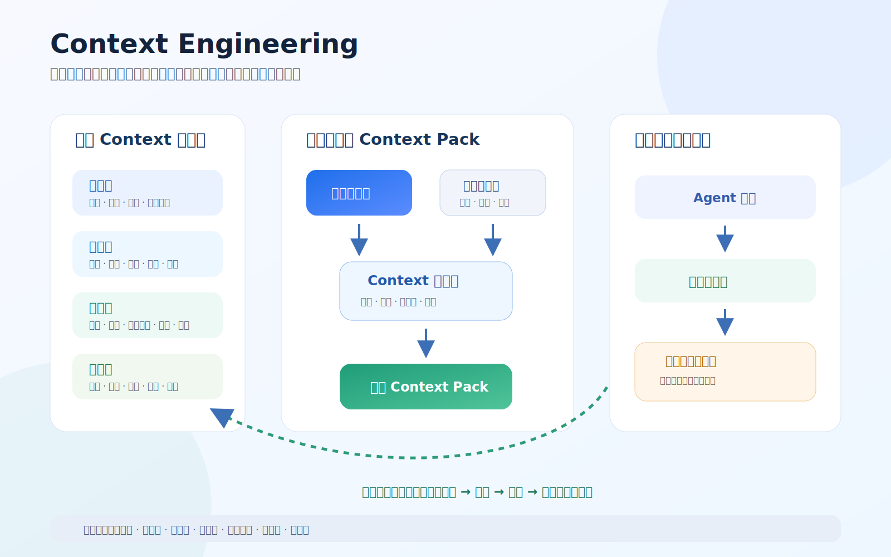

# Context 工程

> Context Engineering 负责让 AI 在每个任务中获得正确、必要、分层、可追溯且安全的信息，并把验证过的决策和经验回写到长期事实源。



## 1. 本模块解决的问题

- 项目事实存在哪里，哪个是当前有效版本？
- 框架、项目、阶段和任务信息如何分层？
- 当前任务到底应该给 AI 哪些信息？
- 如何避免把整个仓库无差别塞给模型？
- 信息冲突、过期、缺失或敏感时如何处理？
- 执行结果、验证证据和失败经验如何进入长期记忆？
- 不同 Agent、模型和会话如何恢复一致的项目认知？

## 2. 核心模型

根据 [DEC-006](../11_设计决策/DEC-006_Context采用四级作用域与独立回写层.md)，Context 采用：

```text
四级作用域：框架级 → 项目级 → 阶段级 → 任务级
独立回写层：设计决策、验证证据、失败原因、经验候选
```

Context Pack 是从权威事实源按项目、阶段或任务装配出的快照，不自动成为新的事实源。

## 3. 版本与成熟度

```text
当前稳定框架版本：v0.1.3
目标开发版本：v0.2.0
当前开发里程碑：A / Context 可执行化
Context 模板成熟度：candidate
```

- 版本规则：[版本管理规范](../10_版本演进/版本管理规范.md)；
- 机器状态和 Pack 字段：[事实源与状态规范](Context事实源与状态规范.md)；
- `A` 是 v0.2.0 的开发里程碑，不是发布版本；
- Framework 自应用已经通过；
- YouYu 已完成首轮真实业务参考任务的部分验证，但签名真机模拟用户验收和完整前后端闭环尚未完成；
- v0.1.3 只完成事实同步、版本治理和验证回写，不代表 Context 能力已经稳定；
- 因此 Context 候选模板仍保持 `candidate`，不能升级为 `single_project_validated`。

## 4. 文档导航

| 文档 | 作用 |
|---|---|
| [Context 与记忆管理](Context与记忆管理.md) | 总览、四级作用域、生命周期和最小记忆包 |
| [事实源与状态规范](Context事实源与状态规范.md) | 权威来源、元数据、状态、版本和敏感级别 |
| [项目 Context Pack 规范](项目Context-Pack规范.md) | 项目长期上下文入口和事实索引 |
| [阶段 Context 规范](阶段Context规范.md) | 阶段输入、产物、门禁、责任和退回路径 |
| [任务 Context Pack 规范](任务Context-Pack规范.md) | 单次任务的目标、边界、契约、风险和验证 |
| [装配与冲突处理](Context装配与冲突处理.md) | 检索、裁剪、冲突、缺失、过期和安全处理 |
| [决策与经验回写](决策与经验回写规范.md) | 执行结果经过审查进入长期资产 |
| [完整性检查清单](Context完整性检查清单.md) | 人工和后续自动门禁检查项 |

## 5. 候选模板

模板位于：[模板资产 / Context](../08_模板资产/Context/README.md)。

当前提供项目、阶段、任务、冲突和经验回写五类候选模板，成熟度均为 `candidate`。Framework 自应用与 YouYu 首轮部分验证已经提供了第一批真实证据，但尚未完成签名真机模拟用户验收、完整产品链路和填写成本复盘。只有完成一个真实业务任务的完整闭环后，才可以评估升级为 `single_project_validated`；跨不同项目复验后，才可以申请进入稳定状态。

## 6. 里程碑 A 完成标准

一个真实业务任务能够做到：

1. 从项目 Context Pack 恢复产品、设计和工程背景；
2. 从阶段 Context 理解进入依据、必须产物和退出门禁；
3. 从任务 Context Pack 明确目标、范围、事实引用和验收；
4. 识别冲突、过期、缺失和敏感信息；
5. 只装配与当前任务相关的最小 Context；
6. 固定关键事实的路径、版本或提交；
7. 知道验证结果和经验应回写到哪个长期资产；
8. 不依赖模型会话记忆完成上述过程；
9. 完成静态、运行和模拟用户三层验证；
10. 记录 Context 填写成本、人工修正、遗漏和回写结果。

## 7. 当前状态

- 四级 Context 和独立回写层：已定义；
- 事实源、项目、阶段、任务、装配、冲突和回写规范：已建立；
- 完整性检查清单：已建立；
- 候选模板：已建立并完成字段修订；
- Framework 自应用：已通过并人工确认；
- YouYu 首轮业务参考任务：已完成 Context 使用、部分工程门禁和无签名真机架构构建验证；
- YouYu 剩余验证：签名真机模拟用户验收、P0/P1 体验问题关闭、填写成本与人工修正复盘；
- 完整前后端业务闭环验证：待开始；
- 自动 Context、版本和状态门禁：待里程碑 B 建设。

## 8. 当前边界

本里程碑不建设向量数据库、通用知识平台或自动记忆产品。先使用 Markdown、契约文件、Git 版本和检查清单验证 Context 方法是否有效，再决定自动化实现。