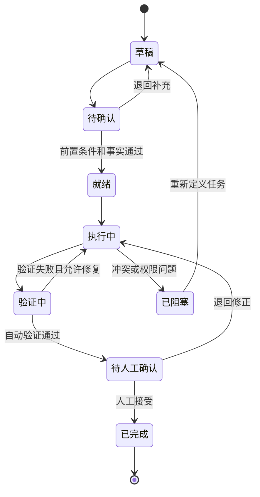

# 任务 Context Pack 规范

> 任务 Context Pack 把一个具体任务所需的目标、事实、边界、契约、风险和验收装配成可执行输入，是 Harness 控制一次 AI 任务的直接入口。

## 1. 定义

任务 Context Pack 是针对一次明确任务生成的**受控上下文快照**。

它必须回答：

- 为什么做；
- 当前任务属于哪个生命周期阶段；
- 哪些事实是执行依据；
- AI 可以做什么、不能做什么；
- 哪些契约不能破坏；
- 如何验证完成；
- 失败时何时重试、停止或升级；
- 结果需要更新哪些长期资产。

任务 Context Pack 不应包含与任务无关的整个项目历史，也不替代项目 Context Pack 和专题事实源。

## 2. 创建条件

以下任务必须建立正式任务 Context Pack：

- 修改多个文件、模块或系统；
- 涉及 API、Schema、权限、依赖或基础设施；
- 影响用户体验、业务规则或高保真确认；
- 需要跨 Agent、跨人员或跨会话执行；
- 需要在 CI、发布或生产环境验证；
- 错误可能影响用户、资金、隐私、安全或合规；
- 计划将执行经验沉淀为模板、门禁或 Skill。

低风险单文件任务可以使用轻量版本，但仍要保留目标、范围、验证和结果记录。

## 3. 标准结构

### 3.1 任务元数据

```yaml
task_id: TASK-20260712-001
title: 新增登录失败空状态
status: ready
lifecycle_stage: 用户体验设计
risk_level: medium
owner: 产品负责人
executor: 开发 Agent
reviewer: 验证 Agent
human_approver: 体验确认人
project_context_version: v0.2
source_commit: abc1234
created_at: 2026-07-12
```

### 3.2 目标与价值来源

必须写清：

- 用户或业务问题；
- 当前任务期望改变的结果；
- 与 PRD、缺陷、指标或设计决策的关系；
- 不完成的影响；
- 明确不属于本任务的目标。

错误示例：

```text
优化登录页面。
```

正确示例：

```text
当账号密码错误时，用户无法理解失败原因。新增明确的错误状态和重试入口，目标是让用户能够在一次反馈后继续完成登录。本任务不改认证协议、数据库和账号锁定规则。
```

### 3.3 权威事实引用

只列执行必要的当前事实：

| 事实 | 来源 | 版本或提交 | 状态 | 用途 |
|---|---|---|---|---|
| 登录业务规则 | 链接 | v1.3 | 当前有效 | 决定错误分类 |
| 登录高保真图 | 链接 | Prototype 4 | 已确认 | 决定页面表现 |
| 认证 API | 链接 | OpenAPI v2 | 当前有效 | 保持接口契约 |

必须说明已排除的旧版本或冲突来源。

### 3.4 前置条件和依赖

- 上游阶段是否通过门禁；
- 产品或高保真是否已人工确认；
- API、Schema 和环境是否可用；
- 依赖任务是否完成；
- 测试数据和权限是否准备；
- 当前分支和基线提交。

前置条件不满足时，任务状态不能标记为 `ready`。

### 3.5 允许修改范围

尽量具体到目录或文件：

```text
允许修改：
- src/features/login/LoginView.tsx
- src/features/login/login.css
- tests/login/login-error.spec.ts
- docs/页面规格/登录页.md
```

如允许新增文件，必须说明允许新增的目录、文件类型和目的。

### 3.6 禁止修改范围

```text
禁止修改：
- 认证 API 和服务端协议
- 数据库 Schema
- 全局路由结构
- package.json 依赖
- 其他页面样式
```

禁止使用“尽量不要改”等模糊表达。

### 3.7 必须保持的契约与不变量

包括但不限于：

- API 请求、响应和错误码；
- 数据字段、主键和约束；
- 用户可观察行为；
- 权限模型；
- 公共组件接口；
- 性能和兼容性要求；
- 已批准高保真和内容文案。

### 3.8 实施要求

说明必要步骤，但不要把实现细节锁死到无法调整：

- 必须先读取哪些文件；
- 必须使用或禁止使用哪些 Skill 和工具；
- 是否允许引入依赖；
- 是否需要同步文档、契约或测试；
- 代码、命名、日志和异常处理规范；
- 是否需要在不同平台或设备验证。

### 3.9 验收断言

验收必须可判断：

```text
- 当 API 返回 INVALID_PASSWORD 时，页面显示已确认文案；
- 焦点回到密码输入框；
- 用户可以立即重新输入；
- 不暴露账号是否存在；
- 原有成功登录流程不受影响；
- 视觉结果与高保真主状态一致。
```

### 3.10 验证方式

至少说明：

- 静态与契约检查；
- 构建或编译命令；
- 单元、接口或集成测试；
- 视觉比对；
- 模拟用户脚本；
- 安全和权限检查；
- 需要人工观察的证据。

不能运行的验证必须说明原因和替代证据。

### 3.11 风险、权限和人工确认

- 风险等级和影响范围；
- 涉及的敏感数据；
- Agent 可使用的工具和权限；
- 必须人工确认的节点；
- 允许自动重试的次数；
- 需要停止和升级的条件。

### 3.12 失败与回滚

明确：

- 失败如何分类；
- 哪些失败可以在任务内修复；
- 哪些失败需要回到产品、设计或架构阶段；
- 如何撤销代码、配置、数据和环境变更；
- 何时禁止继续重试。

### 3.13 输出格式

任务完成时必须输出：

1. 修改文件列表；
2. 实现说明；
3. 未修改和保持的契约；
4. 验证命令、结果和证据；
5. 发现的风险、冲突和未解决事项；
6. 是否需要更新项目 Context、设计决策、模板、门禁或 Skill；
7. 建议的下一步，但不得自行扩大任务。

### 3.14 回写目标

任务开始前就应指定结果可能更新到哪里：

| 结果类型 | 回写位置 |
|---|---|
| 产品规则变化 | 产品定义或设计决策 |
| 高保真变化 | 设计规格和确认记录 |
| API 或 Schema 变化 | 正式契约和工程规格 |
| 新失败类型 | 测试用例、Harness 或经验候选 |
| 通用稳定方法 | 候选模板或 Skill |
| 发布结果 | 发布记录和项目状态 |

## 4. Context 装配清单

任务 Pack 应分为三组：

### 必须直接提供

- 任务目标和边界；
- 关键事实摘要；
- 验收断言；
- 风险和停止条件。

### 按需读取

- 详细 PRD、架构、API、Schema、高保真和历史决策；
- 相关源码和测试；
- 工具说明和运行日志。

### 明确排除

- 与任务无关的历史讨论；
- 已替代文档；
- 未授权敏感信息；
- 容易误导的实验草稿；
- 不属于修改范围的代码和系统。

## 5. 状态模型



## 6. 质量检查

任务 Context Pack 进入 `ready` 前，至少确认：

- 目标能追溯到用户、业务或工程问题；
- 事实引用有当前版本；
- 前置条件已满足；
- 允许与禁止范围明确；
- 关键契约和不变量完整；
- 验收断言可判断；
- 验证方式可执行；
- 风险、权限和人工节点明确；
- 失败和停止条件明确；
- 回写目标已定义；
- 敏感信息已经排除或脱敏。

## 7. 反模式

- 只有一句自然语言需求；
- 把所有项目文档全部粘贴到任务中；
- 允许修改范围写成“整个项目”；
- 没有禁止范围和契约不变量；
- 验收写成“功能正常”“代码优雅”；
- 让开发 Agent 自己宣布用户验收通过；
- 测试失败后无条件无限重试；
- 任务结束后不更新任何长期事实；
- 通过“顺便优化”扩大范围；
- 使用未确认的对话结论覆盖正式文档。
