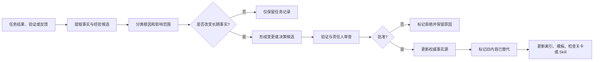

# 决策与经验回写规范

> Context 工程不是单向读取。任务结果、验证证据、失败原因和人工修正必须经过审查，回写到正确的长期事实源，才能形成可靠组织记忆。

中文术语遵循：[术语与易懂表达规范](../01_框架定义/术语与易懂表达规范.md)。

## 1. 回写目标

回写要解决四个问题：

1. 当前任务改变了哪些长期事实；
2. 哪些结论只是一次性结果，哪些可以复用；
3. 失败应更新 Context、Harness、Skill、Agent 约定还是产品假设；
4. 如何避免未经验证的自动记忆直接成为强制规则。

## 2. 回写资产分类

| 资产 | 记录内容 | 进入长期事实源的条件 |
|---|---|---|
| 设计决策 | 重大取舍、备选方案、影响和替代关系 | 责任人批准 |
| 验证证据 | 测试、用户验收、发布和运行结果 | 可复现、来源清晰 |
| 失败记录 | 失败现象、分类、根因和处理 | 完成根因确认 |
| 经验候选 | 可能复用的方法、规则或提醒 | 至少一次真实验证 |
| 稳定规则 | 项目或框架必须遵守的要求 | 多次验证或高风险必要性，并正式批准 |
| 候选 Skill | 可重复任务方法 | 输入输出稳定、验证方式明确、跨任务复验 |

## 3. 回写流程

## 4. 何时必须回写

以下情况不能只停留在任务总结：

- 产品范围、业务规则或验收标准变化；
- 高保真页面、流程或状态重新确认；
- 架构、API、Schema、依赖或权限变化；
- 发现当前文档与实际实现冲突；
- 出现新的失败类型或边缘场景；
- 人工多次修正同一类 Agent 错误；
- 新增或调整质量检查关卡；
- 发布、回滚、事故或重大性能问题；
- 平台能力、限制或适配方式变化；
- 某个方法准备进入模板或 Skill。

## 5. 根因分类与回写位置

| 根因 | 主要回写位置 | 示例 |
|---|---|---|
| 项目事实缺失 | 项目 Context Pack、产品或工程文档 | 缺少错误码定义 |
| 事实过期或冲突 | 权威文档、决策、状态索引 | 高保真与实现版本不一致 |
| 任务边界不清 | 任务 Pack 模板、Harness | Agent 修改无关模块 |
| 约定不完整 | OpenAPI、Schema、接口规范、检查关卡 | Controller 改了但文档未同步 |
| 方法不稳定 | 候选模板、Skill | 代码审查步骤遗漏安全检查 |
| Agent 交接错误 | Agent 输入输出约定 | 设计 Agent 未传递状态矩阵 |
| 工具或平台限制 | 平台适配文档 | 某平台不支持子 Agent |
| 产品假设错误 | 产品定义、价值验证、设计决策 | 用户不需要当前流程 |
| 验证不足 | 测试、用户脚本、发布前检查关卡 | 只测试正常路径 |
| 成本或性能超限 | 指标、预算、架构决策 | Agent 重试导致 Token 超预算 |

## 6. 经验成熟度

经验从低到高分为：

| 状态 | 含义 | 可否作为强制规则 |
|---|---|---|
| 候选 | 从一次任务中观察到 | 否 |
| 已验证 | 在同一项目再次复现或验证 | 一般否，可作为建议 |
| 已采纳 | 责任人批准进入项目规范或检查关卡 | 是，限当前适用范围 |
| 跨项目验证 | 在不同参考工程中有效 | 可进入 Framework 稳定资产 |
| 已废弃 | 被新方法替代或不再适用 | 否 |

公开社区经验、模型建议和自动记忆进入项目时，初始状态均为“候选”。

## 7. 设计决策要求

以下变化必须使用设计决策记录，而不是普通经验记录：

- 框架宪法、全局模型或生命周期变化；
- 项目目标、产品范围或关键业务规则变化；
- 重大架构、数据库、权限或平台选择；
- 人和 AI 责任边界变化；
- 自动化等级、发布和回滚责任变化；
- 多个合理方案之间的长期取舍；
- 现有决策被替代。

设计决策至少包含：背景、问题、备选方案、决定、理由、影响、风险、后续动作和替代关系。

## 8. 自动记忆规则

工具或 Agent 自动生成的记忆必须：

- 标明来源任务和时间；
- 标明是事实、偏好、经验还是推断；
- 默认状态为候选；
- 不包含未经授权的敏感信息；
- 有复核、过期和删除机制；
- 不静默覆盖仓库规则；
- 被采纳时更新正式事实源，而不是只保留在工具私有记忆中。

## 9. 回写完成标准

一次需要回写的任务只有在以下事项完成后才算闭环：

- 已区分临时结果和长期事实；
- 已分类根因；
- 已明确责任人和目标文件；
- 已更新当前有效文档或约定；
- 已标记旧内容被替代；
- 已同步必要索引和导航；
- 已增加必要测试、检查关卡或用户脚本；
- 已记录经验成熟度；
- 已说明是否影响模板、Skill 或 Framework。

## 10. 反模式

- 把每次任务总结都写成长期规则；
- 自动记忆未经验证直接修改 AGENTS.md；
- 只修代码，不更新业务、设计或约定事实；
- 只记录失败现象，不分类根因；
- 新规则没有适用范围和退出条件；
- 用一个项目的经验直接宣称为通用最佳实践；
- 新决策覆盖旧文件但不标替代关系；
- 回写内容包含密钥、隐私或未授权数据；
- 经验只存在某个平台私有记忆，仓库无法恢复。
