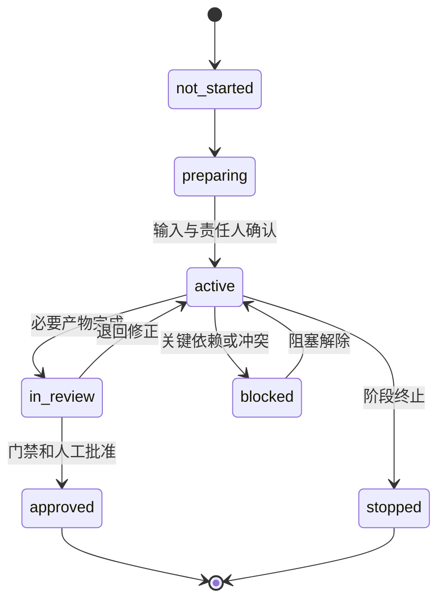

# 阶段 Context 规范

> 阶段 Context 连接项目长期事实与单次任务执行，说明当前生命周期阶段为什么开始、必须产出什么、由谁确认，以及满足什么条件才能退出。

## 1. 定义

阶段 Context 是某一产品价值生命周期阶段的受控工作视图。

它不复制项目全部信息，也不描述某一个具体实现任务，而是回答：

- 当前处于哪个阶段；
- 为什么进入该阶段；
- 上一阶段已经批准了什么；
- 本阶段必须解决哪些问题；
- 应形成哪些标准产物；
- 哪些工作可以并行、哪些有依赖；
- 谁负责执行、审查和批准；
- 满足什么门禁才能进入下一阶段；
- 失败或需求变化时应退回哪里。

## 2. 十阶段对应重点

| 阶段 | 必要输入 | 核心 Context | 退出证据 |
|---|---|---|---|
| 战略与价值验证 | 机会、问题线索、资源约束 | 用户问题、价值假设、市场和风险 | 继续、调整或停止决定，成功指标 |
| 产品定义 | 已验证问题和目标 | 用户、范围、不做清单、业务规则 | 已批准 PRD 和验收断言 |
| 用户体验设计 | 产品范围和用户任务 | 用户流程、信息架构、状态和内容 | 体验规格通过评审 |
| 高保真原型预览与确认 | 体验规格 | 页面、组件、交互、状态、视觉 | 人工高保真确认记录 |
| 工程规格设计 | 已确认产品和体验 | 架构、API、Schema、依赖、安全、环境 | 工程规格和契约批准 |
| 受控任务执行 | 已批准工程规格和任务计划 | 任务边界、依赖、工具、代码基线 | 产物完成并进入验证 |
| 质量与安全验证 | 实现产物和契约 | 静态、运行、安全、性能、数据证据 | 质量门禁通过或豁免 |
| 模拟用户验收 | 质量验证结果 | 用户角色、任务脚本、设备、异常场景 | 人工验收结论 |
| 发布交付 | 验收通过版本 | 发布条件、迁移、监控、回滚、责任 | 发布批准和交付记录 |
| 运行反馈与持续迭代 | 已发布产品和运行信号 | 指标、反馈、问题、成本、假设 | 下一轮优先级和改进决定 |

## 3. 元数据

```yaml
stage_context_id: STAGE-05-ENGINEERING
stage_context_pack_version: 1.0
project: 项目名称
stage: 工程规格设计
status: active
owner: 工程责任人
reviewer: 架构评审人
human_approver: 产品负责人
started_at: 2026-07-12
project_context_pack_version: 0.2-A.2
baseline_commit: abc1234
```

字段要求：

- `status` 使用统一机器值：`not_started`、`preparing`、`active`、`in_review`、`approved`、`blocked`、`stopped`；
- `stage_context_pack_version` 表示阶段 Pack 自身版本；
- `project_context_pack_version` 表示引用的项目 Pack 版本；
- `stage` 必须严格映射 Framework 十阶段名称；
- `baseline_commit` 固定阶段开始时的代码或文档基线。

## 4. 最小结构

### 4.1 进入依据

- 上一阶段退出结论；
- 已批准输入产物；
- 关联设计决策；
- 未关闭但允许带入的风险；
- 进入本阶段的责任人批准。

### 4.2 阶段目标

写清本阶段必须减少的关键不确定性。例如工程规格阶段不是“写技术文档”，而是确认系统边界、契约、数据、安全和实现约束足以支撑任务执行。

### 4.3 必须产物

每个产物至少标明：

- 名称和目标；
- 权威来源路径；
- 责任人；
- 状态；
- 依赖；
- 验证或批准方式。

### 4.4 阶段内工作边界

- 本阶段允许开展的工作；
- 禁止提前开展的下一阶段工作；
- 可并行任务及共享契约；
- 必须串行完成的依赖；
- 需要人工确认的节点。

### 4.5 风险和未决事项

| 风险或问题 | 影响 | 是否阻塞 | 临时处理 | 决策人 | 截止条件 |
|---|---|---|---|---|---|
| API 认证方式未定 | 阻塞接口实现 | 是 | 仅完成领域模型 | 架构责任人 | 进入任务执行前 |

未决事项不得只写“后续再看”，必须说明阻塞判断、决策人和最晚解决条件。

### 4.6 退出门禁

阶段退出必须使用可判断条件：

- 必要输入和产物完整；
- 产物状态为已批准或有明确豁免；
- 关键冲突已经解决；
- 风险等级在允许范围；
- 下一阶段依赖已经准备；
- 人工批准人完成确认；
- 项目 Context Pack 已同步长期变化。

### 4.7 退回路径

明确在以下情况下退回哪个阶段：

- 价值假设变化；
- 产品范围变化；
- 高保真体验无法实现或不被接受；
- 工程契约不成立；
- 验证发现产品或设计问题；
- 用户验收失败；
- 发布风险不可接受；
- 运行反馈证明原假设错误。

## 5. 状态模型



文档可以同时显示中文，但机器字段只使用统一枚举。

## 6. 与任务 Context Pack 的关系

```text
项目 Context Pack
        ↓
阶段 Context：确定阶段目标、产物和门禁
        ↓
任务 Context Pack：确定单次任务范围、契约和验证
        ↓
执行结果、证据和经验
        ↓
更新阶段状态与项目长期事实
```

任务完成不等于阶段完成；阶段退出需要全部必要产物、门禁和人工批准。

## 7. 验收检查

- 阶段名称与十阶段生命周期一致；
- 进入依据可追溯；
- 目标描述的是要消除的不确定性；
- 必须产物、责任人和状态明确；
- 未决事项有阻塞判断和决策期限；
- 不提前执行下一阶段工作；
- 退出门禁可判断且有证据；
- 退回路径明确；
- 长期变化会同步项目 Context Pack；
- 阶段内任务均能追溯到本阶段目标；
- Pack 版本与项目 Pack 引用字段没有混淆。

## 8. 反模式

- 只按计划日期划分阶段，没有输入和退出门禁；
- 阶段名称自创，无法映射十阶段生命周期；
- 产品、设计和工程阶段同时无边界展开；
- 一个任务完成就宣布整个阶段完成；
- 未决事项没有责任人和截止条件；
- 质量验证失败只修代码，不判断是否退回设计或工程规格；
- 阶段结束后项目 Context 仍停留在旧状态；
- 状态字段中混用英文机器值和中文自由文本。
