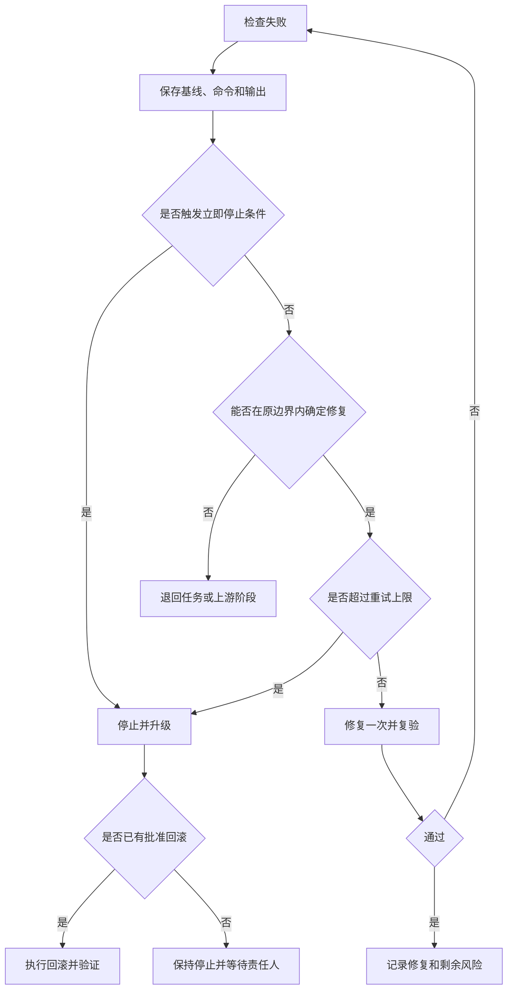

# 失败停止、重试与回滚规范

> 失败处理的目标不是让 Agent 无限尝试，而是尽快识别失败属于哪一层、是否仍在授权范围，以及应修复、退回、停止还是回滚。

## 1. 失败分类

| 类型 | 典型现象 | 默认动作 | 通常退回 |
|---|---|---|---|
| `context_error` | 事实缺失、过期或冲突 | 停止并补齐事实 | Context 或对应上游 |
| `scope_error` | 需要修改未授权路径 | 撤回越界或重新批准 | 任务定义 |
| `spec_error` | 产品、高保真、API、Schema 冲突 | 停止实现 | 产品、设计或工程规格 |
| `implementation_error` | 代码或配置不满足已批准约定 | 边界内修复并复验 | 受控任务执行 |
| `environment_error` | 工具、依赖、网络或设备不可用 | 保存证据，修复环境 | 质量验证 |
| `security_error` | 敏感信息、权限或信任边界风险 | 立即停止并升级 | 工程规格或安全治理 |
| `user_rejection` | 路径可运行但用户不接受 | 判断退回设计或实现 | 高保真或产品定义 |
| `external_side_effect` | 数据、消息、费用或外部状态异常 | 停止、隔离、评估回滚 | 发布或专项处置 |

## 2. 重试上限

同一失败是指根因、命令和错误特征没有实质变化。

| 风险 | 自动修复和重试上限 |
|---|---|
| `low` | 最多 3 轮 |
| `medium` | 最多 2 轮 |
| `high` | 最多 1 轮，扩大范围前重新批准 |
| `critical` | 默认不自动重试，由责任人决定 |

以下情况不受剩余次数影响，必须立即停止：

- 需要扩大允许范围或权限；
- 发现敏感信息或生产环境；
- 回滚不可用或数据状态未知；
- 产品、设计或工程事实源冲突；
- 同类失败达到上限；
- 用户明确退回或中止。

修改输入、扩大范围或换用高风险方案不能伪装成“新的第一次重试”。

## 3. 决策流程

## 4. 回滚要求

回滚方案必须区分：

- 代码和配置回退；
- 数据库 Schema 与数据回退；
- 已发送消息、通知、短信或费用；
- 已发布客户端和兼容性；
- 凭据、权限和外部系统状态。

回滚不是“执行一个命令”即完成。必须验证：

1. 目标版本或状态已经恢复；
2. 数据一致性和外部副作用已经核对；
3. 受影响用户和调用方已经评估；
4. 监控、日志或检查确认系统稳定；
5. 责任人确认后续是继续、修复还是停止。

高风险和严重风险任务必须在执行前准备回滚；无法可靠回滚时必须明确不可逆性和应急方案。

## 5. 状态回写

失败后至少回写：

- 失败类型、首次和最近发生时间；
- 基线提交、环境、命令和错误摘要；
- 已尝试次数和每轮变化；
- 是否越界、是否有外部副作用；
- 当前状态：`fixing`、`blocked`、`rolled_back`、`returned` 或 `failed`；
- 退回阶段、责任人和下一步；
- 可复用经验是否经过复验。

未经复验的临时修复不能直接固化为稳定 Framework 规则。

同一次参考任务还证明，失败归类必须区分：

- 代码或配置本身错误；
- 检查规则误报；
- 模拟器、设备、端口和工具等环境状态；
- 验证脚本落后于当前已批准体验。

只有根因、命令和错误特征相同才累计为同类重试。恢复已授权环境状态不等于修改产品代码，但仍需记录实际动作和结果；更新落后的验证脚本必须保持在任务边界内，不能借机修改产品实现来迎合旧检查。

## 6. 使用入口

- [失败与回滚记录模板](../08_模板资产/Harness/失败与回滚记录模板.md)；
- [阶段进入、退出与退回规范](阶段进入退出与退回规范.md)；
- [风险分级与控制强度](风险分级与控制强度.md)。

本规范已在 YouYu TASK-016 经历两个不同失败类别的一轮修复和完整复验，当前为 `candidate / in_review`；没有发生生产回滚，因此不能据此宣称回滚机制已验证。
