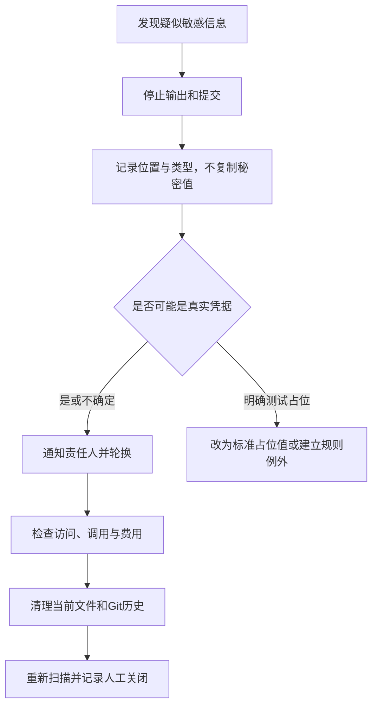

# 安全与敏感信息检查规范

> 本规范定义 AI 任务在权限、密钥、个人数据、日志、配置和 Git 历史方面的最低控制。自动扫描只提供线索和确定性失败，不能代替安全审查。

## 1. 默认边界

- 不在任务、日志、截图、提交信息和证据包中写入密码、Token、私钥或完整个人数据；
- 示例使用明确的占位值，不使用“看起来像测试”的真实凭据；
- 开发、测试和生产配置显式区分；生产配置不得以个人临时地址或隐式默认值兜底；
- Agent 获得文件修改权限，不等于获得数据库、设备、云服务或生产权限；
- 鉴权、授权、密钥、签名、外部暴露和历史泄露至少按 `high` 风险处理；
- 检查当前文件没有敏感值，不代表 Git 历史没有泄露。

## 2. 检查范围

| 范围 | 确定性检查 | 必须人工或专项验证 |
|---|---|---|
| 当前工作区 | 已知密钥格式、私钥头、配置文件和明文模式 | 候选是否为真实秘密、业务必要性 |
| Git 历史 | 扫描工具结果和命中提交 | 凭据轮换、访问与费用、Fork 和缓存影响 |
| 日志 | Token、验证码、手机号等规则命中 | 脱敏是否满足业务和法律要求 |
| 权限 | 配置、路由、声明和测试 | 网络隔离、最小权限和真实绕过路径 |
| 环境 | 开发/测试/生产变量和默认值 | 目标环境真实配置和责任人批准 |
| 数据 | 字段、导出、样例和备份位置 | 数据分级、保留、删除和跨境要求 |

## 3. 发现敏感信息时

关闭历史泄露至少需要：

1. 涉及凭据已经停用或轮换；
2. 访问、调用和费用已经检查；
3. 当前分支与 Git 历史已经处理；
4. 远程副本、Fork、缓存和协作者处置已经评估；
5. 扫描重新执行；
6. 责任人明确确认关闭。

只删除当前文件不能关闭历史泄露。

## 4. 安全结论边界

- 静态扫描无命中：只能说明已配置规则在指定基线没有命中；
- 单元测试通过：不能证明网络和部署信任边界安全；
- Gateway 验证通过：不能证明下游无法被外部直连；
- Token 注销接口通过：必须继续验证旧 Token 不能访问受保护资源；
- 日志代码看似脱敏：必须运行并检查实际输出；
- 本地环境通过：不能扩大为生产安全通过。

## 5. 停止条件

出现以下任一情况必须停止自动执行：

- 需要读取、复制或提交真实秘密值；
- 发现疑似生产凭据或完整个人数据；
- 需要扩大权限或关闭安全检查；
- 无法确认目标环境；
- 破坏性清理、历史重写或轮换需要外部协调；
- 当前任务没有安全责任人或回滚方式。

## 6. 证据记录

安全证据只记录：

- 检查工具和规则版本；
- 基线提交和扫描范围；
- 命中类别、文件位置和数量；
- 处置状态和责任人；
- 重跑结果；
- 未关闭风险。

不得把秘密原文复制进证据。

本规范在 B3 为 `candidate`，不能据此宣称任何项目已经完成安全审计。
