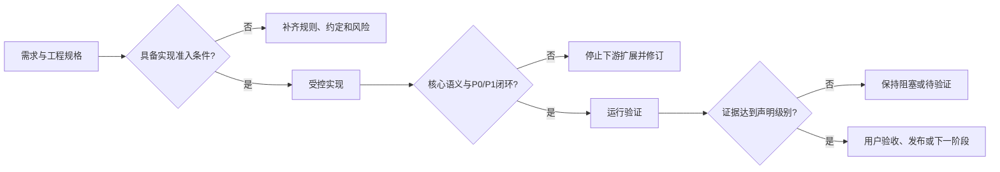

# 实现准入与证据状态关卡

> 资产状态：`candidate`。本规范来自 YouYu 账号登录注册与“我”模块的真实修订过程，用于防止在核心语义、工程边界和运行证据尚未闭环时继续扩展下游实现。

## 1. 为什么需要本关卡

AI 很容易把“已经写出代码”误当成“可以继续向下开发”。真实工程中，以下情况经常同时发生：

- 代码数量持续增加，但核心 P0 仍未解决；
- 字段或能力名称听起来正确，实际语义并不完整；
- 静态检查存在，但没有真实构建、数据库、接口或设备证据；
- 一个服务或脚本承担过多职责，后续修复只能继续叠加补丁；
- 项目 Context、任务记录和验证记录对同一状态给出不同结论；
- 因为“下一层页面已经能写”，跳过当前层的阻塞和回退。

因此，框架需要在“进入实现”“继续扩展”“声明完成”三个位置分别设置关卡。



## 2. 三个独立关卡

### 2.1 实现准入关卡

开始编码前必须确认：

1. 产品目标、范围和不做事项已明确；
2. 用户可感知能力已有流程、状态和人工确认要求；
3. API、数据、并发、安全和失败语义已定义；
4. 任务允许修改范围、禁止范围和依赖顺序已固定；
5. P0 风险有明确设计，不把关键语义留给实现者临时猜测；
6. 验证环境、命令、数据和证据位置可执行；
7. 下游模块的开始条件已写入任务 Context。

未满足时，任务状态应为 `blocked` 或 `not_ready`，不得以“先写起来再说”绕过。

### 2.2 下游扩展关卡

当当前层出现以下任一情况时，必须暂停 UI、客户端、集成或其他下游扩展：

- 新发现 P0；
- 核心业务语义与字段名称不一致；
- 并发、事务、幂等或外部副作用没有明确闭环；
- 静态复核结论被新事实推翻；
- 当前实现无法被独立编译或运行验证；
- 服务职责持续膨胀，只能通过继续叠加条件分支修复；
- 验证脚本不可直接运行或无法保留证据。

暂停不是取消任务。正确动作是回到对应工程规格、服务边界、Harness 或任务拆分层，关闭阻塞后再恢复下游实现。

### 2.3 完成声明关卡

完成声明必须与证据级别一致：

| 事实 | 可以声明 | 不可以声明 |
|---|---|---|
| 文件或代码已存在 | 已定义、已实现 | 已通过、已跑通 |
| 静态复核完成 | 静态检查通过 | 构建、数据库、接口通过 |
| 构建和单元测试成功 | 编译与单测通过 | 端到端与用户体验通过 |
| 集成环境运行成功 | 运行验证通过 | 真实用户验收或生产可用 |
| 模拟用户与目标设备通过 | 业务路径已验收 | 生产稳定、规模化可靠 |

## 3. 状态必须按维度拆分

禁止使用一个 `status` 同时表达实现、复核、运行和业务验收。

推荐至少维护：

```yaml
check_status: blocked | conditional_pass | passed
implementation_status: not_started | in_progress | revised_not_runtime_validated | implemented
static_review_status: not_started | blocked | passed
runtime_validation_status: not_started | pending_execution | blocked | passed
formal_business_validation: not_started | in_review | passed
```

字段规则：

- `check_status` 是当前总体关卡结论；
- `implementation_status` 只描述代码或配置是否存在；
- `static_review_status` 只描述当前复核基线；
- `runtime_validation_status` 必须绑定实际命令、环境和日志；
- `formal_business_validation` 必须绑定人工批准或模拟用户验收；
- 新发现 P0 时，`check_status` 和 `static_review_status` 必须立即降级；
- 历史报告不得覆盖项目 Context 的动态状态。

## 4. 语义级契约检查

静态存在检查不能替代语义检查。每个关键能力至少回答以下问题。

### 4.1 名称与真实语义是否一致

例如一个名为 `idempotencyKey` 的字段，不能只做到“重复请求返回限流”。真正幂等至少需要判断：

- 相同请求是否返回第一次成功结果；
- 处理中是否阻止重复外部副作用；
- 相同键和不同请求内容是否冲突；
- 失败后是否允许重试，以及由谁决定；
- 结果存储丢失后是否有恢复路径。

如果只实现重复抑制，应使用 `deduplicationKey`、`sendIntentKey` 等更准确名称。

### 4.2 状态机是否完整

关键流程应显式列出状态、转换、错误码和恢复方式：

```text
初始
→ 处理中
→ 成功
→ 可重试失败
→ 最终失败
```

必须检查：

- 未知状态如何处理；
- 存储返回空值如何处理；
- 同一状态在代码、契约和文档中的错误码是否一致；
- 状态转换是否原子；
- 失败补偿是否会制造重复副作用。

### 4.3 事务与外部副作用是否一致

数据库事务和外部系统调用不能被视为天然一致。

必须识别：

- 外部调用成功、数据库提交失败；
- 数据库成功、消息或缓存写入失败；
- Token、短信、支付、文件等副作用发生在事务提交前；
- 是否需要 after-commit、补偿、Outbox、幂等消费或人工恢复。

未实现完整方案时，应建立独立任务并保持风险可见，不得藏在备注中。

### 4.4 并发和故障边界是否覆盖

至少检查：

- 相同请求并发；
- 同一业务对象、不同请求键并发；
- 阈值第 N 次和第 N+1 次；
- 存储停机、超时、空结果和未知结果；
- 供应商慢响应超过锁时长；
- 重试是否重复计数或重复调用；
- 失败后锁、冷却、计数和结果状态如何变化。

## 5. 职责和结构关卡

### 5.1 服务职责

一个应用服务应围绕一个业务生命周期职责组织。出现以下信号时应拆分：

- 同一类同时负责发送、登录、协议、账号和资料；
- 修复一个问题需要修改多个无关方法；
- 单元测试必须构造大量无关依赖；
- 事务边界与外部副作用边界混在同一方法；
- 只能继续增加条件分支才能维持行为。

推荐拆分方式：

```text
应用编排服务
├── 业务用例服务
├── 状态机或并发控制服务
├── 外部适配器
├── 持久化边界
└── 契约与校验
```

### 5.2 验证脚本结构

验证脚本不应把所有逻辑堆在一个文件。推荐分层：

```text
编排器
├── 公共环境与函数
├── 静态与契约检查
├── 数据库迁移与行为检查
├── 接口与状态机检查
├── 客户端或设备构建检查
└── 证据汇总
```

检查要求：

- 脚本按文档命令可以直接运行；
- 隔离数据库或测试空间由脚本安全创建；
- 动态名称必须经过格式白名单校验；
- 成功和失败均能定位日志；
- 支持失败时保留环境、成功时清理数据；
- 不依赖大量 grep 证明调用顺序、事务和异常路径。

## 6. 本地 CI 与远程 CI

CI 平台可以是 GitHub Actions、本地 macOS、受控服务器或其他等价环境。平台选择不改变证据标准。

本地 CI 必须具备：

- 固定工具链和版本；
- 可重复启动的依赖环境；
- 隔离测试数据；
- 完整命令和退出码；
- 日志与产物目录；
- 失败环境保留选项；
- 敏感信息扫描；
- 人工无法伪造的关键结果断言。

“已安装 Homebrew”“脚本已经定义”“容器可以启动”都不等于 CI 通过。

## 7. 失败后的框架回写

发现问题后，不只修当前代码，还要判断更新位置：

| 根因 | 首要回写资产 |
|---|---|
| 前置条件不足却进入实现 | 任务模板、阶段关卡 |
| 名称与语义不一致 | 工程规格、契约检查 |
| 服务职责失控 | 架构规范、代码 Review 清单 |
| 脚本不可运行 | Harness、验证模板 |
| 状态源互相矛盾 | Context 模板、发布检查 |
| 运行环境缺失 | 环境规范、验证任务 |
| 外部副作用不一致 | 架构决策、独立风险任务 |

经验从单项目进入 Framework 后仍保持 `candidate`。只有再次在真实任务中减少遗漏或风险，才能提升成熟度。

## 8. 检查清单

### 开始实现前

- [ ] 产品、体验、工程规格和关键状态已定义；
- [ ] P0 风险有设计方案；
- [ ] 下游实现开始条件明确；
- [ ] 运行环境和证据位置可执行；
- [ ] 任务范围和禁止事项固定。

### 继续扩展前

- [ ] 当前层没有未关闭 P0；
- [ ] 关键名称与实际语义一致；
- [ ] 服务职责没有失控；
- [ ] 静态复核基线仍然有效；
- [ ] 运行验证不存在脚本级阻塞。

### 声明完成前

- [ ] 各状态维度独立填写；
- [ ] 实际命令和日志已保存；
- [ ] 错误码、状态机和契约一致；
- [ ] 并发与故障场景已执行；
- [ ] 未实现风险有独立任务；
- [ ] 人工验收结论与证据级别匹配。

## 9. 当前成熟度边界

本规范已在 YouYu 问题复盘和修订中形成，但尚未完成本地 macOS 运行验证，也未经过第二个参考工程复验。因此：

```text
资产成熟度：candidate
Harness里程碑B：not_started
```

新增本规范不代表 Harness B 已启动，也不代表 YouYu 已通过静态或运行验证。