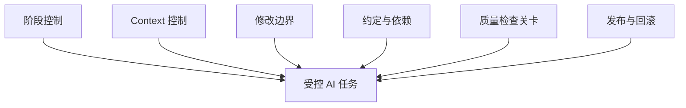
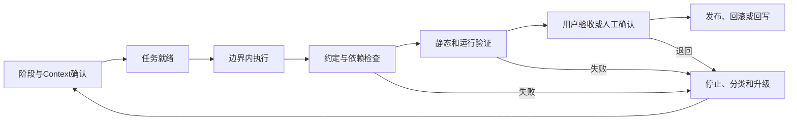
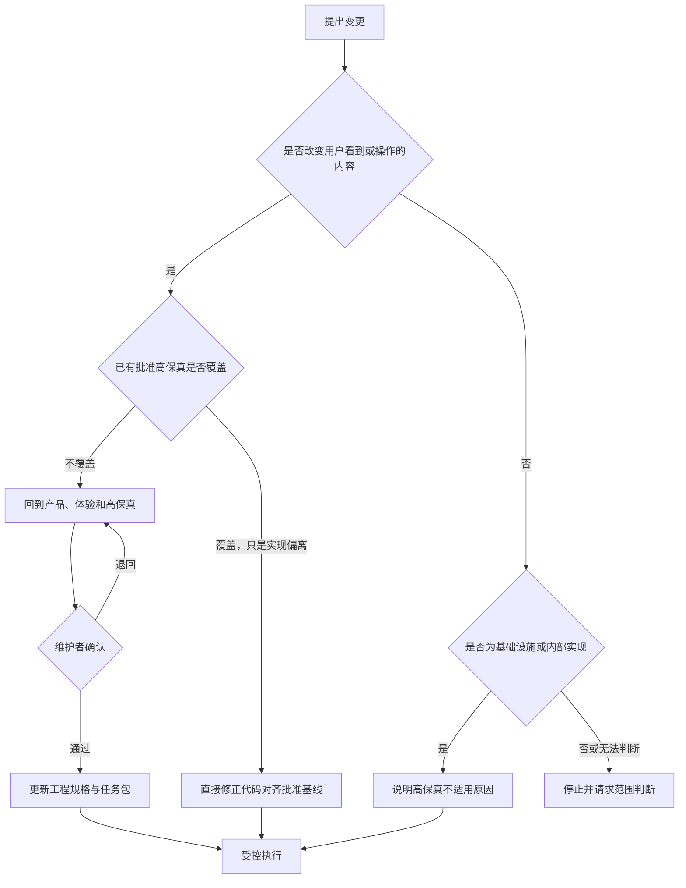
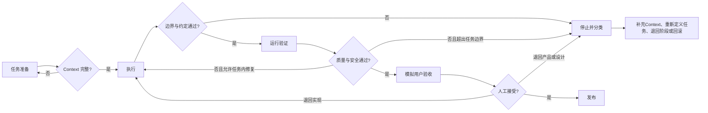

# Harness 执行控制与检查关卡

> 本文是 Harness 工程的当前权威总览。风险等级以[风险分级与控制强度](风险分级与控制强度.md)为准，生命周期阶段转换以[阶段进入、退出与退回规范](阶段进入退出与退回规范.md)为准，单次任务的范围和依赖控制以[任务修改边界与权限规范](任务修改边界与权限规范.md)和[依赖与高风险变更授权规范](依赖与高风险变更授权规范.md)为准；一致性、安全、证据和失败控制分别以[接口、数据与实现一致性规范](接口数据与实现一致性规范.md)、[安全与敏感信息检查规范](安全与敏感信息检查规范.md)、[验证证据与结论边界规范](验证证据与结论边界规范.md)和[失败停止、重试与回滚规范](失败停止重试与回滚规范.md)为准。

## 1. 定义

Harness 是模型外部的工程控制系统。它不依赖模型自觉，而是通过上下文装配、阶段、边界、约定、工具、检查和人工确认，提高执行稳定性。

## 2. 六类控制面



| 控制面 | 要解决的问题 | 典型机制 |
|---|---|---|
| 阶段控制 | 当前是否具备进入下一阶段的条件？ | 阶段清单、批准状态、产物依赖 |
| Context 控制 | AI 是否获得正确且足够的信息？ | Context Pack、事实来源、冲突检查 |
| 修改边界 | AI 可以改什么、不能改什么？ | 文件白名单、禁止模块、权限 |
| 约定与依赖 | 多模块如何保持一致？ | OpenAPI、Schema、接口约定和依赖白名单 |
| 质量检查关卡 | 如何证明结果正确？ | Review、测试、视觉比对、用户脚本 |
| 发布与回滚 | 出错后如何停止和恢复？ | 发布清单、迁移检查、回滚方案 |

六类控制面是一个整体，不是六条互不相关的流程：



## 3. Harness 的最小判断

任何会修改真实仓库、系统、数据或用户体验的任务，开始前必须回答：

1. **阶段**：当前任务属于十阶段中的哪一阶段，上游是否已经通过？
2. **事实**：依赖的产品、高保真、工程规格和代码基线是否为当前有效版本？
3. **边界**：允许修改什么，明确禁止修改什么？
4. **风险**：任务风险等级是什么，哪些动作必须由人批准？
5. **约定**：哪些 API、Schema、权限、用户行为和依赖不能破坏？
6. **证据**：用什么静态、运行和用户证据证明结果？
7. **失败**：何时允许任务内修复，何时必须停止、退回或回滚？
8. **回写**：结果需要更新哪些长期事实、检查关卡或经验？

任一必填问题没有答案时，任务不得进入 `ready`。

## 4. 变更路线判断



规则：

- 新页面、导航、主要交互、可见状态或用户流程变化，必须先更新并确认产品和高保真；
- 代码与已批准高保真不一致，但目标体验没有变化时，可以直接修代码对齐；
- 基础设施、纯后端或内部重构可以标记高保真不适用，但必须写明理由；
- “小改动”不是跳过产品或高保真确认的充分理由；
- 无法判断是否影响用户时，默认停止并请求人工判断。

## 5. 标准任务包

每个可执行任务至少包含：

- 任务目标和业务背景；
- 所属生命周期阶段；
- 输入事实和依赖文档；
- 允许修改的目录或文件；
- 禁止修改的范围；
- 需要保持的接口、数据和功能行为约定；
- 验收断言和验证命令；
- 风险、人工确认点和失败处理；
- 输出格式：修改文件、实现说明、验证结果、风险和后续事项。

## 6. 检查关卡模型



## 7. 三层验证

1. **静态与审查层**：文档一致性、代码规范、架构、约定、依赖和安全扫描；
2. **运行验证层**：构建、单元测试、接口、数据、集成和部署验证；
3. **用户体验层**：真实任务脚本、目标设备、异常和边缘场景、视觉与内容检查。

三层验证不能互相替代：

| 已完成 | 最多可以得出的结论 | 不能宣称 |
|---|---|---|
| 静态与审查 | 结构和规则可继续验证 | 工程可运行 |
| 构建与测试 | 依赖、编译和已执行测试成立 | 服务或 App 可用 |
| 启动与最小调用 | 指定运行链路成立 | 用户体验通过 |
| 模拟用户验收 | 指定用户路径可操作 | 已具备生产发布条件 |
| 发布检查 | 目标环境发布条件满足 | 长期运行稳定 |

证据的结构、总体结论约束和机器清单见[验证证据与结论边界规范](验证证据与结论边界规范.md)。机器检查只验证结构和结论没有自相矛盾，不验证证据真实性。

## 8. 失败处理

失败不应只触发“让模型再试一次”。必须分类：

- Context 缺失或过期；
- 任务拆解或边界错误；
- 约定不完整；
- Skill 能力不足；
- 工具或环境问题；
- 产品或设计假设错误。

分类结果决定更新哪一类资产，避免无限重试。

失败后必须：

1. 停止扩大修改范围；
2. 保存命令、输出、环境和当前提交；
3. 判断能否在原任务边界内修复；
4. 超出边界时更新任务并重新批准，不得先改后补；
5. 产品或体验假设错误时退回对应阶段；
6. 破坏性动作失败时禁止自动重试，先确认回滚和数据状态。

失败分类、各风险等级重试上限和回滚完成条件见[失败停止、重试与回滚规范](失败停止重试与回滚规范.md)。

## 9. 人工责任不可被风险等级取消

以下决定始终由明确的人类责任人承担：

- 产品价值、范围和优先级；
- 高保真体验确认；
- 敏感数据、权限和高风险变更；
- 验收豁免、生产发布和回滚；
- 许可、法律与最终产品责任。

风险等级只决定控制强度，不能取消这些人工责任。

## 10. 能力状态与证据边界

必须区分：

```text
已定义：仓库中存在规则
已实现：已有脚本或流程实现
已执行：在指定任务和基线上实际运行
已通过：执行结果满足断言并有证据
已验证成熟度：经过规定数量和类型的参考工程复验
```

当前成熟度必须逐资产判断：

| 资产范围 | 成熟度 |
|---|---|
| 风险分级与控制强度 | `single_project_validated` |
| 任务修改边界、任务控制模板与路径检查器 | `single_project_validated` |
| 验证证据规则、模板、机器清单与检查器 | `single_project_validated` |
| 阶段退回、依赖变更、全链一致性、安全审计和真实回滚 | `candidate` |
| Harness 整体 | `candidate` |

单项目证据来自 YouYu TASK-016，不代表跨项目、生产或稳定成熟度。完整评估见 [HARNESS-MATURITY-001](../12_框架项目Context/验证/HARNESS-MATURITY-001_B6逐资产成熟度评估.md)。

## 11. 最小原则

Harness 应与风险匹配。小任务使用轻量任务包和检查；高风险数据、权限、支付、发布任务需要更严格的检查关卡。流程复杂度本身不是成熟度，能有效降低错误才是。

低风险任务可以裁剪字段，但目标、事实、允许与禁止范围、验证、责任和结果记录不得删除。
