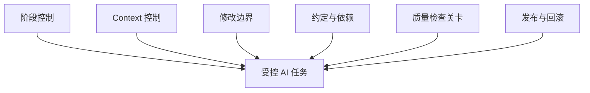
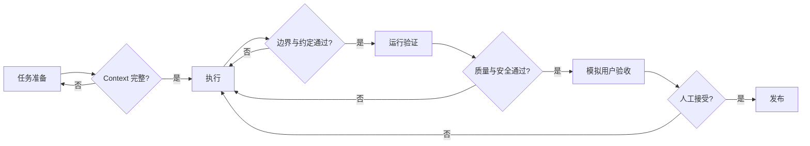

# Harness 执行控制与检查关卡

## 1. 定义

Harness 是模型外部的工程控制系统。它不依赖模型自觉，而是通过上下文装配、阶段、边界、约定、工具、检查和人工确认，提高执行稳定性。

## 2. 六类控制面

| 控制面 | 要解决的问题 | 典型机制 |
|---|---|---|
| 阶段控制 | 当前是否具备进入下一阶段的条件？ | 阶段清单、批准状态、产物依赖 |
| Context 控制 | AI 是否获得正确且足够的信息？ | Context Pack、事实来源、冲突检查 |
| 修改边界 | AI 可以改什么、不能改什么？ | 文件白名单、禁止模块、权限 |
| 约定与依赖 | 多模块如何保持一致？ | OpenAPI、Schema、接口约定和依赖白名单 |
| 质量检查关卡 | 如何证明结果正确？ | Review、测试、视觉比对、用户脚本 |
| 发布与回滚 | 出错后如何停止和恢复？ | 发布清单、迁移检查、回滚方案 |

## 3. 标准任务包

每个可执行任务至少包含：

- 任务目标和业务背景；
- 所属生命周期阶段；
- 输入事实和依赖文档；
- 允许修改的目录或文件；
- 禁止修改的范围；
- 需要保持的接口、数据和功能行为约定；
- 验收断言和验证命令；
- 风险、人工确认点和失败处理；
- 输出格式：修改文件、实现说明、验证结果、风险和后续事项。

## 4. 检查关卡模型

## 5. 三层验证

1. **静态与审查层**：文档一致性、代码规范、架构、约定、依赖和安全扫描；
2. **运行验证层**：构建、单元测试、接口、数据、集成和部署验证；
3. **用户体验层**：真实任务脚本、目标设备、异常和边缘场景、视觉与内容检查。

## 6. 失败处理

失败不应只触发“让模型再试一次”。必须分类：

- Context 缺失或过期；
- 任务拆解或边界错误；
- 约定不完整；
- Skill 能力不足；
- 工具或环境问题；
- 产品或设计假设错误。

分类结果决定更新哪一类资产，避免无限重试。

## 7. 最小原则

Harness 应与风险匹配。小任务使用轻量任务包和检查；高风险数据、权限、支付、发布任务需要更严格的检查关卡。流程复杂度本身不是成熟度，能有效降低错误才是。
