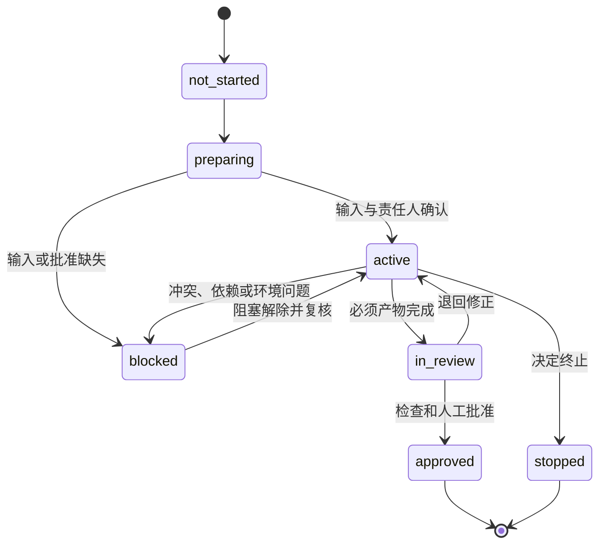
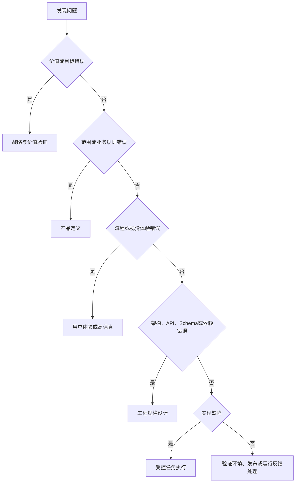

# 阶段进入、退出与退回规范

> 本文把十阶段产品价值生命周期转化为可判断的阶段检查。阶段检查不负责代替产品或工程决定，只负责证明当前是否具备继续条件。

## 1. 基本规则

- 项目只能有一个当前生命周期阶段；
- 阶段 Context 必须映射十阶段标准名称；
- 任务完成不等于阶段完成；
- 进入下一阶段前必须有上游退出证据；
- 检查不通过时只能补充、阻塞、退回或停止，不能静默跳过；
- `不适用` 必须说明原因、适用范围和批准人；
- 人工批准不能被自动检查结果替代。

## 2. 阶段状态

阶段状态和任务状态必须分开。例如任务可以 `completed`，但阶段仍因其他任务或人工批准缺失而保持 `active`。

## 3. 通用进入检查

阶段进入前必须确认：

- 上一阶段结论存在且为当前有效版本；
- 当前阶段目标和要消除的不确定性明确；
- 必须输入、责任人、审查人和批准人明确；
- 允许带入的风险和阻塞边界明确；
- 项目 Context、阶段 Context 和代码基线一致；
- 禁止提前开展的下一阶段工作已经声明。

结果只能是：

| 结果 | 含义 | 后续动作 |
|---|---|---|
| `ready` | 条件满足 | 进入阶段并标记 `active` |
| `conditional_ready` | 只存在允许带入且不影响目标的风险 | 记录条件、责任人和最晚关闭点 |
| `blocked` | 关键输入、权限或环境缺失 | 不得进入执行 |
| `return` | 上游结论错误或变化 | 退回指定阶段 |
| `stopped` | 价值、风险或资源决定终止 | 记录停止决定和资产处理 |

## 4. 十阶段检查矩阵

| 阶段 | 最小进入证据 | 最小退出证据 | 必须人工决定 | 失败通常退回 |
|---|---|---|---|---|
| 战略与价值验证 | 机会、问题线索和资源约束 | 用户问题、价值假设、成功/停止指标 | 是否值得继续 | 停止或继续本阶段 |
| 产品定义 | 已批准继续的价值问题 | 用户、范围、不做清单、业务规则、验收断言 | 产品范围和优先级 | 战略与价值验证 |
| 用户体验设计 | 已批准产品范围 | 用户流程、信息架构、状态和内容 | 关键体验取舍 | 产品定义 |
| 高保真原型预览与确认 | 已批准体验规格 | 可浏览原型、关键状态和确认记录 | 高保真批准 | 用户体验设计 |
| 工程规格设计 | 已确认产品与高保真，或已批准不适用 | 架构、API、Schema、依赖、安全、环境和实现边界 | 高风险技术和成本取舍 | 产品、体验或高保真 |
| 受控任务执行 | 工程规格、任务 Pack、基线、权限和环境就绪 | 产物、修改清单、执行日志和验证入口 | 范围扩大和高风险操作 | 工程规格设计 |
| 质量与安全验证 | 可运行产物和固定约定 | 静态、构建、测试、数据、安全和未解决风险 | 豁免或带风险继续 | 受控执行或工程规格 |
| 模拟用户验收 | 质量验证达到进入标准 | 用户脚本、目标设备、异常状态和人工结论 | 用户是否接受 | 产品、体验、高保真或实现 |
| 发布交付 | 验收通过版本 | 发布计划、迁移、监控、回滚和批准记录 | 是否发布、何时回滚 | 质量验证或受控执行 |
| 运行反馈与持续迭代 | 已交付版本和真实信号 | 指标、反馈、失败、成本和下一轮决定 | 继续、调整或停止 | 对应的价值、产品、设计或工程阶段 |

## 5. 用户可见变更专项检查

对用户可见的变更，在进入工程规格或受控执行前必须判断：

| 情况 | 路线 |
|---|---|
| 新页面、导航、流程或主要交互 | 产品定义 → 体验设计 → 高保真确认 → 工程规格 |
| 修改正常、加载、空、错误或权限状态 | 更新页面说明和高保真状态后再实现 |
| 代码偏离已批准高保真 | 不改变目标设计，直接修代码并做视觉比对 |
| 纯文案但影响业务承诺或法律含义 | 回到产品或法律责任人确认 |
| 用户不可见的基础设施变更 | 在任务中说明高保真不适用及理由 |
| 无法确定是否影响用户 | `blocked`，请求产品或体验责任人判断 |

## 6. 通用退出检查

阶段退出前至少确认：

- 必须产物完成并处于当前有效版本；
- 关键约定、风险和冲突已处理；
- 已执行的检查有真实证据，未执行项有原因；
- 下一阶段的输入和责任人已经准备；
- 项目 Context 和阶段 Context 已同步；
- 必须的人工批准已记录；
- 退回和回滚路径仍然有效。

退出结果：

| 结果 | 机器状态 | 含义 |
|---|---|---|
| 通过 | `approved` | 可以进入下一阶段 |
| 有条件继续 | 保持 `active` 或 `in_review` | 未达到正式退出，不能伪装为通过 |
| 阻塞 | `blocked` | 需要关闭依赖或风险 |
| 退回 | 当前阶段归档或保持待复核 | 回到指定上游阶段 |
| 停止 | `stopped` | 明确终止，不进入下一阶段 |

## 7. 退回规则

发现问题时，应退回最早产生错误假设的阶段：

禁止只在代码层掩盖产品、体验或工程规格错误。

## 8. 不适用和豁免

`不适用` 记录至少包含：

- 哪个检查项不适用；
- 为什么与当前任务无关；
- 适用范围和有效期；
- 谁做出判断；
- 哪种变化会使该结论失效。

豁免表示已知检查未满足但仍申请继续，必须包含风险、补偿、责任人、截止时间和人工批准。AI 不得自行批准豁免。

## 9. 反模式

- 因为代码已经写完而倒推工程阶段通过；
- 因为构建成功而宣布用户验收完成；
- 阶段名称使用计划活动而不是十阶段名称；
- 用“后续补充”代替阻塞判断和截止条件；
- 产品或高保真变化后只修改代码；
- 验证失败时无限留在实现阶段，不判断是否应退回上游；
- 项目 Context 已进入新阶段，阶段 Context 仍停留在旧阶段。

## 10. 当前成熟度

本规范在 B1 为 `candidate`。需要经历一次真实阶段进入、任务执行、失败或退回、退出和项目 Context 同步后，才能评估是否获得单项目证据。
