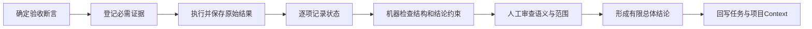

# 验证证据与结论边界规范

> 本规范统一记录静态、运行、用户和发布证据，防止把“写了检查”“命令执行过”或“某一层通过”扩大成完整交付结论。

## 1. 四类证据

| 证据层 | 回答的问题 | 示例 |
|---|---|---|
| `static` | 结构、约定和代码是否可继续验证？ | 链接、格式、静态分析、架构审查 |
| `runtime` | 指定环境中的构建、服务、接口和数据是否真实运行？ | 构建、测试、启动、迁移、接口 |
| `user` | 目标用户路径和体验是否可接受？ | 模拟器、真机、浏览器、截图、人工验收 |
| `release` | 目标环境是否具备发布和恢复条件？ | 配置、迁移、监控、回滚、批准 |

三层业务验证是 `static + runtime + user`。`release` 是交付前的额外检查，不能由前三层自动推出。

## 2. 有效证据最小字段

- 任务 ID、仓库、基线提交和工作分支；
- 执行环境、工具版本和必要配置说明；
- 实际命令或人工步骤；
- 预期结果、实际结果、退出码或人工判断；
- 证据位置；
- 执行者、时间和状态；
- 未执行项、阻塞、风险和适用边界。

命令成功但没有记录目标、环境和基线时，证据不可稳定复现。

## 3. 结论规则

1. `required=true` 的证据项必须全部 `passed`，总体结果才能是 `passed`；
2. `formal_business_validation=passed` 时，`static`、`runtime`、`user` 三层都必须至少有一项必需证据通过；
3. `release` 未执行时，不得宣称已具备生产发布条件；
4. 人工步骤必须记录责任人和明确结论；
5. 未执行命令写成 `not_executed`，不能用计划命令作为证据；
6. 外部状态必须记录真实系统和结果，不能由仓库文件存在推断；
7. 同一证据只支撑其实际覆盖的范围。

## 4. 证据状态

| 状态 | 使用条件 |
|---|---|
| `passed` | 已执行，实际结果满足断言 |
| `failed` | 已执行，实际结果不满足断言 |
| `blocked` | 无法继续，阻塞原因明确 |
| `not_executed` | 尚未执行 |
| `not_applicable` | 已说明为何不适用并有责任人确认 |

总体结果可以是：

```text
passed
conditional_pass
failed
blocked
not_executed
```

## 5. 证据包流程



## 6. 自动检查边界

`scripts/check_evidence_manifest.py` 只检查：

- JSON 结构和允许状态；
- 必需证据与总体结果是否矛盾；
- 正式业务通过是否具备三层证据；
- 已执行项是否记录步骤、责任人和证据位置。

它不运行证据中的命令，也不判断证据内容是否真实、产品是否正确或用户是否满意。

## 7. 使用入口

- [验证证据包模板](../08_模板资产/Harness/验证证据包模板.md)；
- [机器证据清单模板](../08_模板资产/Harness/验证证据清单模板.json)；
- [失败与回滚记录模板](../08_模板资产/Harness/失败与回滚记录模板.md)。

YouYu TASK-016 已完成首次真实参考执行：

- 静态、运行和用户三层必需证据均为 `passed`；
- 发布证据未执行；
- 维护者已接受有限结论；
- 因此总体保持 `conditional_pass`，`formal_business_validation` 保持 `not_executed`。

成熟度：`single_project_validated`。

该结果验证了证据结构和结论约束的可用性，但不验证生产发布检查、证据内容真实性或跨项目复用。
