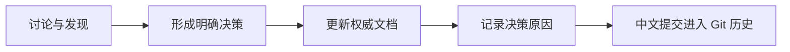

# DEC-001：确立 v0.1 框架宪法层

- **状态**：已采纳
- **日期**：2026-07-12
- **适用版本**：v0.1 起
- **决策类型**：框架级

## 1. 背景

项目最初从 AI 产品工程实战、Harness、Skills、Context、Agents 和 Loops 等概念逐步扩展。随着讨论深入，出现了三个风险：

1. 后续任务重点变化时，早期的重要设计可能只保留在聊天中并被遗忘；
2. 如果先大量建设 Skills、模板和目录，项目可能退化成工具集合；
3. 生命周期阶段与 AI 工程基础设施容易混在一起，导致层级不断增加但边界不清。

因此需要在 v0.1 先建立一组稳定的最高层文件，为后续所有模块提供方向、原则、边界和判断标准。

## 2. 决策

v0.1 建立“框架宪法层”，至少包含：

- 《AI 产品工程框架愿景与定位》；
- 《AI 产品工程核心原则》；
- 《AI 产品工程适用场景》；
- 《AI 产品工程边界声明》；
- 《AI 产品工程总架构》；
- 本设计决策记录。

这些文件共同定义 Framework 的长期稳定内核。

## 3. 核心模型决策

### 3.1 采用双维度模型

不再把所有概念排列成一条不断增长的“十层、十二层或更多层”单一链路，而是拆分为：

1. **产品价值生命周期**：战略与价值验证、产品定义、体验设计、高保真预览、工程规格、受控执行、质量与安全验证、模拟用户验收、发布交付、持续反馈与迭代；
2. **AI 工程基础设施**：Context Engineering、Harness Engineering、Skill Engineering、Agent Engineering、Loop Engineering。

### 3.2 采用横切治理

安全、隐私、合规、质量、可观测性、成本、版本和变更管理作为贯穿全生命周期的治理能力，不机械增加为独立生命周期阶段。

### 3.3 明确落地资产

框架通过标准、模板、Skills、门禁、平台适配和参考工程逐步实现，而不是在 v0.1 直接建设完整运行平台。

## 4. 图示决策

核心文档同时使用：

- **真实图片**：用于快速建立认知、演示和传播；
- **Mermaid 图**：用于正式表达结构、关系和流程；
- **Markdown 正文**：用于定义规则、边界和解释。

真实图片由 ChatGPT 生成，但 AI 图片可能存在文字误差。因此正式定义的权威顺序是：

```text
核心 Markdown 正文 / Mermaid 模型 > 模板和示例 > 真实概念图片
```

## 5. Context 与记忆决策

项目不得依赖模型或聊天会话记住长期结论。重要讨论必须经过以下路径：



README.md 负责让人快速理解，AGENTS.md 负责约束 AI 执行，核心模型文档负责正式定义，设计决策记录负责解释为什么这样设计。

## 6. 备选方案

### 方案 A：先建设 Skills 库

未采用。原因是缺少统一生命周期、准入标准和验证机制，容易形成无序集合。

### 方案 B：只维护一个 README.md

未采用。原因是 README 既要简洁又要承载全部正式定义，会迅速膨胀，也无法清晰区分方向、原则、边界和历史原因。

### 方案 C：采用单一多层生命周期模型

未采用。原因是 Context、Harness、Skill、Agent、Loop 是横切基础设施，不是一次性经过的产品阶段。强行串联会造成模型失真和重复。

### 方案 D：依赖聊天记录和模型记忆

未采用。原因是跨会话、跨模型和长期任务中不可可靠复现，也不具备版本化、审查和回退能力。

## 7. 影响

### 正面影响

- 后续任务可以从仓库恢复完整项目认知；
- 新增模块有稳定的准入判断标准；
- 避免框架退化成 Skills 或 Prompt 收藏库；
- 明确产品生命周期与 AI 工程基础设施之间的关系；
- 为 README、AGENTS.md、模板、门禁和参考工程建立权威来源。

### 成本和风险

- 初期文档建设工作增加；
- 核心文件之间必须持续检查一致性；
- 宪法层过于僵化可能阻碍合理演进，因此必须保留正式变更流程；
- 图片、示例和平台适配可能与核心定义产生漂移，需要一致性门禁。

## 8. 后续行动

1. 更新 README.md，提供宪法层导航和总架构入口；
2. 更新 AGENTS.md，要求 AI 修改前读取宪法层和相关决策；
3. 建立 Context 工程模型和决策记录规范；
4. 逐步细化生命周期各阶段；
5. 建立 Harness、Skill、Agent 和 Loop 的正式规范；
6. 通过参考工程验证后再把方法标记为稳定；
7. 建立文档链接、Mermaid 和一致性检查门禁。

## 9. 变更本决策的条件

只有在真实项目验证证明双维度模型无法覆盖重要问题，且现有原则、横切治理或扩展机制无法解决时，才考虑调整本决策。调整必须新建设计决策记录，不得直接覆盖本文件的历史结论。
