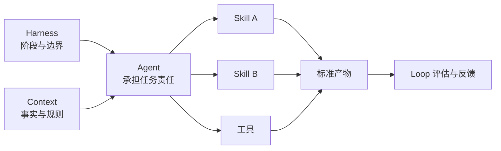

# Skills 与 Agent 协作模型

## 1. Skill 和 Agent 的区别

- **Skill** 是可重复执行的能力包，描述某类任务如何做、需要什么输入、产生什么输出并如何验证。
- **Agent** 是承担目标和责任的执行角色，可以根据任务调用多个 Skills、工具和知识源。
- **Harness** 决定 Agent 在什么阶段、什么范围和什么门禁下执行。
- **Context** 提供 Agent 和 Skill 所需的事实。
- **Loop** 根据执行结果决定重试、升级、停止或改进资产。



## 2. Skill 最小结构

一个成熟 Skill 至少定义：

1. 名称和目标；
2. 触发条件与不适用情况；
3. 必要输入；
4. 执行步骤；
5. 标准输出；
6. 验证方式；
7. 失败和升级处理；
8. 模板、脚本与参考资料；
9. 已验证场景和已知限制。

公开 Skill 只能作为参考，项目内 Skill 必须结合自身业务、架构、工具和门禁。

## 3. Agent 输入输出契约

Agent 协作不能只靠角色名称。每个交接必须明确：

- 输入是否已批准；
- 接收的事实来源；
- 允许调用的 Skills 和工具；
- 需要生成的标准产物；
- 质量要求和门禁；
- 失败时交给谁；
- 哪些结论必须人工确认。

## 4. 平台适配

框架保持平台无关，但适配层可以分别提供：

```text
平台适配/
├── Claude-Code/
│   ├── CLAUDE.md 示例
│   ├── rules/
│   └── skills/
├── Codex/
│   ├── AGENTS.md 示例
│   ├── skills/
│   └── 任务模板/
├── Kimi/
└── GLM/
```

平台适配必须记录真实能力差异，不能假设所有平台都支持相同的记忆、工具、子 Agent、后台任务或权限机制。

## 5. 编排原则

- 先定义契约，再考虑并行；
- Agent 数量服从任务，不追求“多 Agent”标签；
- 高风险节点保留人工审批；
- 每个 Agent 只能在授权范围内调用工具；
- 同一事实只保留一个当前权威来源；
- 验证 Agent 不应只重复开发 Agent 的自我结论。

## 6. 演进顺序

先用人工流程和模板验证方法，再封装 Skill；先用少量 Agent 验证交接，再自动编排；先验证门禁有效，再构建平台化界面。
