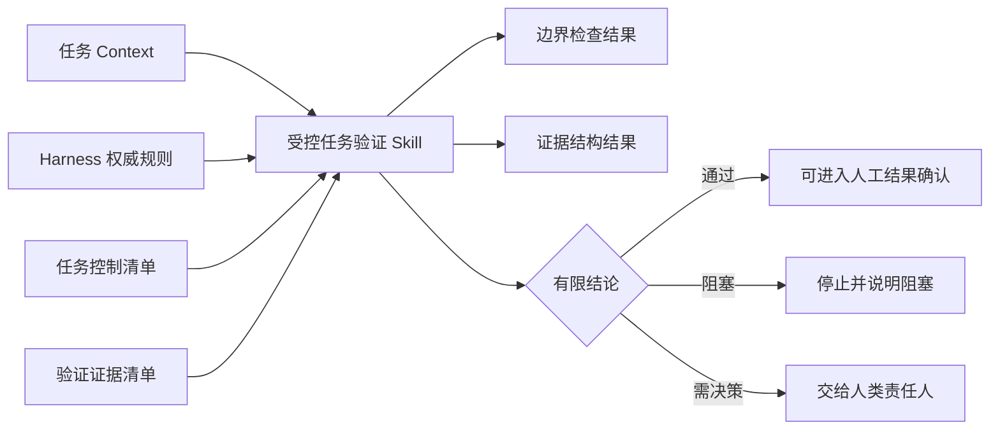
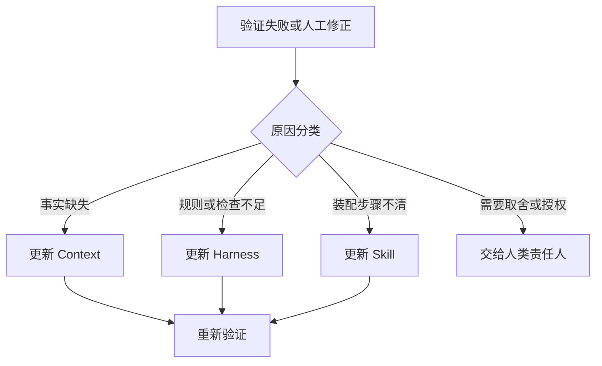

# 受控任务验证 Skill 设计

> 设计状态：`pending_human_approval`
>
> 候选标识：`controlled-task-validation`
>
> 资产成熟度：`candidate`
>
> 本文件只定义首个 Skill 的最小边界，尚未创建可被 Agent 加载的实际 Skill 包。

## 1. 目标

把已经在 YouYu TASK-016 获得单项目证据的风险判断、任务边界和证据结论能力，装配为一次可重复执行的验证流程。

它回答：

> 当前任务是否在已批准范围内执行，并留下足以支撑有限结论的证据？

它不负责决定产品是否值得做，不生成业务实现，不批准高风险变更，也不替代人工验收。



## 2. 具体使用示例

### 2.1 应触发

- “检查这个任务是否超出允许修改范围，并验证证据结论是否成立”；
- “提交前按任务 Context 和控制清单做一次受控验证”；
- “复核这个提交能否形成 `passed`、`conditional_pass` 或 `blocked` 结论”；
- Framework 自身任务完成后，检查暂存路径和证据清单；
- YouYu 后续具备任务 Context、控制清单和证据清单的受控任务。

### 2.2 不适用

- 任务还没有当前有效的任务 Context；
- 没有机器任务控制清单或验证证据清单；
- 用户要求代码审查、性能分析、完整安全审计或视觉验收本身；
- 需要批准数据库、依赖、生产发布、许可或其他高风险决定；
- 仓库没有已验证的边界和证据检查器；
- 目标是自动修复所有失败或自动发布。

不适用时必须说明缺少的输入或应调用的专项能力，不得临时扩大 Skill。

## 3. 权威事实与复用关系

Skill 不复制 Harness 规则，只读取并执行当前项目的权威入口：

| 能力 | 权威来源 |
|---|---|
| 风险判断 | [风险分级与控制强度](../05_Harness工程/风险分级与控制强度.md) |
| 路径和权限 | [任务修改边界与权限规范](../05_Harness工程/任务修改边界与权限规范.md) |
| 证据结论 | [验证证据与结论边界规范](../05_Harness工程/验证证据与结论边界规范.md) |
| 人类可读控制 | [任务执行控制模板](../08_模板资产/Harness/任务执行控制模板.md) |
| 机器边界输入 | [任务控制清单模板](../08_模板资产/Harness/任务控制清单模板.json) |
| 机器证据输入 | [验证证据清单模板](../08_模板资产/Harness/验证证据清单模板.json) |
| 边界检查 | `scripts/check_task_boundary.py` |
| 证据检查 | `scripts/check_evidence_manifest.py` |

Harness 规则变化时先更新并验证 Harness，再调整 Skill 的装配步骤。Skill 不能成为第二套事实源。

## 4. 必需输入

| 输入 | 必需 | 最低要求 |
|---|---|---|
| 仓库路径 | 是 | 可识别 Git 工作区 |
| 当前任务 Context | 是 | 任务 ID、状态、风险、基线、允许和禁止范围明确 |
| 任务控制清单 JSON | 是 | 与任务 ID 和基线一致 |
| 验证证据清单 JSON | 是 | 登记必需证据、实际状态和有限总体结论 |
| 检查模式 | 是 | `worktree`、`staged` 或 `range` |
| 基线与目标提交 | `range` 时 | 必须是可解析提交 |
| 人工授权记录 | 命中高风险时 | 明确批准人、范围和日期 |

输入冲突、路径不存在、提交不可解析或授权不明确时停止，不用猜测补齐。

## 5. 执行步骤

1. 读取项目、阶段和任务 Context，确认当前任务仍有效；
2. 对照 Harness 风险规范检查任务风险，不允许 AI 自行降级；
3. 检查任务 ID、基线、允许路径、禁止路径和高风险授权是否一致；
4. 根据工作区情况选择边界检查模式：
   - 干净工作区盘点可用 `worktree`；
   - 脏工作区提交前使用 `staged`；
   - 提交或 PR 复核使用 `range`；
5. 调用项目内 `check_task_boundary.py`，保存真实命令、退出码和输出；
6. 调用项目内 `check_evidence_manifest.py`，保存真实命令、退出码和输出；
7. 人工语义复核以下机器无法证明的内容：
   - 修改是否符合产品目标；
   - 高风险授权是否真实；
   - 证据内容是否真实；
   - 用户体验和外部副作用是否符合预期；
8. 形成有限结论并列出未覆盖范围；
9. 回写任务 Context、验证记录和项目 Context；需要人类决定时停止等待。

Skill 只运行已存在的确定性检查器，不在运行时生成新的检查规则。

## 6. 标准输出

```yaml
skill: controlled-task-validation
task_id:
repository:
mode: worktree | staged | range
risk_level:
task_context_status:
boundary_check:
  status: passed | failed | blocked
  command:
  exit_code:
  evidence:
evidence_manifest_check:
  status: passed | failed | blocked
  command:
  exit_code:
  evidence:
human_review_required:
human_review_reasons: []
overall_result: passed | conditional_pass | failed | blocked
unverified_scopes: []
context_updates: []
```

`passed` 只表示本 Skill 负责的边界和证据条件满足，不代表代码正确、用户接受或可以发布。存在未完成但不否定已验证范围时，可以输出 `conditional_pass`；必需输入缺失、越界或必需证据失败时输出 `blocked` 或 `failed`。

## 7. 失败与停止

| 情况 | 处理 |
|---|---|
| 任务 Context 与机器清单不一致 | 停止，修复事实源后重跑 |
| 命中禁止或未批准高风险路径 | 停止，不自动扩大允许范围 |
| 脏工作区造成归属不清 | 保留用户改动，改用 `staged` 或 `range` |
| 必需证据未通过 | 不允许总体 `passed` |
| 检查脚本缺失或损坏 | `blocked`，回到 Harness 维护 |
| 同类确定性问题首次出现 | 允许在任务范围内修复一次并复验 |
| 同类问题重复或需要新决策 | 停止并交给人类责任人 |
| 需要产品、权限、发布或法律批准 | 停止，不能由 Skill 批准 |

## 8. Agent 责任边界

- 执行 Agent 负责提供任务结果、实际改动和原始证据；
- 验证步骤应与实现步骤分离，至少形成独立验证阶段；
- 验证 Agent 或验证阶段只能检查已授权范围，不能借验证名义修复产品；
- 人类责任人确认高风险授权、有限结论、用户验收和发布决定；
- 首版不启动多 Agent 自动编排，也不要求平台具备子 Agent。

## 9. Loop 回写



失败不得全部归因于 Skill。只有触发、输入选择、步骤装配或输出表达的问题进入 Skill；权威规则和检查器问题回到 Harness；事实错误回到 Context。

## 10. 平台无关核心与适配边界

平台无关核心包括：

- 输入完整性；
- 风险与人工责任；
- 边界模式选择；
- 两个确定性检查器；
- 有限结论和回写分类。

平台适配只负责：

- 如何定位当前仓库；
- 如何执行本地命令；
- 如何获得暂存区或提交范围；
- 如何呈现人工确认。

首个候选包不为 Claude Code、Codex、Kimi 或 GLM 分别复制规则。平台差异取得真实证据后再建立适配资产。

## 11. 候选包规划

维护者批准本设计后，使用官方 `skill-creator` 初始化：

```text
skills/controlled-task-validation/
├── SKILL.md
└── agents/
    └── openai.yaml
```

首版不复制 Harness 脚本、模板和参考资料，也不创建额外 README。Skill 通过任务输入定位项目内权威文件与检查器；缺少时明确 `not_applicable` 或 `blocked`。

## 12. 验证计划

### 12.1 Framework 自应用

用 Skill 候选包复核一个中风险 Framework 文档任务：

- 使用真实任务 Context 和任务控制清单；
- 脏工作区下用 `staged` 检查；
- 证据清单包含静态通过、运行和用户不适用说明；
- 验证总体结论不会扩大成发布通过。

### 12.2 YouYu 参考验证

选择一个新的、范围有限且不涉及生产发布的 YouYu 任务：

- 任务自身具备 Context、任务控制清单和证据清单；
- 至少包含静态与运行验证；
- 用户可见时必须包含用户证据；
- 记录 Skill 是否减少遗漏、是否产生误报、人工修正次数和时间成本。

同一项目第二次验证仍不等于跨项目验证。跨项目成熟度需要另一个真实项目。

## 13. 退出条件

- 维护者批准本设计；
- 实际候选包通过 `skill-creator` 结构验证；
- Framework 自应用通过；
- YouYu 新任务真实验证通过并记录人工修正；
- 未把 `candidate` 扩大为稳定或跨项目结论；
- 再决定是否进入角色化 Agent 和更高层 Loop 自动化。
