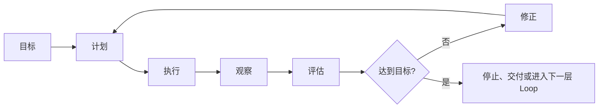
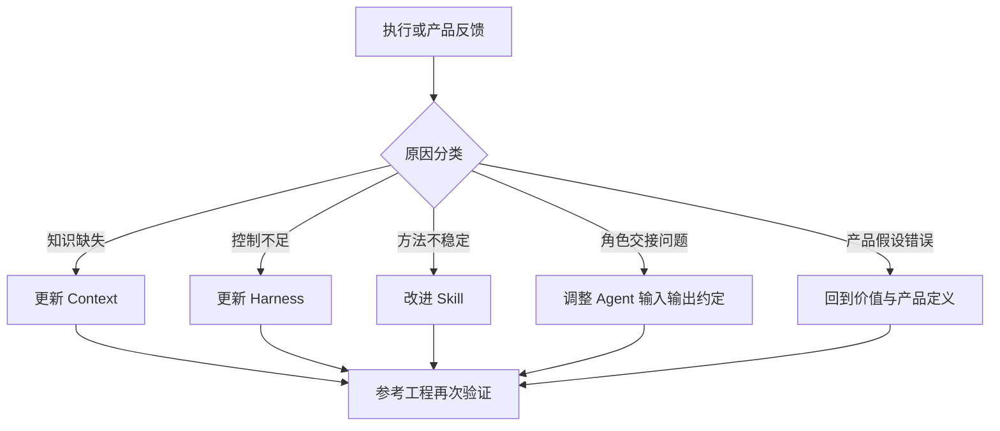

# Loop 工程：持续反馈与演进闭环

中文术语遵循：[术语与易懂表达规范](../01_框架定义/术语与易懂表达规范.md)。

## 1. 定义

Loop Engineering 让系统不止生成一次结果，而是在目标、行动、观察、评估和改进之间形成可控循环。

## 2. 四级 Loop

| Loop | 时间尺度 | 示例 | 主要输出 |
|---|---|---|---|
| 任务 Loop | 分钟到小时 | 测试失败后定位并修复 | 任务结果和失败分类 |
| 阶段 Loop | 小时到天 | 高保真评审退回体验设计 | 阶段产物改进 |
| 产品 Loop | 天到月 | 发布后根据留存和反馈调整产品 | 新假设和优先级 |
| 框架 Loop | 周到版本 | 参考工程发现检查关卡缺失 | 更新 Context、Harness、Skill 或决策 |

## 3. 反馈来源

- 自动测试、日志、性能和安全检查；
- 视觉比对和模拟用户脚本；
- 用户行为、留存、转化和业务结果；
- 客服、运营和人工评审；
- Agent 失败记录、人工修正比例和成本数据；
- 参考工程对框架的验证结果。

## 4. 评估规则

每个 Loop 必须明确：

- 目标和成功指标；
- 可观察信号；
- 评估责任人；
- 最大重试次数或时间预算；
- 停止条件；
- 需要人工升级的条件；
- 结果应更新到哪类长期资产。

## 5. 防止无限循环

禁止无条件“继续尝试”。出现以下情况应停止并升级：

- 连续重试未改变失败类型；
- Context 或约定存在冲突；
- 需要新的产品或架构决策；
- 成本超过预算；
- 权限、安全或数据风险无法自动判断；
- 目标本身不可验证。

## 6. 经验沉淀路径

Loop 的价值不是让 AI 自我进化的宣传概念，而是让每次失败有明确归因、责任、停止条件和长期改进位置。

## 7. C1 受控任务验证 Loop

[受控任务验证 Skill 设计](../06_Skills与Agent/受控任务验证Skill设计.md) 首次把任务 Loop 的回写边界具体化：

| 失败原因 | 回写位置 | 不允许的处理 |
|---|---|---|
| 任务事实缺失或冲突 | Context | 在 Skill 内猜测补齐 |
| 权威规则或检查器不足 | Harness | 在 Skill 内复制另一套规则 |
| 触发、输入或步骤装配不清 | Skill | 修改产品目标掩盖问题 |
| 高风险授权或产品取舍 | 人类责任人 | Agent 自动批准 |

同类确定性问题只允许在任务边界内修复和复验；重复失败、范围扩大或需要新决策时停止。首版不建立自动多 Agent 循环。

首次候选包自应用产生两项真实反馈：

- 官方初始化器拒绝了不足 25 字符的界面短描述，修正元数据后重新验证；
- 默认 Python 缺少 PyYAML，改用本机已具备依赖的解释器，未向仓库新增依赖。

两项问题均属于 Skill 工具环境和装配反馈，不改变 Harness 权威规则。
