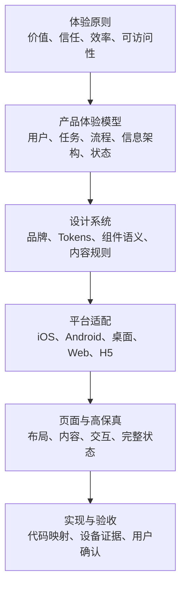

# 体验与设计工程总则

## 1. 目标

体验与设计工程解决五个连续问题：

| 问题 | 产物 |
|---|---|
| 用户要完成什么 | 用户目标、任务和成功标准 |
| 信息和操作如何组织 | 用户流程、信息架构和状态模型 |
| 不同平台如何自然呈现 | 平台适配矩阵 |
| 最终看起来和操作起来怎样 | 平台高保真与交互原型 |
| 如何证明实现没有偏离 | 实现映射、截图、操作和用户验收记录 |

## 2. 六层设计资产

上层越稳定，下层越具体。页面视觉不能反向静默改变业务规则；平台组件也不能改变同一操作的业务含义。

## 3. 必须产物

用户可见的新页面、重大交互或导航变更至少需要：

1. 产品范围和不做清单；
2. 用户目标与主路径；
3. 信息架构和导航关系；
4. 正常、加载、空、错误、权限、离线等状态；
5. 适用平台与平台适配矩阵；
6. 产品级设计系统或本任务明确引用的设计系统版本；
7. 对应平台的高保真和关键交互；
8. 页面设计规范；
9. 人工确认记录；
10. 实现后的目标设备或浏览器视觉与交互验收。

## 4. 责任

| 责任人 | 责任 |
|---|---|
| 产品负责人 | 确认目标、范围、业务规则和优先级 |
| 体验责任人 | 确认流程、信息架构、状态、内容和平台适配 |
| 视觉责任人 | 维护设计系统、视觉层级、组件组合和高保真 |
| 平台工程责任人 | 判断系统组件、技术限制和实现映射 |
| 验证责任人 | 证明目标实现与已批准设计一致 |
| 人类批准人 | 接受或退回用户可见体验 |

一个人可以承担多个角色，但 AI 不得自行替代最终体验批准。

## 5. 变更路线

| 变更 | 必须先更新 |
|---|---|
| 业务范围、用户目标变化 | 产品定义 |
| 主流程、信息架构、导航变化 | 体验规格与高保真 |
| 布局、视觉层级、组件组合变化 | 高保真与页面规格 |
| 单一实现偏离批准设计 | 代码，不修改批准设计 |
| 平台能力导致原设计不可实现 | 平台适配矩阵、高保真和设计决策 |
| 文案涉及法律或业务承诺 | 产品或法律确认 |

## 6. 反模式

- 先写代码，再用现状补画高保真；
- 只有一张漂亮图片，没有流程、状态和平台说明；
- 把 H5 原型的控件一比一复制到 iOS；
- 为追求跨平台像素一致而破坏原生使用习惯；
- 设计系统只列颜色和圆角，不定义语义、组件和状态；
- 只检查构建是否成功，不在目标设备检查视觉和交互；
- 设计批准后继续无记录地改变布局。
