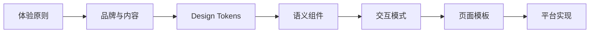

# 设计系统与 Design Tokens 规范

## 1. 设计系统组成

产品设计系统至少包含：



只列颜色、字号和圆角不构成完整设计系统。

## 2. Token 分层

### 2.1 基础 Token

记录原始设计值，例如色板、字号、间距、圆角、阴影、动效时长。

```text
color.green.600
space.16
radius.large
font.size.body
motion.duration.fast
```

### 2.2 语义 Token

记录用途，不绑定具体颜色：

```text
color.text.primary
color.text.secondary
color.surface.canvas
color.surface.card
color.action.primary
color.feedback.error
space.page.horizontal
radius.card
```

页面和组件优先使用语义 Token，不直接散落基础值。

### 2.3 平台 Token

将语义映射到平台能力：

```text
ios.color.text.primary → Color.primary
web.color.text.primary → var(--color-text-primary)
android.color.text.primary → MaterialTheme.colorScheme.onSurface
```

平台 Token 允许为可访问性、系统主题和平台观感进行差异化映射。

## 3. 必须覆盖

- 明亮、暗黑和高对比度（适用时）；
- 字体层级、动态字体和换行；
- 间距、栅格、页面边距和安全区；
- 颜色语义和对比度；
- 圆角、描边、阴影和层级；
- 图标语义与品牌图标；
- 动效、减少动态效果和加载反馈；
- 触控、鼠标和键盘目标；
- 正常、按下、选中、禁用、加载、错误等组件状态。

## 4. 组件分级

| 层级 | 含义 | 示例 |
|---|---|---|
| 基础组件 | 通用输入和展示 | Button、TextField、Card、Badge |
| 组合组件 | 多个基础组件组成的稳定交互 | 搜索与筛选栏、媒体画廊、天气卡 |
| 业务组件 | 带业务语义的复用模块 | 钓点摘要卡、钓况提示、账号资料头部 |
| 页面模板 | 页面级信息层级和布局 | 地图探索页、详情页、个人中心 |

业务组件不得悄悄内置可变化的业务规则。

## 5. 版本和权威来源

产品必须记录设计系统版本，例如：

```yaml
design_system:
  name: YouYu Design System
  version: 0.1.0-candidate
  status: candidate
  token_source: 02_体验与高保真/设计系统/tokens.json
  platform_mappings:
    ios: YouYu-iOS/DesignSystem
    prototype: 02_体验与高保真/高保真原型
```

设计源、Token 源和代码组件必须明确权威顺序。高保真局部值与 Design Tokens 冲突时，不得自行猜测，应修正设计系统或记录批准例外。

## 6. 反模式

- 页面到处硬编码颜色、间距和圆角；
- Token 名称使用 `green1`、`gray2` 而没有语义；
- 暗黑模式只是颜色反转；
- 设计组件和代码组件同名但行为不同；
- 一个 Web 组件库被宣称为所有平台的唯一实现；
- 没有状态、可访问性和内容规则。
