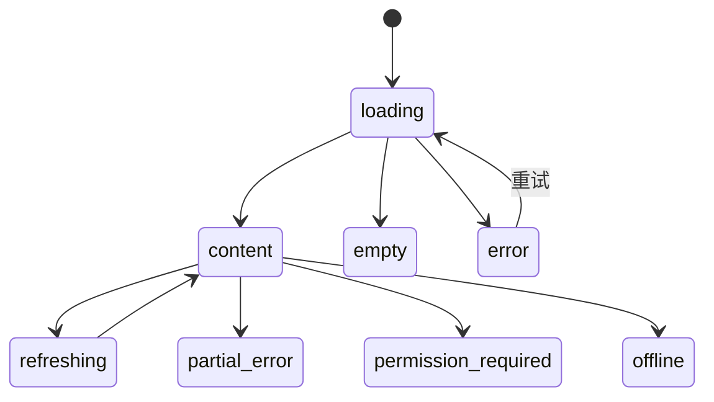

# 页面设计规范

## 1. 页面不是一张图

一个可实施页面必须同时定义目标、结构、内容、状态、交互、平台适配和验收。高保真图片只是其中一个视图。

## 2. 页面规格最小内容

| 类别 | 必须说明 |
|---|---|
| 身份 | 页面编号、名称、版本、状态、责任人 |
| 目标 | 用户为什么来到这里、完成什么、成功后去哪里 |
| 入口出口 | 从哪里进入、返回逻辑、深链接和登录拦截 |
| 信息架构 | 区块顺序、主次层级、折叠和滚动关系 |
| 操作层级 | 一个主要操作、必要次要操作、危险操作 |
| 状态 | 默认、加载、局部加载、空、错误、离线、权限、禁用、成功 |
| 数据 | 字段含义、缺失策略、截断、单位、时间和隐私 |
| 交互 | 点击、滑动、拖动、长按、键盘、焦点、返回、手势冲突 |
| 平台 | 目标平台、系统组件、差异和不支持项 |
| 响应式 | 尺寸范围、断点、方向、窗口变化和安全区 |
| 可访问性 | 语义标签、顺序、动态字体、对比度、减少动态效果 |
| 高保真 | 页面图、交互原型、状态图和批准记录 |
| 验收 | 可观察断言、目标设备、浏览器和证据 |

## 3. 信息层级

页面先确定：

1. 用户此刻最需要知道什么；
2. 用户此刻最需要做什么；
3. 哪些信息可以延后或按需展开；
4. 哪些内容不应出现在本页面。

禁止通过堆卡片、堆徽章和堆入口掩盖优先级不清。

## 4. 完整状态



页面不一定使用全部状态，但“不适用”必须说明。地图、媒体、天气、定位和上传等依赖外部能力的页面还要定义：

- 定位未授权、受限和不可用；
- 地图或天气数据失败；
- 图片或视频加载失败；
- 弱网和断网；
- 外部导航应用不可用；
- 内容过期或审核状态变化。

## 5. 操作层级

- 一个视口内应有清晰的主要操作；
- 收藏、分享、导航、编辑等操作必须按用户目标排序；
- 多个相同“收藏”入口视为设计缺陷，除非承担不同且被清楚说明的对象；
- 危险操作需与普通操作区分并按平台使用确认；
- 图标不能靠猜，必要时配文字或辅助标签。

## 6. 导航和返回

页面规格必须明确：

- 它是否属于主导航目的地；
- 主导航在进入详情后是否保留；
- 系统返回、页面返回和关闭的区别；
- 登录前后返回到哪里；
- 弹层、Sheet、全屏和新页面的选择理由；
- 深链接打开后的退出路径。

## 7. 视觉层级

- 使用设计系统 Token，不在页面规格创造新的局部风格；
- 主体内容、导航和固定操作区不得互相遮挡；
- 背景图不能降低表单、协议、警告等关键信息可读性；
- 媒体优先页面必须处理比例、裁剪、页码、播放、Live 标识和失败占位；
- 固定底部操作需要处理 Safe Area、键盘和滚动内容末尾。

## 8. 高保真状态

```text
draft
→ draft_for_confirmation
→ revision_required
→ approved
→ implemented
→ runtime_validated
→ user_accepted
```

`approved` 只表示设计获批准；`runtime_validated` 才表示实现已在目标平台检查；`user_accepted` 必须有人类用户验收记录。
