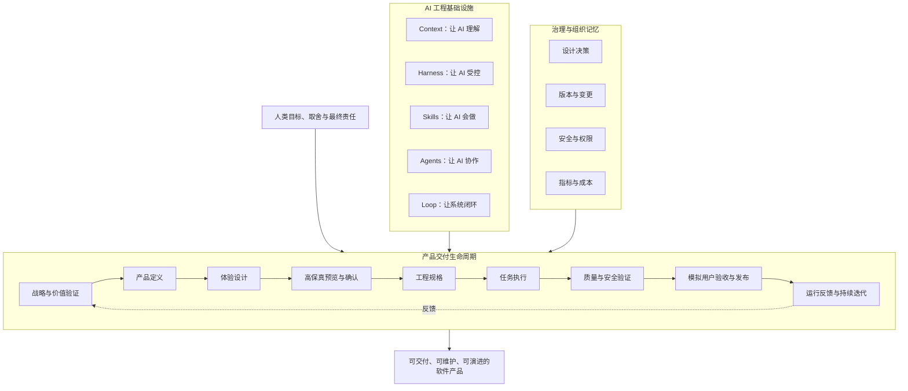
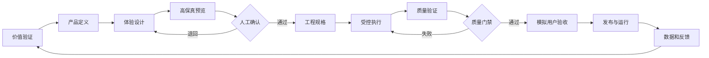
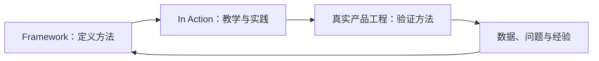

# AI 产品工程框架

> **AI Product Engineering Framework**：一套开放、跨平台、可验证的 AI 产品工程框架，用工程化方式组织人、AI Agent、上下文、技能、门禁和反馈闭环，将产品目标持续转化为可维护、可验证、可演进的软件产品。

## 这是什么

本项目不是 Prompt 合集、Coding Skill 收藏库，也不是某个模型或 Agent 平台的配置示例。

它希望回答一个更完整的问题：

> 当 Claude Code、Codex、Kimi、GLM 等 AI Agent 已经能够执行复杂任务时，人和团队应该如何定义目标、管理上下文、约束执行、验证结果，并通过真实反馈持续改进产品？

框架将软件产品生产拆成三个相互配合的平面：

1. **产品交付生命周期**：规定产品从价值验证到持续迭代的主流程。
2. **AI 工程基础设施**：提供 Context、Harness、Skills、Agents 和 Loop 五类基础能力。
3. **治理与组织记忆**：管理决策、变更、安全、成本、指标和长期知识。

## 核心判断

大模型只是执行能力的一部分。稳定的软件产品交付还需要：

- 人明确产品目标、业务取舍和关键验收结论；
- Context 系统保存项目事实、规则、历史决策和当前任务背景；
- Harness 控制阶段、边界、契约、依赖和质量门禁；
- Skills 将方法、模板、脚本和检查规则封装成可重复执行的能力；
- Agents 按角色与输入输出契约协作，而不是无边界地相互调用；
- Loop 将执行结果、运行数据和用户反馈带回下一轮决策；
- 决策记录与版本治理保证框架不会随着对话切换或模型变化而失忆。

## 产品交付生命周期

高保真预览不是装饰环节。它负责在编码前确认页面、流程、状态、内容和关键交互，尽早暴露体验偏差。发布也不是终点，真实用户反馈和运行指标必须进入下一轮产品决策。

## 五大 AI 工程基础设施

| 基础设施 | 回答的问题 | 核心资产 |
|---|---|---|
| Context Engineering | AI 凭什么理解项目？ | `AGENTS.md`、项目知识、业务规则、设计决策、任务上下文包 |
| Harness Engineering | 如何限制 AI 的执行范围并证明完成？ | 阶段门禁、修改边界、契约检查、测试与验收规则 |
| Skill Engineering | 如何把方法变成可重复执行的能力？ | `SKILL.md`、模板、脚本、参考资料、检查清单 |
| Agent Engineering | 多个 AI 角色如何协作？ | 角色职责、输入输出契约、编排流程、人工介入点 |
| Loop Engineering | 如何根据结果持续修正？ | 观察、评估、反馈、重试、迭代和能力改进闭环 |

## 适用场景

- **个人开发者**：一个人管理多个 AI 角色，完成从产品定义到交付的完整闭环。
- **创业团队**：用高保真预览、明确契约和快速反馈降低 MVP 试错成本。
- **企业创新团队**：在权限、合规、数据和变更治理下建设内部产品。
- **传统研发团队**：将 AI 纳入已有产品、设计、开发、测试和发布流程，而不是绕过流程。
- **AI 内容与自动化产品**：将生成结果、人工质检、发布数据和下一轮优化连接成持续 Loop。

详见：[适用场景与期望](01_框架定义/适用场景与期望.md)。

## v0.1 的目标

v0.1 是**框架立项版本**，优先建立完整地图和统一语言：

- 明确框架愿景、边界和适用场景；
- 区分产品生命周期、AI 工程基础设施和治理能力；
- 定义人类角色与 AI Agent 角色；
- 建立 Context、Harness、Skills、Agents、Loop 的关系；
- 建立设计决策记录，防止项目和 AI 随时间失忆；
- 同时使用 Mermaid 和真实 SVG 图片表达复杂概念；
- 为后续逐个模块细化、实现和真实项目验证建立稳定入口。

v0.1 暂不建设自动 Agent 平台、通用 IDE、完整 Skill 市场或无人值守发布系统。

## 文档导航

| 模块 | 说明 |
|---|---|
| [框架定义](01_框架定义/AI产品工程框架愿景与定位.md) | 愿景、适用场景、边界和核心原则 |
| [全局模型](02_全局模型/AI产品工程全局框架.md) | 三平面架构、生命周期和五大基础设施 |
| [角色体系](03_角色体系/人类与AI角色.md) | 人类责任、AI 角色和协作关系 |
| [Context 工程](04_Context工程/Context与记忆管理.md) | 项目记忆、任务上下文和决策记录 |
| [Harness 工程](05_Harness工程/执行控制与门禁.md) | 阶段控制、边界控制、契约和门禁 |
| [Skills 与 Agent](06_Skills与Agent/Skills与Agent协作模型.md) | 能力封装、角色协作和平台适配 |
| [Loop 工程](07_Loop工程/持续反馈与演进闭环.md) | 从任务修复到产品反馈的多级闭环 |
| [模板资产](08_模板资产/README.md) | 后续可执行模板的统一入口 |
| [参考工程](09_参考工程/README.md) | 用真实项目验证框架，而不是只写概念 |
| [版本路线](10_版本演进/Roadmap.md) | 从 v0.1 到可执行框架和参考实现 |
| [设计决策](11_设计决策/README.md) | 记录为什么这样设计以及变更影响 |

## 与原实战仓库的关系

- `ai-product-engineering-framework`：定义标准、模型、模板、Skills、门禁和平台适配。
- `ai-product-engineering-in-action`：面向学习和实践，展示如何理解、使用和验证框架。
- 具体业务仓库：作为参考工程，用真实交付结果反向改进 Framework。

## 当前状态

当前版本：**v0.1.0（框架立项）**。

本阶段坚持：**先建立完整框架，再逐个模块细化和实现；所有重要结论必须进入仓库，而不是只保留在对话中。**
