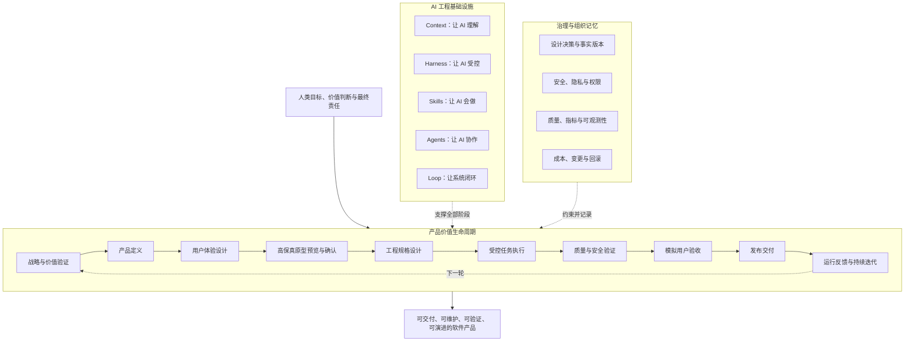
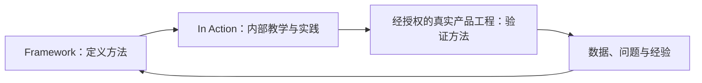

# AI 产品工程框架

> **AI Product Engineering Framework**：一套由 zhidao-studio 专有维护、跨平台、可验证的 AI 产品工程框架，用工程化方式组织人、AI Agent、上下文、技能、检查关卡和反馈闭环，将产品目标持续转化为可维护、可验证、可演进的软件产品。

> **专有权利声明：** 本仓库不是开源项目。除 GitHub 平台条款允许的有限浏览行为外，未经 zhidao-studio 事先书面授权，禁止使用、复制、修改、分发、商业化、模型训练或创建衍生作品。正式条款见 [LICENSE](LICENSE)。


> 概念图由 ChatGPT 生成，用于快速建立认知。正式定义以核心 Markdown、设计决策、约定和 Mermaid 图为准。

## 当前版本

```text
当前稳定版本：v0.1.6
目标开发版本：v0.2.0
当前开发里程碑：A / Context 可执行化
当前工作段：A2 / YouYu 高保真确认与工程规格准备
执行状态：active
业务准备：in_progress
高保真候选：v0.1.0-draft.5 / conditional_pass / 待维护者批准
正式业务实现：blocked
正式业务验证：not_started
阻塞原因：高保真人工批准、接口与数据约定、历史敏感信息、共享会话与下游网络隔离、采集待审入库运行验证和 iOS 真机人工体验验收尚未关闭
许可证：Proprietary / All Rights Reserved
仓库可见性：Public，待维护者手动切换为 Private
```

当前状态的唯一运行入口是：[Framework 项目 Context](12_框架项目Context/README.md)。版本边界与开发路线分别以 [CHANGELOG](CHANGELOG.md) 和 [Roadmap](10_版本演进/Roadmap.md) 为准。

- [v0.1.1 全量复核报告](10_版本演进/v0.1.1全量复核报告.md)
- [v0.1.2 专有许可与阶段清场报告](10_版本演进/v0.1.2专有许可与阶段清场报告.md)
- [v0.1.3 业务验证事实同步与版本治理报告](10_版本演进/v0.1.3业务验证事实同步与版本治理报告.md)
- [v0.1.4 术语易懂化与表达统一报告](10_版本演进/v0.1.4术语易懂化与表达统一报告.md)
- [v0.1.5 当前状态收敛与历史边界治理报告](10_版本演进/v0.1.5当前状态收敛与历史边界治理报告.md)
- [v0.1.6 工程修复与业务功能准备同步报告](10_版本演进/v0.1.6工程修复与业务功能准备同步报告.md)
- [版本管理规范](10_版本演进/版本管理规范.md)
- [术语与易懂表达规范](01_框架定义/术语与易懂表达规范.md)
- [Roadmap](10_版本演进/Roadmap.md)

`A/B/C` 是 v0.2.0 的开发里程碑，不是发布版本。`main` 中存在的候选 Context、数据库规范和参考工程资产不代表已经稳定发布。

## 这是什么

本项目不是 Prompt 合集、Coding Skill 收藏库，也不是某个模型或 Agent 平台的配置示例。

它希望回答一个更完整的问题：

> 当 Claude Code、Codex、Kimi、GLM 等 AI Agent 已经能够执行复杂任务时，人和团队应该如何定义目标、管理上下文、约束执行、验证结果，并通过真实反馈持续改进产品？

框架将软件产品生产拆成三个相互配合的平面：

1. **产品价值生命周期**：规定产品从价值验证到持续迭代的主流程；
2. **AI 工程基础设施**：提供 Context、Harness、Skills、Agents 和 Loop 五类基础能力；
3. **治理与组织记忆**：管理决策、版本、安全、权限、指标、成本、变更和长期知识。



## 框架宪法

以下四份文档是后续 Context、Harness、Skills、Agents、Loop、模板、检查关卡和参考工程的上位依据：

| 宪法文档 | 回答的问题 |
|---|---|
| [愿景与定位](01_框架定义/AI产品工程框架愿景与定位.md) | 框架为什么存在、是什么、不是什么？ |
| [适用场景与期望](01_框架定义/适用场景与期望.md) | 哪些项目适用、实施多深、各版本期望什么？ |
| [核心原则](01_框架定义/AI产品工程核心原则.md) | 新能力进入框架时必须满足哪些判断标准？ |
| [边界声明](01_框架定义/AI产品工程边界声明.md) | 框架负责什么、不负责什么，人和 AI 各承担什么责任？ |

任何局部实现不得静默改变宪法层。重大变化必须进入 [设计决策](11_设计决策/README.md)。

## 核心判断

大模型只是执行能力的一部分。稳定的软件产品交付还需要：

- 人明确产品目标、业务取舍和关键验收结论；
- Context 保存项目事实、规则、历史决策和当前任务背景；
- Harness 控制阶段、边界、约定、依赖、权限和质量检查关卡；
- Skills 将经过验证的方法、模板、脚本和检查规则封装成可重复能力；
- Agents 按角色与输入输出约定协作，而不是无边界地相互调用；
- Loop 将执行结果、运行数据和用户反馈带回下一轮决策；
- 设计决策与版本治理保证框架不会随着对话、模型或任务变化而失忆。

## 十阶段产品价值生命周期

| 阶段 | 核心问题 |
|---|---|
| 1. 战略与价值验证 | 为什么值得做？ |
| 2. 产品定义 | 做什么与不做什么？ |
| 3. 用户体验设计 | 用户如何完成目标？ |
| 4. 高保真原型预览与确认 | 最终体验是否正确？ |
| 5. 工程规格设计 | 系统如何实现？ |
| 6. 受控任务执行 | AI 可以在什么范围内完成什么？ |
| 7. 质量与安全验证 | 系统是否正确、可靠和安全？ |
| 8. 模拟用户验收 | 真实用户路径是否可用？ |
| 9. 发布交付 | 是否具备进入目标环境的条件？ |
| 10. 运行反馈与持续迭代 | 真实使用如何改变下一轮？ |

高保真预览不是宣传插图，而是编码前的体验检查关卡；模拟用户验收和发布交付是两个独立阶段；发布不是终点，真实反馈必须进入下一轮产品决策。

## 五大 AI 工程基础设施

| 基础设施 | 回答的问题 | 核心资产 |
|---|---|---|
| Context Engineering | AI 凭什么理解项目？ | 项目事实、业务规则、设计决策、项目、阶段和任务 Context Pack |
| Harness Engineering | 如何限制 AI 的执行并证明完成？ | 阶段检查关卡、修改边界、约定一致性检查、权限、测试和人工确认 |
| Skill Engineering | 如何把成熟方法封装成可重复能力？ | `SKILL.md`、模板、脚本、参考资料、检查清单和验证记录 |
| Agent Engineering | 谁承担任务责任，如何协作？ | 角色职责、输入输出约定、工具权限、编排和升级路径 |
| Loop Engineering | 如何观察、评估、纠偏和沉淀？ | 重试、停止、反馈、失败归因、指标复盘和资产改进 |

## 适用场景

- **个人开发者**：一个人管理多个 AI 角色，完成从产品定义到交付的完整闭环；
- **创业团队**：用价值验证、高保真预览和快速反馈降低 MVP 试错成本；
- **企业创新团队**：在权限、合规、数据和变更治理下建设内部产品；
- **传统研发团队**：将 AI 纳入已有产品、设计、开发、测试和发布流程；
- **AI 原生与内容产品**：连接生成、人工质检、发布指标、失败降级和持续 Loop；
- **AI 工程平台团队**：统一规则、Skills、检查关卡、适配和参考工程。

详见：[适用场景与期望](01_框架定义/适用场景与期望.md)。

## 文档导航

| 模块 | 说明 |
|---|---|
| [框架宪法](01_框架定义/AI产品工程框架愿景与定位.md) | 愿景、场景、原则、边界和 README 结构规范 |
| [全局模型](02_全局模型/AI产品工程全局框架.md) | 三平面架构、十阶段生命周期和五大基础设施 |
| [角色体系](03_角色体系/人类与AI角色.md) | 人类责任、AI 角色、交接和人工确认点 |
| [Context 工程](04_Context工程/README.md) | 项目记忆、事实来源、阶段与任务 Context、冲突和回写 |
| [Harness 工程](05_Harness工程/执行控制与检查关卡.md) | 阶段、边界、约定、权限、验证和发布检查关卡 |
| [Skills 与 Agent](06_Skills与Agent/Skills与Agent协作模型.md) | 能力封装、角色协作和平台适配 |
| [Loop 工程](07_Loop工程/持续反馈与演进闭环.md) | 任务、阶段、产品和框架四级闭环 |
| [模板资产](08_模板资产/README.md) | 将标准转化为可执行输入输出的模板入口 |
| [参考工程](09_参考工程/README.md) | 用真实产品验证框架，而不是只写概念 |
| [版本路线](10_版本演进/Roadmap.md) | 稳定版本、开发目标、里程碑和退出检查关卡 |
| [设计决策](11_设计决策/README.md) | 保存为什么这样设计以及变更影响 |
| [Framework 项目 Context](12_框架项目Context/README.md) | 当前运行状态、阻塞、下一步和权威事实入口 |

## 与原实战仓库的关系

- `ai-product-engineering-framework`：定义标准、模型、模板、Skills、检查关卡和平台适配；
- `ai-product-engineering-in-action`：面向维护者内部学习和实践，展示如何理解、使用和验证框架；
- 经授权的具体业务仓库：作为参考工程，用真实交付结果反向改进 Framework。



## 当前进展

- Context 规范、检查清单、候选模板和 Framework 自应用已经完成；
- YouYu 工程基础经过修复后为 `conditional_pass`，本地真机和远程可重复构建证据已具备；
- 首个正式业务切片“手机号验证码登录注册与个人资料管理”已经确认，产品定义和体验定义已经完成；
- YouYu 已采用统一数据库基础规范，Framework 已将其登记为候选工程规格，尚未经过正式业务表运行验证；
- 高保真候选已修订至 `v0.1.0-draft.5`，范围和交互检查为 `conditional_pass`，等待维护者逐页批准；
- OpenAPI、账号/资料/验证码表、实现任务边界和三层验证尚未完成，正式业务实现仍为 `blocked`；
- YouYu 正式业务参考工程验证仍为 `not_started`；
- Context 模板保持 `candidate`，Harness 里程碑 B 尚未正式开始。

详细执行状态、阻塞和下一步只在 [Framework 项目 Context](12_框架项目Context/README.md) 维护。

## 贡献与治理

- 本仓库不接受未经邀请的外部贡献；受邀协作者请阅读：[CONTRIBUTING.md](CONTRIBUTING.md)；
- AI 执行规则：[AGENTS.md](AGENTS.md)；
- 版本变化：[CHANGELOG.md](CHANGELOG.md)；
- 重大取舍：[设计决策索引](11_设计决策/README.md)。

## 专有许可证

本仓库采用专有闭源许可，版权所有，保留全部权利。任何使用、复制、修改、分发、商业化、模型训练或衍生使用均须事先取得 zhidao-studio 的书面授权。详见 [LICENSE](LICENSE)。

> GitHub 已核验当前仓库可见性为 Public。若要真正限制访问，而不只是限制法律上的使用权，必须由维护者在 GitHub `Settings → General → Danger Zone → Change repository visibility` 中将仓库改为 Private。
