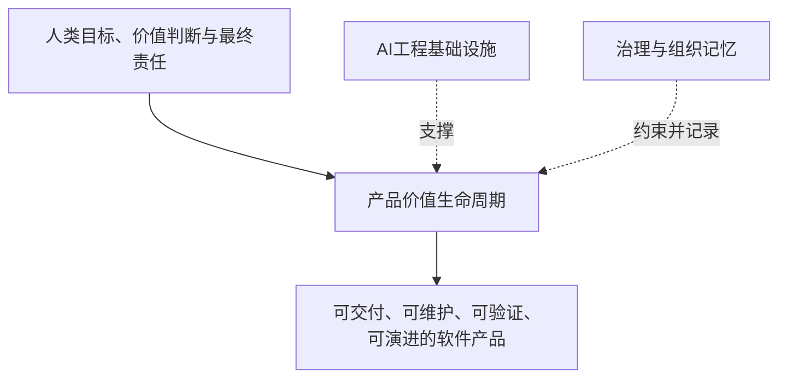

# AI 产品工程框架

> **AI Product Engineering Framework**：由 zhidao-studio 专有维护、跨平台、可验证的 AI 产品工程框架。它用工程化方式组织人、AI Agent、Context、Skills、检查关卡和反馈闭环，将产品目标持续转化为可维护、可验证、可演进的软件产品。

> **专有权利声明：** 本仓库不是开源项目。未经 zhidao-studio 事先书面授权，禁止使用、复制、修改、分发、商业化、模型训练或创建衍生作品。正式条款见 [LICENSE](LICENSE)。


## 当前版本

```text
当前稳定版本：v0.1.10
目标开发版本：v0.2.0
当前里程碑：B / Harness 可执行化
当前工作段：B1 / in_review
执行状态：pending_human_approval
YouYu版本：v0.1.4
服务端实现：conditional_pass
静态复核：conditional_pass
运行验证：conditional_pass
高保真：v0.1.2 / maintenance_approved
正式业务验证：passed_core_path_by_maintainer
Context模板：candidate
数据库规范：single_project_validated
Harness里程碑B：active
```

动态状态的唯一入口：[Framework 项目 Context](12_框架项目Context/README.md)。

- [v0.1.10 同步报告](10_版本演进/v0.1.10YouYu并发发送与事实源修订同步报告.md)
- [Roadmap](10_版本演进/Roadmap.md)
- [CHANGELOG](CHANGELOG.md)
- [版本管理规范](10_版本演进/版本管理规范.md)

## v0.1.10 当前进展

Framework 本轮同时修复自身事实源与 YouYu v0.1.4 参考工程静态缺陷：

- 修正不可解析的 Framework `baseline_commit`；
- 将 Framework 提交与 YouYu 参考提交分字段管理；
- 发布检查脚本从项目 Context 解析动态状态；
- 增加 Framework Git 提交真实性校验和可选 YouYu 仓库归属校验；
- 修复 Harness B 状态泛化匹配；
- 同步 YouYu Redis Lua 原子发送频控、发送幂等键和故障失败关闭；
- 同步 App 基础数据源、配置启动校验、严格 Bearer 和 Trace 响应头；
- 同步 OpenAPI v0.1.4、SERVER-CHECK-004 和可重复验证脚本。

状态边界：

```text
静态修订已完成
≠ Maven/MySQL/Redis/接口运行通过
≠ 正式业务验证通过
```

2026-07-22，YouYu 已补齐 Maven、MySQL、Redis、Gateway/App、iOS 模拟器与真机核心路径证据；维护者确认“账号和我验证通过”，PR #3 已合并主线。Framework 稳定版本不因此升级，本轮只更新开发中的 v0.2.0 事实与具体资产成熟度。

## 这是什么

本项目不是 Prompt 合集、Coding Skill 收藏库，也不是某个模型或 Agent 平台的配置示例。它回答：当 AI Agent 已能执行复杂任务时，人和团队如何定义目标、管理 Context、约束执行、验证结果，并通过真实反馈持续改进产品？

框架包含三个平面：

1. **产品价值生命周期**：从价值验证到持续迭代；
2. **AI 工程基础设施**：Context、Harness、Skills、Agents、Loop；
3. **治理与组织记忆**：决策、版本、安全、权限、质量、成本和变更。



## 框架宪法

| 文档 | 回答的问题 |
|---|---|
| [愿景与定位](01_框架定义/AI产品工程框架愿景与定位.md) | 框架为什么存在、是什么、不是什么 |
| [适用场景与期望](01_框架定义/适用场景与期望.md) | 哪些项目适用、实施多深 |
| [核心原则](01_框架定义/AI产品工程核心原则.md) | 新能力必须满足什么判断标准 |
| [边界声明](01_框架定义/AI产品工程边界声明.md) | 框架、人和 AI 分别负责什么 |

重大变化必须进入 [设计决策](11_设计决策/README.md)，局部实现不得静默修改宪法层。

## 十阶段产品价值生命周期

| 阶段 | 核心问题 |
|---|---|
| 1. 战略与价值验证 | 为什么值得做 |
| 2. 产品定义 | 做什么与不做什么 |
| 3. 用户体验设计 | 用户如何完成目标 |
| 4. 高保真预览与确认 | 最终体验是否正确 |
| 5. 工程规格设计 | 系统如何实现 |
| 6. 受控任务执行 | AI 可在什么范围完成什么 |
| 7. 质量与安全验证 | 系统是否正确、可靠和安全 |
| 8. 模拟用户验收 | 真实用户路径是否可用 |
| 9. 发布交付 | 是否具备进入目标环境条件 |
| 10. 运行反馈与持续迭代 | 真实使用如何改变下一轮 |

## 五大 AI 工程基础设施

| 基础设施 | 核心问题 |
|---|---|
| Context Engineering | AI 凭什么理解项目 |
| Harness Engineering | 如何限制执行并证明完成 |
| Skill Engineering | 如何把成熟方法封装为重复能力 |
| Agent Engineering | 谁承担责任，如何协作 |
| Loop Engineering | 如何观察、纠偏和沉淀 |

## 当前参考工程

[YouYu](09_参考工程/README.md) 用真实产品切片验证 Framework。

```text
产品与体验
→ 工程规格和受控实现
→ v0.1.3数据库审计与验证码消费修订
→ v0.1.4并发发送与事实源修订
→ 本地等价检查脚本与自动工作流
→ 本地与真机核心路径验证
→ 维护者验收
→ PR #3 合并与 Framework 回写
```

账号与“我”核心路径已经通过维护者真机验收。项目 Context、任务 Context 与数据库基础规范获得 `single_project_validated` 证据；阶段 Context 已完成防漂移修订并经历从 A 到 B1 的真实阶段转换。维护者已于 2026-07-23 批准启动 Harness B，当前只开展 B1 控制基线设计，候选检查尚未宣称在参考工程执行通过。

## 文档导航

| 模块 | 说明 |
|---|---|
| [框架定义](01_框架定义/AI产品工程框架愿景与定位.md) | 愿景、原则、边界和术语 |
| [全局模型](02_全局模型/AI产品工程全局框架.md) | 三平面、十阶段和五大基础设施 |
| [角色体系](03_角色体系/人类与AI角色.md) | 人类责任、AI 角色和交接 |
| [Context 工程](04_Context工程/README.md) | 事实源、Context Pack、装配、冲突和回写 |
| [Harness 工程](05_Harness工程/执行控制与检查关卡.md) | 边界、约定、权限和检查关卡 |
| [Skills 与 Agent](06_Skills与Agent/Skills与Agent协作模型.md) | 能力封装和角色协作 |
| [Loop 工程](07_Loop工程/持续反馈与演进闭环.md) | 反馈、失败归因和持续演进 |
| [模板资产](08_模板资产/README.md) | 可执行模板入口 |
| [参考工程](09_参考工程/README.md) | 真实产品验证状态 |
| [版本路线](10_版本演进/Roadmap.md) | 版本与里程碑 |
| [设计决策](11_设计决策/README.md) | 重大取舍和替代条件 |
| [项目 Context](12_框架项目Context/README.md) | 当前状态、阻塞和下一步 |

## 当前边界

- v0.1.10 不代表 v0.2.0 里程碑 A 已退出；
- Context 模板族保持 `candidate`，项目与任务模板为 `single_project_validated`；
- 数据库基础规范为 `single_project_validated`；
- Harness B 为 `active`，当前工作段为 B1 控制基线设计；
- 检查定义不等于检查执行；
- Framework 自应用不替代真实业务验证；
- 本版本没有改变三平面、十阶段、五大基础设施或许可模式。

## 贡献与许可

- 受邀协作者：[CONTRIBUTING.md](CONTRIBUTING.md)
- AI 执行规则：[AGENTS.md](AGENTS.md)
- 专有许可证：[LICENSE](LICENSE)
